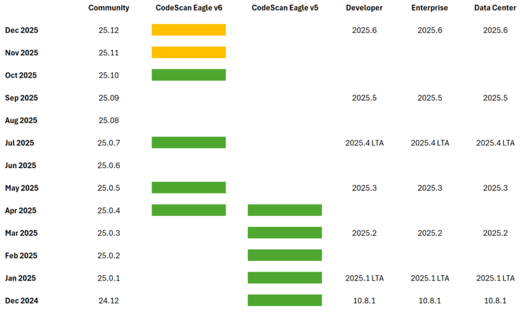

# Release Notes 24.0

## CodeScan Cloud

## Release Notes 24.0.15

**Release Date: 22 December 2024**

### Summary

CodeScan 24.0.15 is comprised of the following components:

* [1 New Module](release-notes-24.0.md#new-module-ncino)
* [1 New Rule](release-notes-24.0.md#rule)
* [1 Fix](release-notes-24.0.md#fix)

### New Module: nCino&#x20;

The new nCino module contains rules that scan your metadata and directly query your Salesforce org to find issues and inconsistencies with your nCino configuration.  This is a paid module, please contact your account team for more information on pricing.


**Please note**, a portion of these rules are only available for projects created with CodeScan's direct Salesforce integration due to being based on a query to the Salesforce Org.


**nCino Rules Activation:**

Create a project analysis with the Salesforce Org that includes nCino objects. Select the nCino specific built in profile and run the project analysis.

User can choose the built in nCino Quality profile consisting of **ncino-specific** and **ncino-goldstandard** rules in Apex/Salesfocre metadata or User can add nCino rules to the CodeScan Quality profile. Users can extend existing profiles and activate more rules from Apex and Salesforce Metadata using the **"ncino-specific"** tag.

Alternatively, they can add the rules directly to newly created quality profiles by selecting the **"ncino-specific"** tag from the Rules filter, then apply Bulk Change > Activate in > Choose a quality profile.

To learn how to create a custom Quality Profile, [see this article.](https://knowledgebase.autorabit.com/product-guides/codescan/quality-profiles/customizing-quality-profiles)

**New nCino Specific Rules:**

The following nCino-related rules have been added to the existing Apex/Salesforce Metadata rule sets and are tagged as "nCino-Specific."

**Avoid Duplicates in Custom Labels**\
&#x20;Maintaining unique labels ensures data accuracy and consistency within the nCino platform. By avoiding the creation of multiple labels with the same value, users can rely on the uniqueness of each label for categorization, and analysis purposes.

**Collateral Configuration is Null**\
The Collateral Configuration Field on the Collateral Type object should not be null. This will reduce the likelihood of missing or incomplete Collateral information.

**Duplicate LookupKeys** \
In the nCino Record Based Configuration, no two records in the configuration should have duplicate LookupKeys. The LookupKey is a critical identifier for these records, and duplicates could lead to data inconsistency and errors in the system.

**Fee Template Record Screen Section**\
Ensure that every Fee Template record includes a Screen Section data value. This will reduce the likelihood of missing or incomplete Fee information.

**Field History Tracking Check**\
Field History Tracking is limited according to the features in your Salesforce org. By default Field History Tracking can be use to track a maximum of 20 fields per object.

**Null LookupKeys**\
&#x20;In the nCino Record Based Configuration, object records without LookupKeys will cause challenges in data management and processing.

**Product Feature record does not exist**\
Ensure that for each nCino Product Object, there is a corresponding Product Feature record. Product Object records existing without an associated Product Feature record, can lead to potential data inconsistencies.

**Product Feature Sharing**\
Ensure that each nCino Product Object record is associated with unique Product Feature records. Shared Product Feature records may lead to data inconsistencies and operational challenges.

**nCino Custom Components with Duplicate Names**\
Avoiding naming conflicts with existing Managed Package Components minimizes the risk of errors and conflicts within the system, ultimately enhancing system stability and reliability.

**nCino Custom Fields with Duplicate Names**\
Avoiding naming conflicts with existing Managed Package Fields minimizes the risk of errors and conflicts within the system, ultimately enhancing system stability and reliability.

**nCino Data Integration User Configuration**\
The Data Integration user is authenticated for background jobs such as nightly batched updates of records. Configuring this user’s Permission Sets correctly makes sure that updates by the Data Integration User don't execute additional tasks.

**nCino Deprecated Fields**\
Deprecated fields in an nCino environment are labelled with a '-D' to make the deprecation visible when configuring the environment. This rule is to identify the location when deprecated fields are used and should be addressed.

**nCino Trigger Handler Framework**\
The Trigger Handler Framework removes logic from Triggers and enforces consistency across the platform. There are many ways to create a Trigger Framework/Factory; however, the nCino Managed Package can save users time and effort. By levering the nCino Trigger Framework, users can control the execution of triggers at runtime, simplify existing customizations and logic.

**System Bypass Logic - Flows**\
System bypass logic is required for custom Flows. Checking for the Exclude Flows Permission Set allows the system to cease further processing of the Flow if it is found at the outset. This improves the efficiency of flow execution and reduces unnecessary processing steps.

**System Bypass Logic - Triggers**\
System bypass logic is required for custom triggers. Checking for the Exclude Trigger Permission Set allows the system to cease further processing of the Trigger if it is found at the outset. This improves the efficiency of Trigger execution and reduces unnecessary processing steps.

**System Bypass Logic - Validation Rules**\
System bypass logic is required for Validation Rules.Checking for the Exclude Validation Permission Set allows the system to cease further processing of the rule if it is found at the outset. This improves the efficiency of Validation Rule execution and reduces unnecessary processing steps.

### Rule

**Remote Site Settings Description**\
Remote Site Settings should have a description of their functionality making it easy for others to understand the purpose and functionality of the component as it may not always be understandable from the name.

### Fix

1. **Fix false positive occuring for the rule "Utilizing Apex Unit Tests with @IsTest(IsParallel)"**\
   When IsParallel was being passed with multiple other flags, sometimes the rulewould fire incorrectly.  This has been rectified.

## Release Notes 24.0.14

**Release Date: 04 December 2024**

### Summary

CodeScan 24.0.14 is comprised of the following eight components:

* [2 Enhancements](release-notes-24.0.md#enhancements)
* [2 New Rules](release-notes-24.0.md#new-rules)
* [4 Fixes](release-notes-24.0.md#fixes)

Component details are listed in their corresponding sections within this document.

### New Features

There are no new features associated with this release.

### Enhancements

1.  **Added “Project Search” in CSV Export**\
    Customers with a large number of projects were experiencing a UI issue with the export feature: users who wanted to export issues in CSV format were only able to see the first 100 projects on the list.\
    \
    In this release, we have addressed this issue by adding a search function in the drop-down list to allow users to search for the name of the project they wish to export.

    \
    We verified the added “Project Search” on CSV Export page for multiple scenarios including:

    1.  Verified search option functionality with the drop-down list of projects:

        <figure><figcaption></figcaption></figure>
    2.  Verified the drop-down list shows 20 of the most recently scanned projects by default.

        <figure><figcaption></figcaption></figure>
2.  **Updated the message for Security Hotspot Status “Exception”**\
    We recently added a new status type for Hotspots (status = “Exception”). Its intent is to serve as a more accurate status than 'Acknowledged' or 'Open' for issues being treated as exceptions. \
    \
    When we first delivered an “Exception” status, the associated message was: “The code has been reviewed and does not pose a risk currently. Further review is needed at a later date.” Based upon numerous client suggestions, we have enhanced the message to read: "The issue has an approved exception and will be re-reviewed until mitigated or upon exception expiry.”

    <figure><figcaption></figcaption></figure>

### New Rules

1. **New Rule for LWCs: “API Version Is Too Old”**\
   This is a new rule to ensure that all Lightning Web Components (LWCs) are using an acceptable API version (including the most current API version).\
   \
   Using outdated API versions can lead to compatibility issues, missed opportunities to leverage new features, and potential security vulnerabilities. This rule aims to streamline the process of identifying and updating LWCs to the latest API version. We recognize that by identifying and updating LWCs to the latest API version, developers are able to maintain higher code quality, reduce the risk of deprecated features, and improve the overall performance and security of the application.\
   \
   Verified the new LWC rule (API Version Is Too Old) for these scenarios:
   *   Verified the description, issue type, severity, message, tags, remediation, and parameters of the rule:

       <figure><figcaption></figcaption></figure>
   *   Verified that a violation is thrown if the API version used is lower than the minimum version allowed:

       <figure><figcaption></figcaption></figure>
   *   Verified that a violation is thrown if the API version used is higher than the maximum version allowed:

       <figure><figcaption></figcaption></figure>
   * Verified that no violation is thrown when the API version is between the minimum and maximum versions allowed.
2.  **New Rule for APEX: “OuterClassExplicitSharing”**\
    Enforces security best practices on classes by ensuring that sharing settings ('with sharing', 'without sharing', or 'inherited sharing') are explicitly declared. This prevents accidental data exposure and enhances code maintainability and compliance with security policies.

    * **Name**: Outer Class Explicit Sharing
    * **Key**: OuterClassExplicitSharing
    * **Type**: Vulnerability
    * **Severity**: Major
    * **Message**: Class '{className}' does not have an explicit sharing rule
    * **Tags**: Convention
    * **Remediation**: 5 minutes

    Verified the rule: OuterClassExplicitSharing for the following scenarios:

    *   Verified the rule’s description, type, severity, message, tag, remediation, key, and name:

        <figure><figcaption></figcaption></figure>
    *   Verified the rule is not throwing a violation if used with sharing, without sharing, or inherited sharing:

        <figure><figcaption></figcaption></figure>
    *   Verified that a violation is thrown if not used with sharing, without sharing, or inherited sharing.

        <figure><figcaption></figcaption></figure>


**NOTE**: This rule overlaps with the **ClassExplicitSharing** rule and will always overlap with violations for outer classes. This rule has been created to:

* Allow for the reporting of this issue as a vulnerability instead of a code smell
* Only flag if sharing settings are missing for outer classes (inner classes that are missing sharing settings will not be flagged—which is opposite of how the ClassExplicitSharing rule works)

If both rules are active, check the violations that were reported and disable one of the rules as necessary.


### Fixes

1. **Fixed an issue in the CodeScan application in which flagged violations were not being displayed when using the "issues in new code" filter**\
   \
   **NOTE**: This issue only relates to a separate fix stemming from our last release (24.0.13), when we fixed an issue with reference branch analyses. After that fix, however, users were experiencing a new issue, in which flagged violations were not being displayed when using the "issues in new code" filter. The other parts of the CodeScan application were NOT impacted by the reference branch analyses fix in release 24.0.13. As such, all other parts of CodeScan continued to show the accurate new issue count.\
   \
   Regarding this issue, users were unable to navigate to the issues page after running the project analysis. Further, users were not able to see the issues if the user selected any of the issue types (e.g., vulnerability) after running the project analysis.\
   \
   This fix corrects this issue. Users are now able to navigate to the issues page after running the project analysis. Further, users are now able to see the issues if they select any of the issue types (e.g., vulnerability) after running the project analysis.\

2.  **Fixed issue in rule for APEX “sf: \{{FieldLevelSecurity\}}” {Permissions should be checked before accessing resource}.**\
    Previously, this rule was throwing violations that were false positives. This was occurring when a SOSL query having an inner query calls the related Object. The Object needs to be checked by using isAccessible() before accessing its data.\
    \
    &#xNAN;_&#x4E;OTE: We addressed a similar issue related to SOQL queries in a previous release. That update has been extended in this release to also include SOSL queries._\
    \
    As per Salesforce documentation, when checking the Access for the inner query object, it allows to check by using \_\_c, but while making inner query on related Objects, it must be in plural and end with \_\_r.\
    \
    &#xNAN;_&#x54;his fix corrects this issue._ In this enhancement, the Object is checked by using isAccessible() before accessing its data.\
    \
    Verified the rule “Field Level Security Vulnerabilities” for the following scenarios:

    1.  Rule is throwing a violation if isAccessible is not checked for the objects used in the inner query:

        <figure><figcaption></figcaption></figure>
    2.  Rule is not throwing the violation if isAccessible is checked for the objects used in the inner query.

        <figure><figcaption></figcaption></figure>

    **REMINDER**: In the previous release, we added support for SYSTEM\_MODE in this rule. A new parameter has been added, allowing users to choose true or false to include or ignore violations related to SYSTEM\_MODE.\
    \
    We have verified the rule: FieldLevelSecurity for the following scenarios:

    * Rule is throwing the violation if the object is NOT checked via isAccessible for the methods used in the inner query.
    * Rule is not throwing the violation if the system mode value is set = “true” (and the object IS NOT checked via isAccessible for methods).
    * Rule is not throwing the violation if the system mode value is set = “false” (and the object IS checked via isAccessible for the methods).\

3.  **Fixed issue with Retention Period settings**\
    The retention period for project branches in CodeScan was not functioning properly. The UI is able to be set, but it does not affect the cleanup of branches within the project.\
    \
    This setting can be found in Project Settings > General Settings > Housekeeping > Delete inactive branches and PRs after.\
    \
    Also, the text in the “Branches” menu did not reflect the branch retention length change:

    <figure><figcaption></figcaption></figure>

    Verified the Retention Period fix for the following scenarios:

    1.  In the UI, users are able to set **Delete inactive branches and PRs after** value:

        <figure><figcaption></figcaption></figure>
    2.  Users are able to see the same branch retention length value on the **Branches & Pull Requests** page.\

        <figure><figcaption></figcaption></figure>
4. **Fixed issue with Group Synchronization for SAML connections**\
   We uncovered an issue with Group Synchronization during a recent customer implementation. We identified the root cause and a code change delivered in this release fixes the issue. Group synchronization is now working as designed. Further, we verified the Group synchronization option in SAML connection on a customer environment and have reported that this capability is working as expected.

## Release Notes 24.0.13

**Release Date: 30 October 2024**

### Summary

CodeScan 24.0.13 is comprised of the following 4 components:&#x20;

* [1 Enhancement](release-notes-24.0.md#enhancement)
* [3 Fixes](release-notes-24.0.md#fixes)&#x20;

Component details are listed in their corresponding sections within this document.&#x20;

### New Features

There are no new features associated with this release.

### Enhancement

1. **Enhancement to Rule for VF: “"vf:AvoidJavaScriptScriptlets”** \
   \
   We recognize that using direct \<script> tags in components or pages can pose a security risk by increasing the likelihood of cross-site scripting (XSS) attacks. \
   \
   Separately, but importantly, you cannot use “includeScript” to embed an Aura Application to a Visualforce page (as the $Lightning global object is not available if put in a separate .js file as a static resource). To address this, Salesforce details how to “create a component on a Page,” advising you to add your top-level component to a page using $Lightning.createComponent(String type, Object attributes, String domLocator, function callback). Note that this function is similar to $A.createComponent(), but it includes an additional parameter, domLocator, which specifies the DOM element where you want the component inserted. Access the full documentation at[https://developer.salesforce.com/docs/atlas.en-us.lightning.meta/lightning/components\_visualforce.htm](https://developer.salesforce.com/docs/atlas.en-us.lightning.meta/lightning/components_visualforce.htm). \
   \
   Considering both of these items together, we recognize that there was limitation on this rule where customers were getting violations flagged as false positives. This enhancement involves implementing Regex to detect the use of Lightning components within a \{{\<script>\}} tag in Visualforce pages. The rule \{{vf:AvoidJavaScriptScriptlets\}} should not trigger a violation if only Lightning components are found. However, if any additional lines of non-Lightning code are detected within the script, a violation will be raised. This ensures the proper use of Lightning components while avoiding insecure or outdated practices in scriptlets.

### New Rules

There are no new rules associated with this release.

### Fixes

1.  **Fixed issue with reference branch analyses:** Branch initially fails the quality gate, then passes on subsequent scans without changes.

    \
    Previously within CodeScan, branches with new code consistently failed the quality gate when they contained unresolved new issues (such as bugs, vulnerabilities, code smells, or security hotspots). This failure persisted until all new issues were addressed, ensuring only clean code passed the quality gate. \

    Recently it was reported that "New Code -> Reference Branch" functionality was no longer working as designed, which was impacting quality gate evaluations for new code on branches for some customers. Indeed, branches with new code were initially failing the quality gate if new issues are detected (as expected and desired). However, on subsequent analyses of the same branch—without addressing the new issues—the quality gate was incorrectly passing. &#x20;

    &#x20;

    We recognize that this behavior could result in code potentially being deployed to production despite unresolved issues, as the quality gate no longer blocks the release after the first analysis.  As such, a fix has been implemented to ensure the quality gate consistently fails whenever unresolved new issues exist in the code, preventing deployment until all issues are addressed.&#x20;

    &#x20;

    Verified the functionality of reference branch for the following scenarios:&#x20;

    * Verified the new code of a branch where user is able to see the issues exactly when compared with the reference branch.&#x20;
    * Verified that the quality gate failed status if the new branch has any new code compared to the reference branch.&#x20;
    * Verified that the quality gate passed status if the new branch has no new code compared to the reference branch.&#x20;
    * Verified that we can change the reference branch in the UI and run the analysis locally, with or without specifying the reference branch in the command. (If we didn’t specify the reference branch, it should take master as RB.)&#x20;
    * Verified that renaming of the reference branch and using the new name for analysis are working correctly.&#x20;
    * Verified that when a branch is deleted in the UI and then used as a reference branch in the SFDX command, a 404 error is returned.&#x20;
    * Verified the version option on activity page by providing name and editing name.&#x20;
    * Verified the following options that are present under new code period for any branch under specific settings for a branch.
      * Previous version&#x20;
      * Number of days&#x20;
      * Specific analysis&#x20;
      * Reference branch&#x20;
    * Verified the functionality by adding new code with vulnerabilities and fixed some issues that were marked as false positives in the UI.&#x20;
    * Verified the sonar scanner command as well for the reference branch.\

2.  **Fixed issue in rule “sf:OptimizeParallelUnitTests” (IsParallel)** \
    \
    This rule is designed to ensure that isParallel is present, either True or False. Previously, when a second flag was added to a test, the rule threw a violation, e.g., @IsTest(SomeFlag=True IsParallel=False). This should not throw a violation since IsParallel is specified. Instead, something like @IsTest(SomeFlag=True) should throw a violation, as IsParallel is not specified. \
    \
    This issue was occurring because the rule detection logic was looking for “@isTest(isParallel=true/false)” annotation being defined/set individually on its own (only), but not when used in combination with other annotations. Not being able to detect combination annotations setting was thereby causing false positive violations. \
    \
    Various scenarios tested outcomes for the rule BEFORE the fix was added:

    1. Not setting “@isTest(isParallel=false)” (or true) – Violation – Correct behavior.
    2. Setting @isTest(isParallel=false) or @isTest(isParallel=true) – No violation – Correct behavior.
    3. Setting @isTest(OnInstall=true isParallel=False) – Violation – Incorrect behavior as isParallel is set.
    4. Setting @isTest(SeeAllData=False isParallel=True) – Violation – Incorrect behavior as isParallel is set.

    \
    Results demonstrated that scenarios a and b were working as expected; however, in scenarios c and d, the rule was not able to understand multiple combined annotations format of @IsTest(xxx=false yyy=true) \
    \
    &#xNAN;_&#x54;his fix corrects the issue._ \
    \
    We have verified the Apex rule sf:OptimizeParallelUnitTests via multiple scenarios, and all are working as expected.

<figure><figcaption></figcaption></figure>

\
\

3. **Fixed issue in rule for VF “vf:AvoidExternalResources”** (in which the rule was checking **ALL** attributes for external resources, producing false positives). \
   \
   Previously, the rule vf:AvoidExternalResources was checking **ALL** attributes for external resources, which it should not do. This resulted in false positives being flagged as violations. \
   \
   This fix ensures that the check is limited to the **“value”** attribute only, to avoid false positives and ensure the rule functions as intended. As an example, the following will NOT be flagged as a violation:\
   \<apex:includeScript value="{!$Resource.example\_js}" loadOnReady="true"/> //Good: Uses a static resource.\

## **Release Notes 24.0.12**&#x20;

**Release Date: 9 October 2024**&#x20;

### Summary

CodeScan 24.0.12 is comprised of the following 2 components:&#x20;

* 1 Rule Enhancement&#x20;
* 1 Fix&#x20;

Component details are listed in their corresponding sections within this document.&#x20;

### Enhancements

1. **Enhanced the rule sf: \{{FieldLevelSecurity\}} to eliminate false positives**&#x20;

Summary:  Previously, this rule was flagging issues that were actually false positives. This was occurring when an SOQL query has an inner query calling the related Object. &#x20;

In this enhancement, the Object is checked using isAccessible() before accessing its data.&#x20;

Per Salesforce, when checking the Access for the inner query object, it allows you to check by using \_\_c, but while making an inner query on related Objects, it must be plural and end with \_\_r. &#x20;

Further, we added SYSTEM\_MODE support to the rule enhancement via a rule parameter (where rules admins can choose true or false to include SYSTEM\_MODE). &#x20;

For additional info on Object permission Checks and SYSTEM\_MODE, refer to: [https://developer.salesforce.com/docs/atlas.en-us.apexcode.meta/apexcode/apex\_classes\_perms\_enforcing.htm|https://developer.salesforce.com/docs/atlas.en-us.apexcode.meta/apexcode/apex\_classes\_perms\_enforcing.htm|smart-link](https://developer.salesforce.com/docs/atlas.en-us.apexcode.meta/apexcode/apex_classes_perms_enforcing.htm|https:/developer.salesforce.com/docs/atlas.en-us.apexcode.meta/apexcode/apex_classes_perms_enforcing.htm|smart-link) &#x20;

### Fixes&#x20;

1. &#x20;**Fixed errors when reattaching Bitbucket projects using new enhanced security.**&#x20;

In the previous CodeScan release (24.0.11), we enhanced the security of our Bitbucket webhooks to stay current with the guidelines provided in Bitbucket’s documentation ([https://support.atlassian.com/bitbucket-cloud/docs/manage-webhooks/#Secure-webhooks](https://support.atlassian.com/bitbucket-cloud/docs/manage-webhooks/#Secure-webhooks)).&#x20;

We also implemented a process to make this update easier for existing customers using Bitbucket projects.&#x20;

Some customers were experiencing errors with this process. This fix has corrected those errors in full, and we have validated that the process works as expected.&#x20;

For more information on reattaching Bitbucket projects, please refer to our Knowledge Base:&#x20;

[https://knowledgebase.autorabit.com/fundamentals/faq/codescan-faqs/codescan-cloud-issues/reattaching-bitbucket-projects](https://knowledgebase.autorabit.com/fundamentals/faq/codescan-faqs/codescan-cloud-issues/reattaching-bitbucket-projects)&#x20;

For your convenience, we are also including the documentation from CodeScan release 24.0.11 regarding the enhanced security for Bitbucket projects.&#x20;

With this enhancement (in 24.0.11), when you create a new Bitbucket project, you must generate a “secret” key and send it to Bitbucket to create a Webhook. In the Webhook endpoint, you should validate the \{{X-Hub-Signature\}} header value in accordance with Bitbucket guides.  &#x20;


NOTE:  We recognize our customers may have existing Bitbucket projects running in their CodeScan org that were created without this enhanced security feature. &#x20;

To avoid having errors occur in these existing projects, we have intentionally added a retention period for clients to migrate the projects (reattach them). &#x20;

We have set **31 December 2024** as the _deprecation date_. This is the final day to perform the migration before these projects will break (at that point, customers will have to reattach their projects using the enhanced security webhook). &#x20;

Further, to highlight this notification more visibly, customers with existing Bitbucket projects will receive a new type of Organization Notification directly within the CodeScan UI.  &#x20;

To maximize effectiveness (and only deliver this notification when relevant), CodeScan will check if your organization has any Bitbucket projects without these enhanced security settings. &#x20;

If true, when Org Admins log in, they will receive this \*WARNING\* message: “You have to reattach the following Bitbucket projects by the end of 2024 to enhance security: project\_key\_1, project\_key\_2, project\_key\_3, etc."&#x20;


<figure><figcaption></figcaption></figure>


Starting **1 January 2025**, you will not be allowed to trigger the analysis for Bitbucket if that project doesn’t have the secret key configured. Further, instead of the WARNING message, an _ERROR_ message will be displayed.


***

## Release Notes 24.0.11&#x20;

**Release Date: 25 September 2024**&#x20;

### Summary

CodeScan 24.0.11 is comprised of the following 3 components:&#x20;

* 2 Functional Enhancements&#x20;
* 1 Security Enhancement&#x20;

Component details are listed in their corresponding sections within this document.&#x20;

### Functional Enhancements&#x20;

1. **Org Names are no longer restricted to a single word only**&#x20;

Summary:  Previously, customers had a restriction limiting Org Names to a single word. With this enhancement, that restriction has been removed.&#x20;

Valid strings now include names such as:&#x20;

* "My Organization"&#x20;
* "Organization-123"&#x20;
* "My Organization-123"&#x20;
* "Org 123"&#x20;

However, there are some restrictions regarding leading spaces, trailing spaces, trailing hyphens, and invalid characters, such as:&#x20;

* " Organization" (leading space)&#x20;
* "Organization " (trailing space)&#x20;
* "Organization-" (trailing hyphen)&#x20;
* "My Organization-" (trailing hyphen)&#x20;
* "Org-!Name" (contains an invalid character !)&#x20;

2. **Enhancement of rule “sf:AvoidPublicFields” (reducing false positives on private classes).**&#x20;

The rule sf:AvoidPublicFields identifies when public fields are used and flags them as issues. Two of the three reasons this rule is important are:&#x20;

* The internal representation is exposed and, thus, cannot be easily changed.&#x20;
* When the value is changed in an unexpected way (for example nulled), the implementation may not handle it correctly.&#x20;

But these are not concerns when those public fields are on a private class. &#x20;

This enhancement adds a private class validation check first and will not flag the two previously mentioned issues if the class is a private class.&#x20;

### Security Enhancement&#x20;

**Enhanced security for Bitbucket webhooks**&#x20;

We have enhanced the security of our Bitbucket webhooks to stay current with the guidelines provided in Bitbucket’s documentation ([https://support.atlassian.com/bitbucket-cloud/docs/manage-webhooks/#Secure-webhooks](https://support.atlassian.com/bitbucket-cloud/docs/manage-webhooks/#Secure-webhooks))&#x20;

With this enhancement, when you create a new Bitbucket project, you must generate a “secret” key and send it to Bitbucket to create a Webhook. In the Webhook endpoint, you should validate the \{{X-Hub-Signature\}} header value in accordance with Bitbucket guides.  &#x20;


NOTE:  We recognize our customers may have existing Bitbucket projects running in their CodeScan org that were created without this enhanced security feature. &#x20;

To avoid having errors occur in these existing projects, we have intentionally added a retention period for clients to migrate the projects (reattach them). &#x20;

We have set **31 December 2024** as the _deprecation date_. This is the final day to perform the migration before these projects will break (at that point, customers will have to reattach their projects using the enhanced security webhook). &#x20;

Further, to highlight this notification more visibly, customers with existing Bitbucket projects will receive a new type of Organization Notification directly within the CodeScan UI.  &#x20;

To maximize effectiveness (and only deliver this notification when relevant), CodeScan will check if your organization has any Bitbucket projects without these enhanced security settings. &#x20;

If true, when Org Admins log in, they will receive this \*WARNING\* message: “You have to reattach the following Bitbucket projects by the end of 2024 to enhance security: project\_key\_1, project\_key\_2, project\_key\_3, etc."&#x20;


<figure><figcaption></figcaption></figure>


Starting **1 January 2025**, you will not be allowed to trigger the analysis for Bitbucket if that project doesn’t have the secret key configured. Further, instead of the WARNING message, an _ERROR_ message will be displayed.


***

## Release Notes 24.0.10

**Release Date: 28 August 2024**&#x20;

### **Summary**

**CodeScan 24.0.10 is comprised of the following components:**&#x20;

* **1 Enhancement**&#x20;
* **2 New Rules**&#x20;
* **6 Fixes**&#x20;

Component details are listed in their corresponding sections within this document.&#x20;

### Enhancements

**1.     Enhancement to rule “Use the null coalescing operator instead of ternary”**&#x20;

The original aim of this rule is to identify ternary statements and suggest potential use of "??" operator.  Previously, CodeScan was checking for ternary statements only.&#x20;

This rule was originally developed according to common development practices in Salesforce where most usages of this would be in ternary. However, it can be applied in scenarios involving if-else and return statements.  As such, we have adjusted the rule to account for these use cases. With this enhancement, CodeScan suggests where null coalescing could be used instead of an “if” block (recognizing that if a developer is already thinking about shortening their code with ternary, then they are likely considering null coalescing operator as well).&#x20;

### New Rules&#x20;

**1.     New Rule for APEX: “IsBlankForNullChecks”** &#x20;

This is a new rule that leverages the built-in \{{isBlank\}} and \{{isNotBlank\}} methods instead of the \{{!=\}} and \{{==\}} operators to check for null or empty values.&#x20;

This approach is especially relevant in programming environments and languages where \{{IsBlank\}} or equivalent methods are provided for more readable, maintainable, and less error-prone code. Using the \{{IsBlank\}} method for null checks improves code clarity, reduces the likelihood of bugs, and enhances maintainability compared to using the \{{!=\}} operator. Developers are less likely to encounter unexpected behavior due to differences in how null and empty values are handled. Additionally, built-in methods like \{{IsBlank\}} are optimized and tested to handle various edge cases, reducing the potential for errors compared to using the \{{!=\}} operator. It also makes the code easier to read and understand.&#x20;

**2.     New Rule for APEX: “Avoid Classes Without Explicit Sharing”** &#x20;

**New Rule to Enforce Sharing Rules in Classes**&#x20;

Summary:  Enforce security best practices on classes by ensuring that sharing settings ('with sharing', 'without sharing', or 'inherited sharing') are explicitly declared. This prevents accidental data exposure and enhances code maintainability and compliance with security policies.&#x20;

### Fixes&#x20;

**1.     Make fields of CustomObject Compatible with SFDX**&#x20;

CodeScan is in the process of updating all of our Salesforce metadata rules to ensure they support both the Salesforce metadata API as well as SFDX formats for the issues they were built to find.&#x20;

We’ve architected this change because metadata pulled with SFDX has a different structure than metadata pulled with Salesforce’s metadata API. CodeScan can scan these different structures with some additions to the sf-meta suffixes. For this release, we have ensured that the differences are covered within the types of metadata that have these differences (specifically, the Object metadata contains all field metadata when pulled from the metadata API; however, when this is pulled with SFDX, the object and field metadata are separate). &#x20;

See the following SF article for details of these differences: [https://developer.salesforce.com/docs/atlas.en-us.sfdx\_dev.meta/sfdx\_dev/sfdx\_dev\_source\_file\_format.htm|https://developer.salesforce.com/docs/atlas.en-us.sfdx\_dev.meta/sfdx\_dev/sfdx\_dev\_source\_file\_format.htm|smart-link](https://developer.salesforce.com/docs/atlas.en-us.sfdx_dev.meta/sfdx_dev/sfdx_dev_source_file_format.htm|https:/developer.salesforce.com/docs/atlas.en-us.sfdx_dev.meta/sfdx_dev/sfdx_dev_source_file_format.htm|smart-link) &#x20;

**2.     Fixed issue in rule “sf:AvoidSoqlInLoops”** &#x20;

This CodeScan rule was found to have two issues:&#x20;

* SOQL in the code does not appear to be in a loop, but CodeScan is flagging as a violation.&#x20;
* A violation message is displayed multiple times for the perceived detected violation.&#x20;

The root causes of these issues were identified, and the following enhancements were added:&#x20;

Top of Form&#x20;

* Added condition to check if the method call matches the Method name; if not, do not flag as a violation

Bottom of Form&#x20;

Top of Form&#x20;

* When checking the nested method call, if method name matches, only then it will throw violation.&#x20;
* Bottom of Form&#x20;

Top of Form&#x20;

* Avoid false positives when a recursive call happens without matching the method name&#x20;

Bottom of Form&#x20;

**3.     Fixed issue when attaching a GIT project for a second time after initially canceling the request** &#x20;

CodeScan UI was inaccessible (page greys out) during scenarios where users were attaching Git analysis to a project in CodeScan where those projects previously had an unattached analysis.&#x20;

Detail:  When users would follow this navigation, they would encounter an error:&#x20;

1. &#x20;Select a project with an unattached analysis -> &#x20;
2. Attach analysis -> &#x20;
3. select Git -> &#x20;
4. cancel -> &#x20;
5. select Git again -> &#x20;

RESULT: Page is grayed out until the page is refreshed.&#x20;

The root cause of the issue was identified and fixed. Verification the issue is now resolved included:

1. Creating an empty project and subsequently attaching a Git analysis to the project&#x20;
2. Deleting the project analysis and attaching a new Git analysis&#x20;
3. Validating attaching analyses with no issues for:&#x20;

* Salesforce &#x20;
* GITHUB&#x20;
* BITBUCKET&#x20;
* GITLAB&#x20;
* GIT &#x20;
* WEBHOOK &#x20;

**4.     Fixed issue in rule “sf:FixDuplicateMethods”, where Nested statements were being flagged (which was a false positive issue).**&#x20;

Previously, the sf:FixDuplicateMethods rule was throwing violations for nested statements, which is not the intended behavior. The root cause was identified and fixed, and now the rule is working as designed and expected.

**5.     Fixed issue with Date Filter on IDE Usage Page**&#x20;

In the 24.0.9 release, we made several UI enhancements to the “IDE Usage” page, including the addition of a date filter for:&#x20;

* Last 30 days&#x20;
* Last 60 days &#x20;
* Last 90 days &#x20;
* Last 180 days  &#x20;

However, the action “On click” wasn’t showing the filtered list as expected.  The root cause was identified and the issue has been remediated.  The date filter now works as designed and expected.&#x20;

<figure><figcaption></figcaption></figure>

**6.     Fixed issue with Individual / All Filter on IDE Usage Page** &#x20;

In the 24.0.9 release, we made several UI enhancements to the “IDE Usage” page, including the addition of a filter toggle for Individual / All where:&#x20;

* Upon toggling to “Individual,” the last connection for each individual unique user list is shown.&#x20;
* Upon toggling to “All," the full list of activity is shown (every connection for the selected duration).&#x20;

However, the action “On click” wasn’t showing the filtered list as expected.  The root cause was identified, and the issue has been remediated. The date filter now works as designed and expected.&#x20;

<figure><figcaption></figcaption></figure>

***

## Release Notes 24.0.9

**7 August 2024**

The latest CodeScan release is comprised of the following components:

* [Enhancements](release-notes-24.0.md#enhancements)&#x20;
* [New Rule](release-notes-24.0.md#new-rule)
* [Fix](release-notes-24.0.md#fix)

### Enhancements&#x20;

1. **Feature Enhances the “sf.testfile” parameter in project settings UI** \
   Summary:  Previously, customers using our Git integration could store their test coverage in their repository branches by using a parameter called sf.testfile, which allows you to add coverage to your code with SFDX JSON outputs.\
   \
   With this enhancement, CodeScan allows the parameter to be configurable at a project level.  Adding this parameter will allow teams to view the coverage on the CodeScan dashboard. The addition of this parameter notably provides more value for SFDX workflows.\
   \
   Further details are available at the following link: [Importing Code Coverage from SFDX Projects](https://knowledgebase.autorabit.com/product-guides/codescan/codescan-integration/codescan-sfdx-plugin/importing-code-coverage-from-sfdx-projects).
2.  **UI Enhancements to the IDE Usage Page**\
    Summary: The “IDE Usage” page has been updated with the following UI components:\
    \
    \

    <figure><figcaption></figcaption></figure>

For the IDE Type, logos are now shown instead of text\
Added a date filter, including:\
Last 30 days\
Last 60 days\
Last 90 days\
Last 180 days\
\
Updated the Column title of “Use at” to “Time Stamp.“\
Added a filter toggle for Individual / All as shown.\
Upon toggling to “Individual,” the last connection for each unique user list is shown.\
Upon toggling to “All," the full list of activity—every connection for the selected duration—is shown.&#x20;

<figure><figcaption></figcaption></figure>

1. **New “Exception” status for Security Hotspots**\
   Summary: For this release, the “Exception” status essentially mirrors the functionality of the “Acknowledged” status; but this is just temporary. We will be adding the ability to assign a “date time stamp” to this feature, which will then allow the issue to be flagged after the expiration of the date time stamp.

### New Rule

**New Rule for “Cognitive Complexity” in CodeScan**

This is a new rule for assessing Cognitive Complexity. Note that we had a previous Cognitive Complexity rule. What’s different is that this rule aims to enhance the understanding of code readability and maintainability by identifying areas where the cognitive load on developers may be high.

To introduce this new rule for assessing Cognitive Complexity, we pinpointed specific code structures and circumstances that contribute to increased cognitive load. This enables developers to refactor complex sections of code, leading to improved code quality, readability, and maintainability.

Basic criteria and methodology: A Cognitive Complexity score is assessed according to three basic rules:

* Ignore structures that allow multiple statements to be readably shorthanded into one.\
  Increment (add one) for each break in the linear flow of the code.
* Increment when flow-breaking structures are nested.&#x20;
* Additionally, a complexity score is made up of four different types of increments:&#x20;
  * Nesting – Assessed for nesting control flow structures inside each other
  * Structural – Assessed on control flow structures that are subject to a nesting increment and that increase the nesting count.
  * Fundamental – Assessed on statements not subject to a nesting increment.
  * Hybrid – Assessed on control flow structures that are not subject to a nesting increment but increase the nesting count.

### Fix

* **Fixed intermittent “400 bad request error” experienced by some users after successfully logging in via SSO.**\
  \
  This issue is now resolved. We have verified that users who have been assigned to an organization and have since converted to SSO are able to log in to the application successfully.

***

## Release Notes 24.0.8

**Release Date: 10 July 2024**

### New Features&#x20;

This update includes several New Features within CodeScan’s Visual Studio Code IDE Extension: &#x20;

1. New CodeScan Issue Filter: Quickly sort and filter issues by type and severity for efficient code review.&#x20;

<figure><figcaption></figcaption></figure>

2. Fixed a plugin issue that failed to recognize CodeScan-specific JavaScript (JS) and VisualForce (VF) rules. &#x20;
3. Resolved duplicate issue detection for specific Apex rules. &#x20;
4. Added automatic token generation and connection flow UI. &#x20;
5. Added support for SonarQube 9.9 and later versions.

### Enhancements

1. **Rule Enhancement for “Avoid Using Test.isRunningTest()” {APEX Rule}:** \
   **Summary**: Previously, this rule was flagging violations when finding methods written as  Test.isRunningTest(). This rule has been enhanced to also flag violations when finding methods written as System.Test.isRunningTest(). \

2. **Decrease False Positives reported for Rule “sf:FixDuplicateMethods”** \
   **Summary**: CodeScan recognizes that methods should not share the same implementations. As such, the scope of the rule will be limited to methods with actual implementations, rather than including interface method declarations. This means the rule will now focus solely on detecting and addressing duplicate implementations within concrete classes, ensuring that only methods containing executable code are evaluated.  Violations reported by this rule will now include details of all duplicate methods affected. This means each violation will list every instance of a method that shares the same implementation, making it easier to identify and resolve duplicated code.  \
   These updates will make the rule more precise, and its violation reports more comprehensive, enhancing its effectiveness. \

3. **Enhancement to Rule: "Field-Level Security" (FLS)**\
   CodeScan’s FLS rule did not detect DML methods called when syntax is insert (record), update (record), etc. Instead, FLS was only detecting when “insert record;” syntax was used. We made a parser update within CodeScan and an enhancement to the rule was applied, which corrected the syntax detection. \

4. **Enhancement to Rule: "Cyclomatic Complexity"** \
   **Summary**: Several enhancements were applied to the rule cyclomatic complexity, including adding the decision points '?', '&&', '||', and 'catch'. \

5. **Added dashboard Url to Job status API** \
   **Summary**: On the Project Analysis page, we have added dashboard Url to Job status API on success/failure of analysis:

<figure><figcaption></figcaption></figure>

### Fixes

1.  **UI Improvement on Rule “NullCoalescing operator”** \
    We completed an alignment adjustment within the CodeScan UI for this specific rule. \
    **Previous UI:** \

    <figure><figcaption></figcaption></figure>

**Adjusted UI:**

<figure><figcaption></figcaption></figure>

2. **UI Improvement on Rule “Lightning channel Exposed”**\
   We completed an alignment adjustment within the CodeScan UI for this specific rule. \
   **Previous UI:**&#x20;

<figure><figcaption></figcaption></figure>

**Adjusted UI:**

<figure><figcaption></figcaption></figure>

3. **Improved IDE Usage Tracking** \
   Previously, the IDE tracking page was tracking every use of a token by a user and displaying it on this page. The updated functionality is: 1 entry per user, where the tracking page gets updated / refreshed when a user token is used within VS Code. <mark style="background-color:yellow;">NOTE: Only VS Code updates on the page.</mark> Additionally, instead of login ID, we now display the name of the user and the email under a single column called ‘User’.  Also, we changed the title to IDE Usage instead of “IDE Usages” \* Finally, we removed the token information, as it is not needed. &#x20;
4. **Fixed CodeScan IntelliJ Plugin error**  \
   Previously, the CodeScan IntelliJ Plugin was throwing an error during binding updates when connected to SonarQube 10. The issue was caused by self-hosted connections being incorrectly detected as cloud connections, resulting in an error popup. This issue occurred when connecting to self-hosted SQ 10.x versions in both 2023 and 2024-based IntelliJ versions. The issue error message (popup) resulted from an API call failure. This issue has now been remedied with this fix.&#x20;
5. **Generated SARIF now associated with the branch being scanned** \
   Previously when SARIF was generated while scanning from our SFDX plugin, the SARIF was generated from the main branch of the project and NOT the branch being scanned. This has been corrected, and now the SARIF is generated from the branch of the project that has just been scanned.&#x20;

## CodeScan Polyfill Protection Release

**Release Date: 6 July 2024**

We are excited to announce that CodeScan has been updated with crucial enhancements to address recent security concerns related to polyfills. Recent advisories have highlighted significant threats stemming from polyfills, particularly those distributed via the CDN polyfill.io, which are linked to malware.&#x20;

This update, effective **July 6th**, introduces advanced protection mechanisms to ensure your Salesforce environment remains secure.&#x20;

Here’s how CodeScan is advancing your security:&#x20;

1. **Configuration Scanning:** Our enhanced system now scans the configuration settings of Salesforce components, including Salesforce Sites, Salesforce CORS (Cross-Origin Resource Sharing), and Salesforce CSP (Content Security Policy), to detect any unauthorized calls to polyfill.io domains.&#x20;
2. **Component Scanning:** We are scanning the core Salesforce components that enable developers to build sophisticated, custom user interfaces including Visualforce, Aura, Lightning, and other web components&#x20;
3. **Package Scanning:** Our updated scanning mechanism checks downloaded packages from Salesforce AppExchange to ensure they do not contain insecure calls to polyfill.io domains&#x20;

**Why This Matters**&#x20;

Recent security advisories highlight the risks associated with compromised polyfills. &#x20;

**What Do I Need to Do?**&#x20;

For our SaaS Cloud clients, these updates were included in the most recent maintenance release on July 06, so no action is required on your side.  For our On Prem clients, these rules will be included in the 24.0.8 On Prem release, which is scheduled for July 17.  For our Dedicated Cloud clients, please contact your Account Team to schedule your upgrade. &#x20;

## Release Notes 24.0.7

**Release Date: 19 June 2024**

### Rule Updates&#x20;

1. The 'Hard Coded Credentials' rule name has been changed to 'Use Named Credentials' for clarity.&#x20;
2. 'Use Named Credentials' and 'Field Level Security' rules have updated descriptions highlighting Salesforce best practices and better paths to resolution.

### Bug Fixes&#x20;

Fixed a false positive in the rule 'Avoid using methods getDescribe and getMap inside Loops' when using custom methods with similar names.&#x20;

A link was fixed on the rule description pages.&#x20;

Filtering the list by project, the rule now works correctly.&#x20;

New code settings no longer switch depending on the main branch of the project; all branches can be configured independently. A warning will be shown if the setting chosen will have no effect.

## Release Notes 24.0.6

**Release Date: 5 June 2024**

### **Summary:**&#x20;

CodeScan 24.0.6 is comprised of the following 3 enhancements:&#x20;

1.  **SBOM Upgrade for ADO extension:**&#x20;

    * CodeScan currently provides an ADO extension to integrate with Azure DevOps. For this enhancement, we have upgraded components and libraries (within our SBOM), eliminating all high-severity vulnerabilities.&#x20;

2.  &#x20;**Severity added to SARIF output:**&#x20;

    * CodeScan currently generates SARIF output; however, that SARIF output in GitHub does not contain the severity. By adding severity to our SARIF output, CodeScan can now provide a more verbose presentation of the issues in GitHub. This change will provide a better experience for our customers working in GitHub Actions.&#x20;

3.  **Added more fields in our Report Header:**

    * CodeScan report header contained limited information regarding the context of the report.  This enhancement provides much more detailed information including:&#x20;

    **Field 1**&#x20;

    * Label = "Report Generation Date"
    * Value = Date report was created

    **Field 2**

    * Label = “Project Name”&#x20;
    * Value = Name of project&#x20;

    **Field 3**

    * Label = “Main Branch”&#x20;
    * Value = Name of the main branch&#x20;

    **Field 4**

    * Label = “Main Branch – Last Analysis Date”&#x20;
    * Value = Date of the last analysis of the main branch&#x20;

    **Field 5**

    * Label = “Comparison Branch”&#x20;
    * Value = Name of the comparison branch or pull request branch&#x20;


NOTE: If there is not a corresponding comparison branch or pull request branch, the value should be “Not Applicable.”


**Field 6**

* Label = “Comparison Branch – Last Analysis Date”&#x20;
* Value = Date of the last analysis of the comparison branch


NOTE: If there is not a corresponding comparison branch or pull request branch, the value should be “Not Applicable.”


**Field 7**

* Label = “Version”&#x20;
* Value = The corresponding version number listed in version history / measure history&#x20;

<figure><figcaption></figcaption></figure>

### Changelogs

#### 27 June 2024

**v. 2.0.3**

Changes were required to support fixes and enhancements of the **VS Code CodeScan Plugin (v2.0.3)** to VS Code Extension Marketplace; specifically, we fixed a plugin issue that caused non-recognition of CodeScan-specific JS and VF rules. Support ticket #114684

**13 June 2024**

**v. 2.0.2** &#x20;

New CodeScan Issue Filter: Quickly sort and filter issues by type and severity for efficient code review. You can click on the specific _Type_ or _Severity_ to only see issues of that type.

<figure><figcaption></figcaption></figure>

The released plugin can be updated directly from VSCode and also can be found in this link: [https://marketplace.visualstudio.com/items?itemName=codescansf.codescan-vscode](https://marketplace.visualstudio.com/items?itemName=codescansf.codescan-vscode)

***

## Release Notes 24.0.5

**Release Date: 15 May 2024**

### New Rules

1. **Rule Name:&#x20;**_**“Comment All Hardcoded Values”**_\
   \
   **Category**: New APEX rule in CodeScan\
   \
   **Purpose**: Ensure comments are included when using hardcoded values in Apex classes\
   \
   **Detail:** Ensures any hard-coded values or strings in the code are accompanied by descriptive comments or, alternatively, use constants. This practice enhances code readability, maintainability, and will make it easier for other developers to understand the purpose of these values.\
   \

2. **Rule Name: “**_**Use the null coalescing operator instead of the ternary operator”**_\
   \
   **Category**: New APEX rule in CodeScan\
   \
   **Purpose**: CodeScan recommendation to consider replacing ternary operators (? :) for explicit null checks with the Null Coalescing operator (??) where applicable to enhance code performance and clarity.\
   \
   **Detail**: In Salesforce's Spring '24 release, the null-coalescing operator has been introduced in Apex. This rule will identify where this operator could be used but isn’t being utilized.\
   \
   For further information, please refer to Salesforce Release Documentation - [Null Coalescing Operator](https://developer.salesforce.com/docs/atlas.en-us.apexcode.meta/apexcode/langCon_apex_NullCoalescingOperator.htm). \
   \

3. **Rule Name: “**_**Use Accessibility Attributes”**_\
   \
   **Category**: New Lightning Web Component Rule in CodeScan\
   \
   **Purpose**: Updating LWCs with certain attributes makes these components more accessible to users of assistive technology.\
   \
   **Detail**: Accessibility software such as screen readers interpret the elements on a webpage using the title attribute, so specifying a value for components is very important.\
   \
   Salesforce’s ARIA attributes allow accessibility software to gather more information on the state of the page and align with the ARIA standard.\
   \
   For further information, please refer to: \
   [Component Accessibility Attributes](https://developer.salesforce.com/docs/platform/lwc/guide/create-components-accessibility-attributes.html)\
   [Accessible Rich Internet Applications (WAI-ARIA)](https://w3c.github.io/aria/)\
   \

4. **Rule Name: “**_**nCino Inactive Workflow Rules”**_\
   \
   **Category**: New nCino Gold Standard Rule in CodeScan\
   \
   **Purpose**: Removing inactive, unmanaged workflow rules in a Salesforce instance allows organizations to maintain an organized workflow environment\
   \
   **Detail**: Removing inactive UNMANAGED workflow rules will streamline workflow processes, reduce confusion among users, and improve system performance. This action leads to a cleaner and more efficient Salesforce instance. Further, removing inactive UNMANAGED workflow rules helps declutter the Salesforce environment, making it easier for administrators and users to navigate and manage active workflows effectively.

<figure><figcaption></figcaption></figure>

5. **Rule Name: “**_**Avoid JavaScript Scriptlets in Aura Components and Apex Pages”**_\
   \
   **Category**: New Aura / Lightning / Visualforce Rule in CodeScan\
   \
   **Purpose/Detail**: JavaScript scriptlets should not be directly embedded within the markup of Aura components or Apex pages. Instead, utilize Salesforce Static resources for including JavaScript code. Using direct \<script> tags in components or pages can pose a security risk, increasing the likelihood of cross-site scripting (XSS) attacks.\
   \
   For further information, please refer to: [https://developer.salesforce.com/blogs/2023/08/the-top-20-vulnerabilities-found-in-the-appexchange-security-review](https://developer.salesforce.com/blogs/2023/08/the-top-20-vulnerabilities-found-in-the-appexchange-security-review) - \
   [The Top 20 Vulnerabilities Found in the AppExchange Security Review](https://developer.salesforce.com/blogs/2023/08/the-top-20-vulnerabilities-found-in-the-appexchange-security-review)\
   [MITRE, CWE-79](https://cwe.mitre.org/data/definitions/79.html) - Improper Neutralization of Input During Web Page Generation ('Cross-site Scripting')\
   \

6. **Rule Name: “**_**Exposed Lightning Message Channel”**_\
   \
   **Category**: New LWC / Aura / Visualforce rule in CodeScan\
   \
   **Purpose**: It is recommended to verify instances where the 'isExposed' flag in Lightning Message Channels is set to true. Setting this flag can lead to unintended access to the Lightning Message Service (LMS) API, potentially resulting in unauthorized message publishing and subscribing across components within the Salesforce ecosystem.\
   \
   **Detail**: This term specifically refers to cases where you have not configured the 'isExposed' flag in Lightning Message Channel to false. Since this provides access to the Lightning Message Service (LMS) API, which lets you publish and subscribe to messages across the DOM and between Aura, Visualforce, and Lightning Web Components, it should be set to false.\
   \
   For further information, please refer to: [https://developer.salesforce.com/blogs/2023/08/the-top-20-vulnerabilities-found-in-the-appexchange-security-review](https://developer.salesforce.com/blogs/2023/08/the-top-20-vulnerabilities-found-in-the-appexchange-security-review)\
   \

7. **Rule Name: “**_**Utilizing Apex Unit Tests with @IsTest(IsParallel)”**_\
   \
   **Category**: New APEX rule in CodeScan\
   \
   **Purpose**:  The annotation “@isTest(isParallel=true/false)” can be set in Apex test classes to indicate whether the particular test can be executed parallelly or sequentially (performance enhancement).\
   \
   **Detail**:  When writing Apex unit tests, ensure that the @IsTest(IsParallel) annotation is set, whether true or false. This keeps the option of running tests in parallel visible through development to optimize test execution times. However, it should only be enabled in scenarios where it adds value without introducing risks or conflicts.\
   \
   **Further information**: When utilizing Apex unit tests with the annotation @IsTest(IsParallel=true), it's essential to be aware of potential drawbacks to ensure smooth execution and accurate results. Enabling parallel testing with @IsTest(IsParallel=true) may lead to UNABLE\_TO\_LOCK\_ROW errors due to resource competition, which in turn can result in rerunning failed tests in serial mode. \
   \
   Additionally, it's important to note that this setting does not affect change set deployment or package upload processes. \
   \
   By understanding these drawbacks, developers can effectively manage test execution and deployment processes, minimizing errors, and ensuring the reliability of test results.\

### Fixes

1. **Updated the rule “Avoid duplicate conditions in "if"/"else if" and "switch" statements to eliminate dead code."**  \
   \
   **Detail**:  In the Initial implementation, the "if/else-if" statements and the nested "if/else-if" statements present within them were not allowed to have duplicate conditions. Now only the related "if/else-if" statements are checked for duplicate conditions, without considering the nested "if/else-if" statements present within them.\
   \
   **Value**: The same conditions can cause duplication and lead to dead code in statements such as "if"/"else if" and "switch." This issue often occurs due to a copy/paste error. In the best-case scenario, it results in dead code that serves no purpose, but in the worst-case scenario, it introduces bugs that may propagate as the code is maintained, potentially leading to unexpected behavior.

<figure><figcaption></figcaption></figure>

2. **Updated the documentation and example on rule “API Version is Too Old” to:** “This rule identifies visual force pages which are using older versions of the API. Change the API Version of this visual force page.”\
   \
   **Reason for change**: The description and example needed to be updated for the rule.\
   \

***

## Release Notes 24.0.4

**Release Date: 21 April 2024**

### **New Features**

In this release, we've added more metadata suffixes as recognized types for Salesforce metadata:

**Newly added CodeScan logic:**

Any suffix with .\[dot] present will be treated as a correct suffix and not be modified. This means:

1. **.field-meta.xml** - will treat all files ending with .field-meta.xml as metafiles.
2. **-meta.xml** - will treat all files ending with -meta.xml as metafiles.
3. **.xml** - will treat all files with .xml suffix as metafiles.
4. **xml** - will treat all files with .xml suffix as metafiles. (.\[dot] is added at the start if not provided)

### IDE Enhancements

* Add UI element within the CodeScan Administration tab to list IDE license usage at the Org level.

<figure><figcaption></figcaption></figure>

* Admins are now notified within the UI when IDE licenses have exceeded the maximum allotment.

<figure><figcaption></figcaption></figure>

* Users are now notified in IDE when additional IDE licenses are required (i.e., the company has allocated all available licenses).

<figure><figcaption></figcaption></figure>

* CodeScan now removes IDE usage records for users who have been removed from their organization’s member group.

### Fixes

* Improved the CodeScan parser as it relates to Visual Force. Specifically, the parser had some issues recognizing parts of Aura code (for example, with components (cmp), the parser was unable to recognize divs and spans across multiple lines). With this release, we have corrected these issues and verified that the Visual Force parser for .cmp, vf, xml, and .page files are all parsed properly. Further, CodeScan users can successfully see these issues after analysis.
* Fixed a NullPointerException with the Apex rule “Null Coalescing Operator.”
* Fixed an issue with New Code settings. Customers who were changing new code settings while selecting the reference branch as “main” were receiving a notification that the settings had been saved. However, the change was not reflected/applied properly to the CodeScan engine. This issue is now resolved.

***

## Release Notes 24.0.3

**Release Date: 27 March 2024**

This release has several new features that support enhanced user capabilities.

<figure><figcaption></figcaption></figure>

1. **CSV Export**: With this fix, we added a URL column to the CSV Export that enables teams to quickly navigate to the Issue and get a fix in place.
2. **CSV Export not exporting all issues**: To avoid doubling up the queries, when a user presses the **Export** button, the **Export** and **Reset** buttons are grayed out and unusable. After the buttons are clicked, the following message should show underneath: "Please remain on this page while your report is generated. Depending on the number of issues in your report, this may take up to 5 minutes. Your download will start shortly."&#x20;
3. **CSV Export added functionality – Pull Requests**: This enables CSV Exports to include the options to filter and group code issues by specific pull request(s).
4. **Quality Profile error**: A bug that caused project analysis issues is now fixed in the sfmeta:FlowNullHandler rule.
5. **NullPointerException in IdempotentBinaryOperatorsRule:** This fixes an exception when a null pointer is thrown in IdempotentBinaryOperatorRule.txt.
6. **Quick Report — Issue Counts**: This fixes a bug causing issue count errors in Quick Report.
7. **Null Pointer Exception — Apex classes**: This fixes an error causing an exception during analysis of Apex classes.
8. **Null Pointer Exception for IfElseDefaultCase Rule**: This fixes a null pointer exception thrown for triggers.
9.  **False Positives**: This fixes false positive errors for the sf:FixDuplicateConditions rule. The same conditions can cause duplication and lead to dead code in statements such as "if"/"else if" and "switch". This issue often occurs due to a copy/paste error. In the best-case scenario, it results in dead code that serves no purpose, while in the worst-case scenario, it introduces bugs that may propagate as the code is maintained, potentially leading to unexpected behavior. Addressing false positives for cases such as:

    <pre><code>public class sample{
    public static void main(){
        if(a==true){}
        else if(a == null){}

        if(super.a){}
        else if(this.a){}

        if(this.a){}
        else if(this.b){}
    }
    }
    <strong>
    </strong></code></pre>
10. **Use Relative, not Absolute URLs**: Code that uses absolute URLs for Salesforce pages will only work when running on the corresponding Salesforce instances. This can cause code to fail when deployed in another sandbox or production environment. Use relative URLs to avoid this issue.
11. **Null Pointer Exception – sf:AvoidAbsoluteURL rule**: Fixed a null pointer exception during analysis associated with the sf:AvoidAbsoluteURL rule.

***

## Release Notes 24.0.2&#x20;

**March 2024**

This update introduces several new rules and bug fixes for current rules. This includes:

1. **Apex Rules:**

* **Duplicate method implementations**: Methods should not share the same implementations. To prevent duplication and confusion, avoid using two methods with identical implementations.
* **Code length**: Lines should not be too long in APEX. Limiting the length of code lines enhances code clarity and readability by reducing complexity and improving quick understanding.
* **System.runAs to test user permissions**: To ensure accurate and realistic testing of user permissions, it is crucial to utilize System.runAs during test execution, ensuring logic is tested in the same context in which it will run.
* **Relative Salesforce URLs**: Salesforce pages should use relative URLs, as code using absolute URLs for Salesforce pages will break in different environments.
* **“If ... else if” should have “else” case**: Include a default case using an "else" statement at the end of "if" and "else if" clauses to handle all conditions and provide code clarity.
* **Limit case clauses in switch statements**: Using a large number of case clauses in switch statements creates complex, difficult-to-read code.
* **Avoid Identical Expressions on Both Sides of a Binary Operator**: When both sides of a binary operator have identical values, the condition will always give the same result.
* **Avoid Sending Emails in Loops**: Avoid using Messaging.sendEmail within loops to prevent exceeding Salesforce governor limits and to enhance application performance.
* **Avoid duplicate conditions in "if"/"else if" and "switch"**: When the same conditions are used in statements like "if"/"else if" and "switch", it can lead to duplicate or dead code.
* **API Versions 7.0 through 20.0 Retirement**: The retirement of older Salesforce Platform API versions (7.0 through 20.0) after the Summer '22 release is a critical step to ensure the continued smooth operation of Salesforce applications.
* **Avoid using methods getDescribe and getMap inside Loops**: The ‘getDescribe’ and ‘getMap’ methods typically involve fetching metadata information for objects and fields. Invoking them inside loops can result in unnecessary overhead.

2. **Assertion Rules:**

* **Use Assert.areEqual instead of Assert.isTrue**: This rule detects Unit test assertions in object references equality. Instead of using Assert.isTrue as an equality check, these assertions should be made by more specific methods, like **Assert.areEqual**.
* **Use Assert.isTrue instead of Assert.areEqual**: When asserting a value that is the same as a Boolean literal, use **Assert.isTrue**, instead of Assert.areEqual.
* **Use Assert Equals Instead of Boolean Equality Assertion**: This rule detects unit test assertions in object references equality. Instead of using Assert.isTrue combined with "==" as an equality operator, these assertions should be made by more specific methods, like **Assert.areEqual** (expected, actual).
* **Unit Assertions should include a Message**: Unit assertions should include a message. In other words, use the three-argument version of **Assert.areEquals()**, not the two-argument version.
* **Unit Test Method Contains Too Many Asserts**: Unit tests should not contain too many asserts. Many asserts are indicative of a complex test, for which it is harder to verify correctness. Consider breaking the test scenario into multiple, shorter test scenarios. Customize the maximum number of assertions used by this Rule to suit your needs.
* **Non-Unit Test Methods Should Not Contain Asserts**: Asserts should only be used in test methods.
* **Misuse of Assert Class**: Assert Class can be misused if not applied correctly. To ensure the correctness of our code and avoid common pitfalls, establish best practices for its usage.
* **Use Messages in Assert Statements**: Ensure that messages are included when using the assert method with the message parameter to improve code quality and make it easier to identify the cause of failures during testing and debugging.
* **Consider Using Assert in place of System.Assert**: This new class aims to enhance the readability and maintainability of test code for developers. It is preferable to use Assert in your tests instead of older System.Assert methods.

3. **LWC Rules:**

* **Enable Salesforce Lightning Web Security (LWS)**: Enabling LWS ensures that the Lightning components within our Salesforce instance are executed in a secure and controlled environment, reducing the risk of potential security vulnerabilities.

4. **SF Meta:**

* **Adopt the ICU Locale Formats instead of JDK locale formats**: Salesforce is retiring the JDK locale formats with the Spring ’24 release. ICU is the new standard enforced in API version 45. Make sure your custom code does not use JDK locale formats and instead uses locale-neutral methods.
* **Set Flows to Auto Layout**: Implementing auto-layout for your flows helps designers modify layouts more quickly, allowing them to iterate on their designs with greater speed. It ensures elements are perfectly aligned and evenly spaced, improving readability in complex Flows.
* **Potential Overuse of Rollup Summaries**: Ensure compliance with Salesforce's limit of 25 roll-up summary fields per object to prevent potential issues arising from exceeding Salesforce platform limits.

**Bug Fixes:**

* Improvement was provided on how to fix for the "**Deserializing JSON is Security Sensitive**" rule.
* We provided a fix on the "**sf:AvoidUsingHardCodedId**" rule not detecting hard-coded IDs as expected.
* Wrongly identified violations in specific scenarios were fixed for the "**Comments are Required"** rule.
* The rule "**sf:AvoidPublicFields"** was updated to exclude public fields with the **`@InvocableVariable`** annotation.
* We provided a fix for the rule's missing root element in "**RuleSet**."
* We provided a fix for the **"Consider removing inactive flows"** rule not working correctly.

***

### Release Notes 24.0.1 **Feb 2024**

The following items were implemented, fixed, or enhanced with this release:

* We fixed a parser issue in the "Avoid Untrusted/Unescaped Variables in DML Query" rule.
* A new rule parameter, `allowList`, was added to the "Track Usage of @SuppressWarnings" rule.
* We fixed the "Get help" action, which was not working when users clicked the plus (+) icon.
* Security tokens are now sorted by creation date.
* A fix was provided for the "Flows API Version Is Too Old" rule to prevent Null Pointer Exceptions.
