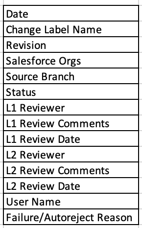
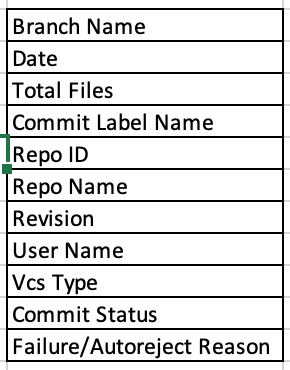
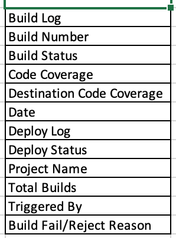
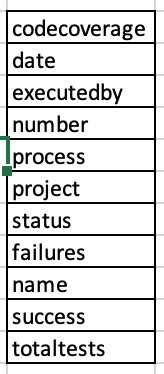

# Analytics

ARM allows its users to view all the deployment, merge, and dataloader-related information that is carried out in the [Salesforce Org](broken-reference) in the form of reports. This information improves productivity, accountability, and insight into your business data by generating reports.

Also, users have the option to produce reports either weekly, monthly, yearly, or between specific dates.

### Viewing Audit Reports 

The **Report** screen is best viewed when the zoom setting is 80% on your Chrome/Firefox browser.

1. Hover your mouse over the **Reports** module and click on the Analytics.\
   \
   .png>)\

2.  A screen displays the weekly summary report of EZ-Commits, deployments,[ dataloader](https://www.autorabit.com/blog/9-ways-a-salesforce-data-loader-assists-compliance/), TAF, and continuous integration.\

    <figure><figcaption></figcaption></figure>

<figure><figcaption></figcaption></figure>

\
3\. Click on the option to filter the data based on the chosen date range. The users can view the reports either **weekly**, **monthly,** or **yearly**.\
\

<figure><figcaption></figcaption></figure>

4. View the reports for the selected dates using the **date range** icons
5.  For CI Jobs triggered in ARM, you have a provision to view detailed reports for each project or all the projects at once.\

    <figure><figcaption></figcaption></figure>
6.  You can also expand the audit report of each module for better visualisation.\
    \

    <figure><figcaption></figcaption></figure>

### Downloading Reports 

Select the required data range to download under the Analytics screen, Click on **Fetch Latest reports**. \
\
&#x20;Click on **Download** you can export the report to a Zip format.\
\

<figure><figcaption></figcaption></figure>

Users can download reports for:

<table><thead><tr><th width="217">Report Type</th><th width="352">List of Columns Available in Each Report</th></tr></thead><tbody><tr><td><ol><li>EZ Merge</li></ol></td><td></td></tr><tr><td><ol start="2"><li>EZ Commits</li></ol></td><td></td></tr><tr><td><ol start="3"><li>Deployment</li></ol></td><td></td></tr><tr><td><ol start="4"><li>CI Build jobs</li></ol></td><td></td></tr><tr><td><ol start="5"><li>Data Loader</li></ol></td><td></td></tr><tr><td><ol start="6"><li>TAF</li></ol></td><td></td></tr></tbody></table>

By clicking on the "Latest 6 Months Report" option.
