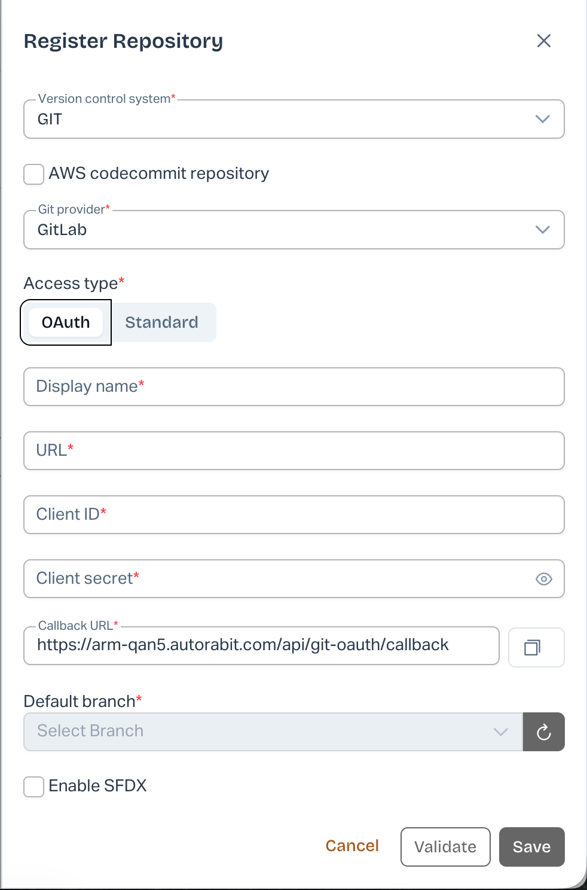
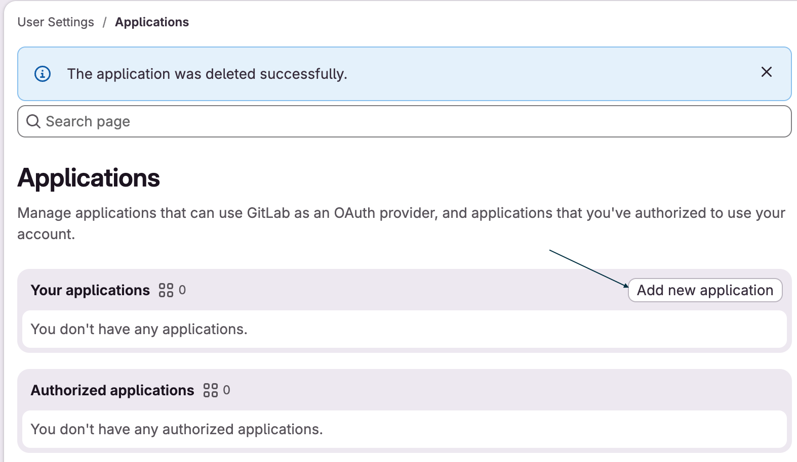
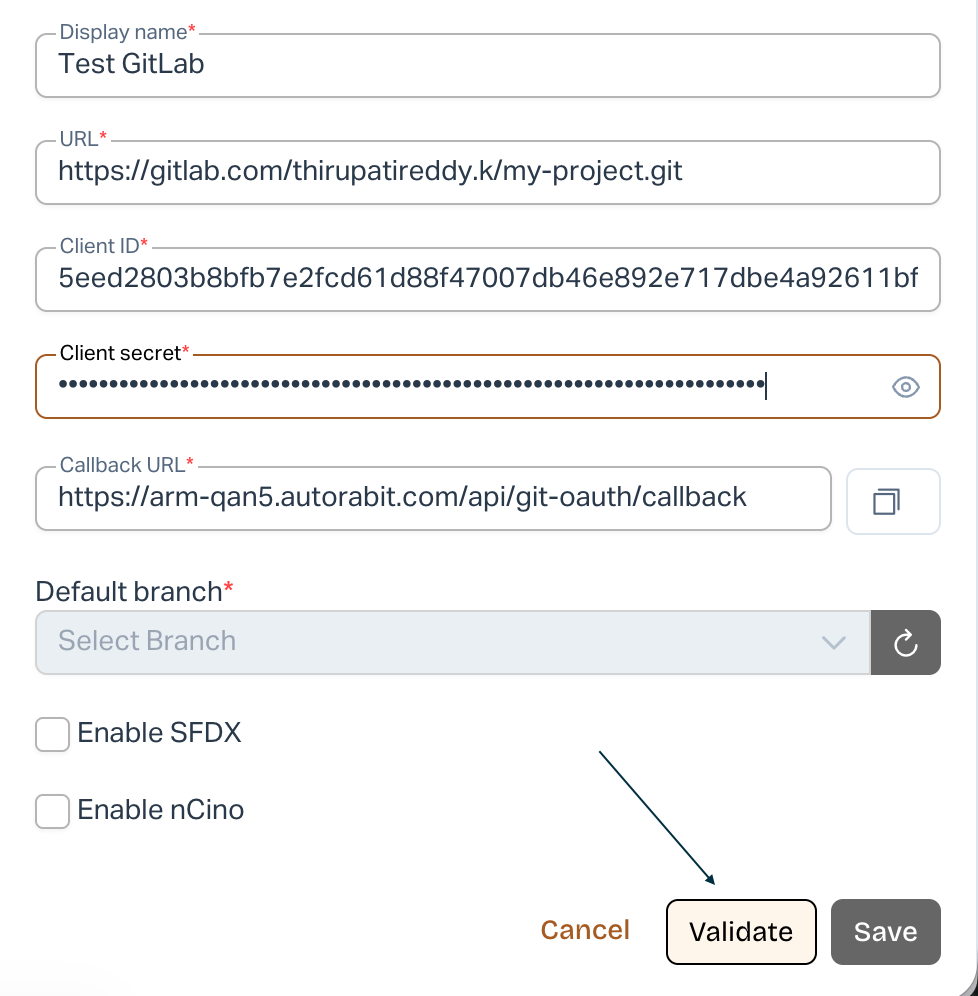
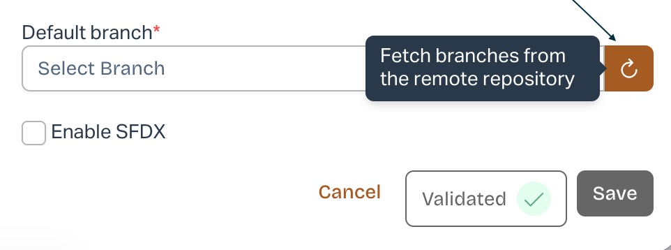
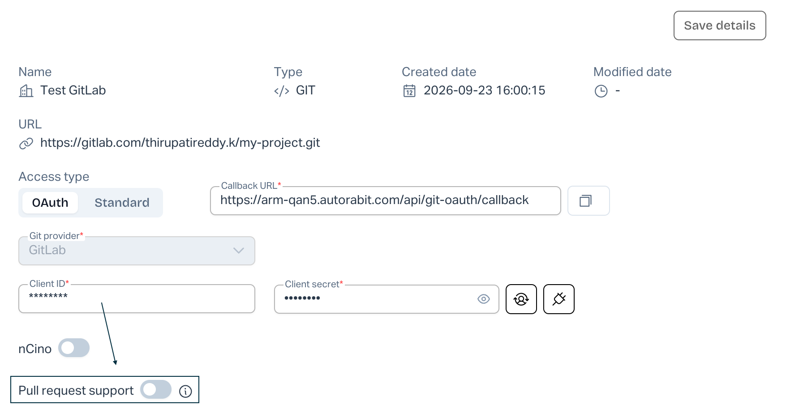
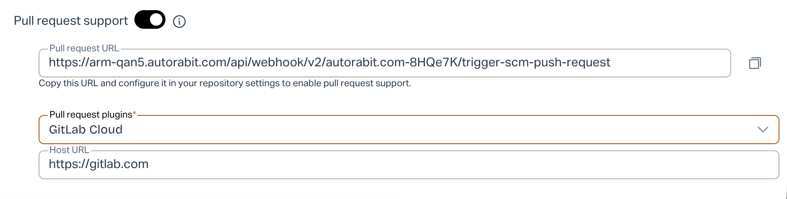

# Configure GitLab OAuth for Repository Registration in ARM

### Overview

ARM supports **OAuth authentication for GitLab repositories** as an alternative to Personal Access Token (PAT) and SSH authentication.

This article explains how to create a GitLab OAuth application, authorize ARM, and register a GitLab repository using OAuth.

### Prerequisites

Before you begin, ensure that:

* You have access to the GitLab repository.
* You have permission to create an OAuth application in GitLab.
* You have permission to register repositories in ARM.

### Configure GitLab OAuth

#### Step 1: Start Repository Registration in ARM

1. Log in to **ARM**.
2. Navigate to **Settings → Repositories**.
3. Click **Register repository**.
4. Select:
   * **Version control system:** GIT
   * **Git provider:** GitLab
   * **Access type:** OAuth

The OAuth configuration fields are displayed.

<figure><figcaption></figcaption></figure>

#### Step 2: Copy the Callback URL

ARM automatically generates a **Callback URL**.

Click the **Copy** icon next to the Callback URL.

Example:

`https://<your-arm-instance>/api/git-oauth/callback`

This URL is required when creating the OAuth application in GitLab.

#### Step 3: Create an OAuth Application in GitLab

<figure><figcaption></figcaption></figure>

Log in to GitLab and navigate to:

**User Settings → Access → Applications**

1. Under **Your applications**, click **Add new application**.
2. Enter an application **Name**.
3. Paste the ARM **Callback URL** into the **Redirect URI** field.
4. Keep **Confidential** enabled.
5. Select the required OAuth scopes for API, user, and repository access.
6. Click **Save application**.

GitLab creates the OAuth application and displays the **Application ID** and **Secret**.

> Copy and securely store the Application ID and Secret. The secret may only be available when the application is created.

#### Step 4: Configure the Repository in ARM

<figure><figcaption></figcaption></figure>

Return to **Register Repository** in ARM and provide:

* **Display name**
* **Repository URL**
* **Client ID** – GitLab Application ID
* **Client secret** – GitLab application Secret

The Callback URL is automatically populated by ARM.

#### Step 5: Validate and Authorize

Click **Validate**.

You are redirected to GitLab, where the application requests permission to access your account and repository.

Review the requested permissions and click **Authorize**.

After successful authorization, you are redirected back to ARM and the connection is displayed as **Validated**.

#### Step 6: Select the Default Branch

<figure><figcaption></figcaption></figure>

1. Click the **Fetch branches from the remote repository** icon next to **Default branch**.
2. Select the required branch, such as `main`.
3. Click **Save**.

The GitLab repository is now registered in ARM using OAuth authentication.

### Configure Pull Request Support

<figure><figcaption></figcaption></figure>

<figure><figcaption></figcaption></figure>

If pull request support is required:

1. Open the registered repository in ARM.
2. Enable **Pull request support**.
3. Copy the **Pull request URL** generated by ARM.
4. Configure the URL in the applicable GitLab repository settings.
5. Select **GitLab Cloud** under **Pull request plugins**.
6. For GitLab SaaS, verify the **Host URL** as `https://gitlab.com`.
7. Save the configuration.

### Re-authorize the Connection

If OAuth access is revoked or the credentials are changed, open the repository configuration in ARM and validate the connection again. Complete the GitLab authorization when prompted and save the updated configuration.
