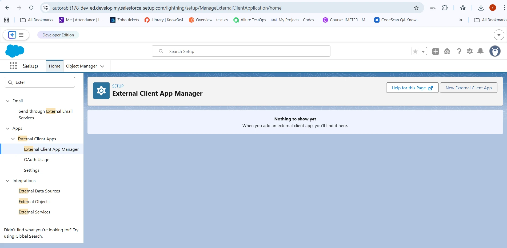
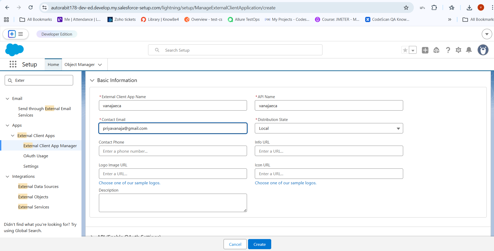
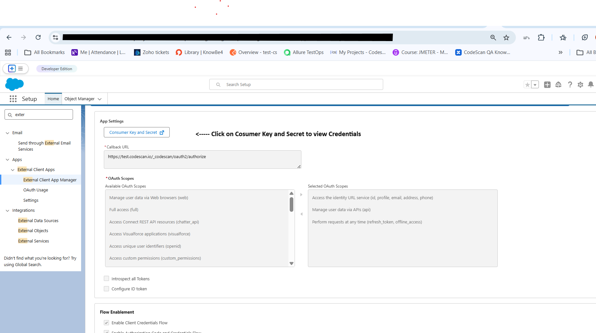
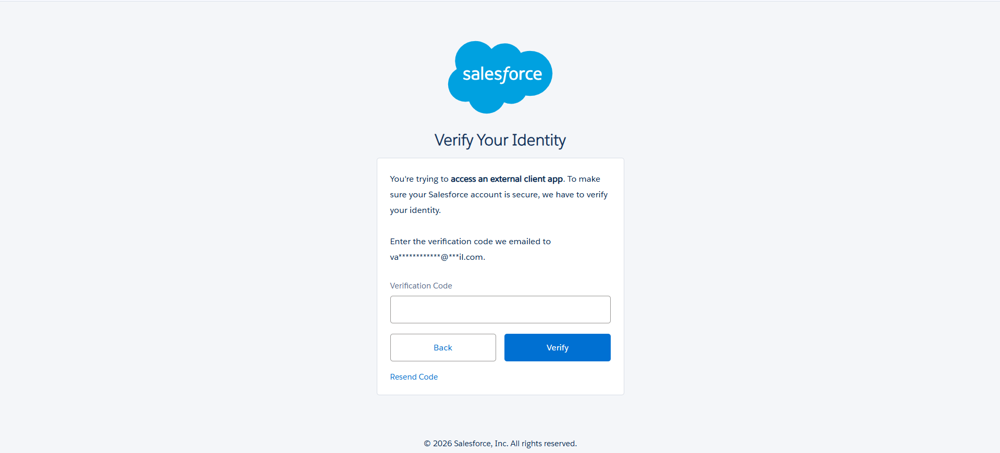
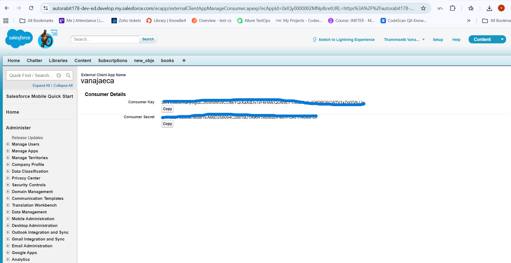
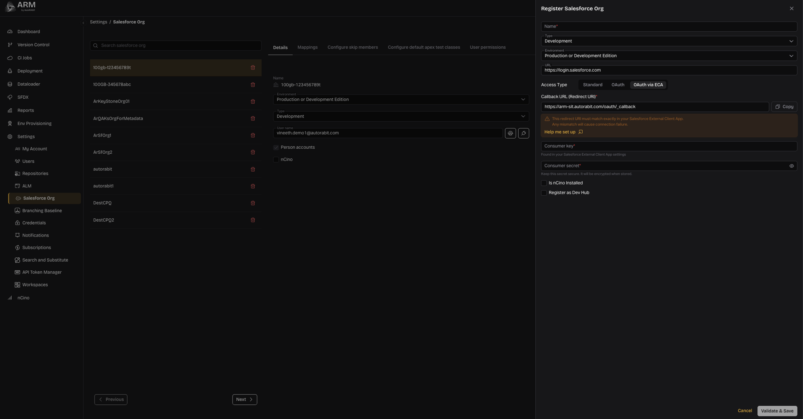
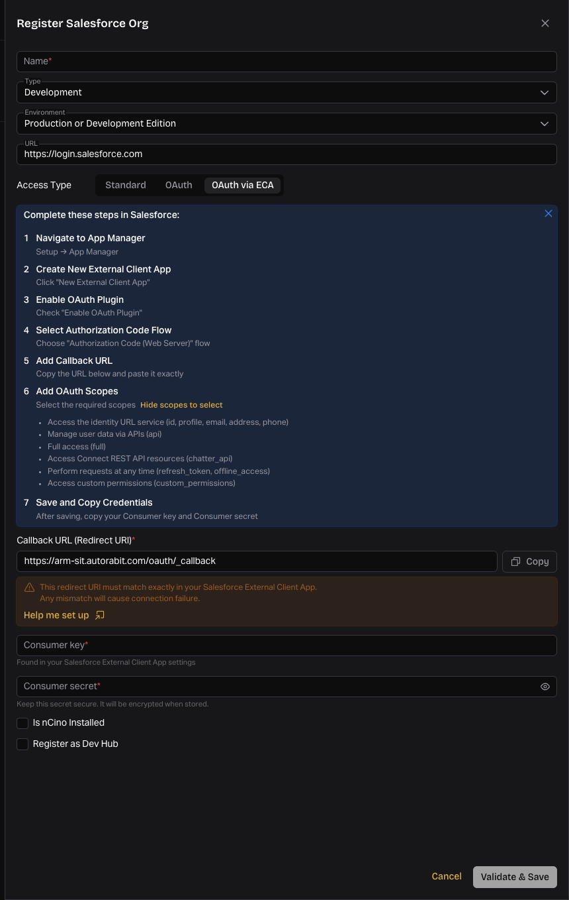
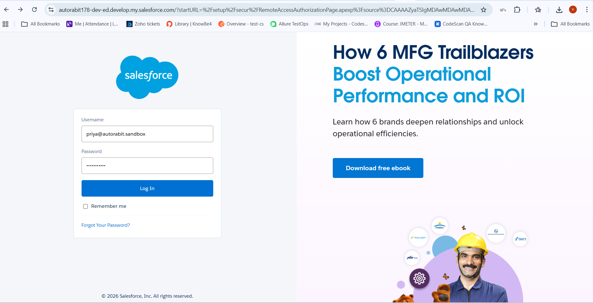
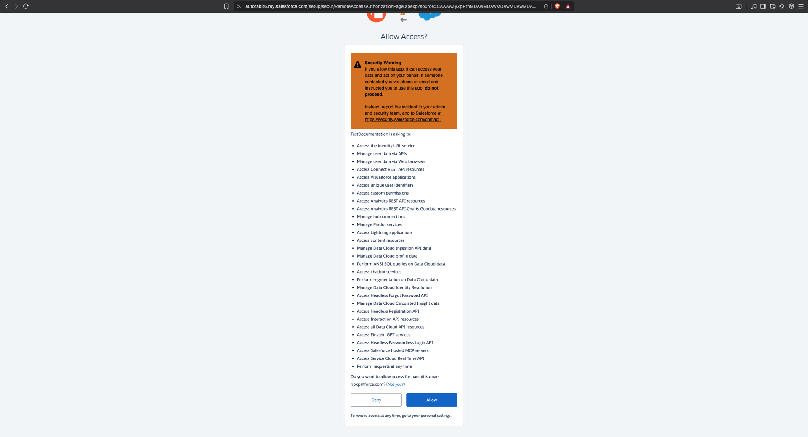
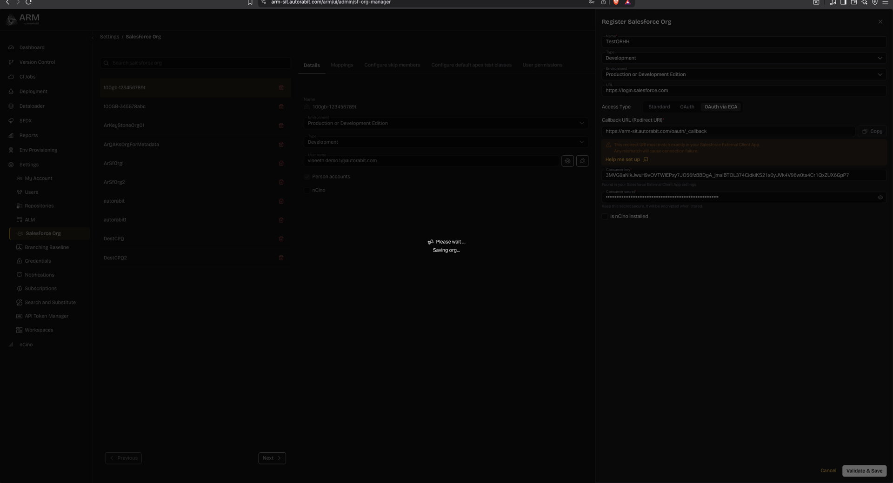

# ARM: Salesforce ECA Connection Setup Steps



### Pre-req: get your Callback URL (redirect URI)

For AutoRABIT’s ARM ECA setup, you need **the callback URL**

Callback URL is depending on the instance:

```
{$instancename}/oauth/_callback
```

Example:

```
https://arm-qan5.autorabit.com/oauth/_callback
```



### Create the External Client App (ECA) in your Salesforce Org

1. Login into Salesforce

<figure><figcaption></figcaption></figure>

2. In **Salesforce**, go to **Setup**.
3. In **Quick Find**, search **External Client Apps**.
4. Open **External Client App Manager** (or the External Client Apps area).

<figure><figcaption></figcaption></figure>

5. Click **New External Client App**.
6. Fill in the basics:

* **Name / Label ( e.g. AR\_Local)**
* **API Name** (auto-filled)
* **Contact Email**
* **Distribution State**:
  * **Local** (only for this org)

<figure><figcaption></figcaption></figure>




**Important Note**: After creating the ECA in Salesforce, there may be a replication delay on the Salesforce side. If you encounter the error error=invalid\_client\_id\&error\_description=client%20identifier%20invalid while attempting to connect or register the org, please wait 30 minutes, then try again to allow the Salesforce configuration to sync completely




### Enable OAuth + set callback URL + scopes <a href="#arm-3-enableoauthsetcallbackurlscopes" id="arm-3-enableoauthsetcallbackurlscopes"></a>

1. Click **Enable OAuth** (or expand **API (Enable OAuth Settings)** and check **Enable OAuth**).
2. Set \*_Callback URL_

The URL you collected in step 1.

3. Choose **OAuth Scopes**:

* Access the identity URL service (id, profile, email, address, phone)
* Manage user data via APIs (api)
* Full access (full)
* Access Connect REST API resources (chatter\_api)
* Perform requests at any time (refresh\_token, offline\_access)
* Access custom permissions (custom\_permissions)

<figure><figcaption></figcaption></figure>



### Flow Enablement <a href="#arm-4-turnment" id="arm-4-turnment"></a>

1. In **Flow Enablement**, select **Enable Authorization Code and Credentials Flow**.
2. **user credentials are required in the POST body** (Salesforce shows this option when you choose that flow) should be disabled.

<figure><figcaption></figcaption></figure>



### Security toggles (common defaults) <a href="#arm-5-securitytoggles-commondefaults" id="arm-5-securitytoggles-commondefaults"></a>

In the **Security** section the next options should be enabled:

* **Require secret for Web Server Flow**
* **Require secret for Refresh Token Flow**
* **Enable Refresh Token Rotation(Auto Selected)**
* **Limit Idle Refresh Token Time-to0Live (TTL) to 30 days(Auto Selected)**

**Note:** If this Salesforce Org remains inactive for **30 days**, the refresh token will expire. You must manually re-authenticate the registered Org from the ARM application before it can be used again.



### Create the app and capture Client ID / Secret <a href="#arm-6-createtheappandcaptureclientid-secret" id="arm-6-createtheappandcaptureclientid-secret"></a>

1. Click **Create**.
2. Open the app’s **Settings** tab and locate **Consumer Key and Secret**:

* **Consumer Key** = **Client ID**
* **Consumer Secret** = **Client Secret**

<figure><figcaption></figcaption></figure>

When you click the button for Consumer Key and Secret a code will be sent to the registered email for the user creating the configuration

<figure><figcaption></figcaption></figure>

After getting the code and verify in Salesforce the Consumer Key (CliendID) and Consumer Secret (Client Secret) will be displayed.

**IMPORTANT: STORE THIS VALUES IN A SAFE PLACE WHERE CAN BE EASILY USED FOR FUTURE REFERECES.**

<figure><figcaption></figcaption></figure>



### Configure Policies (very important) <a href="#arm-7-configurepolicies-veryimportant" id="arm-7-configurepolicies-veryimportant"></a>

After creating the ECA, open the **Policies** tab and adjust as needed (exact options vary by org/security posture), commonly:

* **Permitted Users**: often set to **Admin approved users are pre-authorized** for controlled rollouts.
* Add the required **profiles/permission sets** (or approved users) for who is allowed to authorize.



### What you’ll use in AutoRABIT <a href="#arm-8-whatyoulluseinautorabit" id="arm-8-whatyoulluseinautorabit"></a>

Once created, the set of values you’ll reference in your ARM configuration are:

* **Client ID**
* **Client Secret**

Also, the internal direction is to be clear that **one ECA per customer org** can be used across products (rather than creating one per AR product).

***

After the configuration in salesforce is complete, and you have obtained the ClientID and Client Secret, we can go to ARM to create the connection

In the menu Click in Salesforce org and click in register Salesforce org

<figure><figcaption></figcaption></figure>

Create the connections filling the required information obtained from Salesforce.

<figure><figcaption></figcaption></figure>

Important Note: After creating the ECA in Salesforce, there may be a replication delay on the Salesforce side. If you encounter the error error=invalid\_client\_id\&error\_description=client%20identifier%20invalid while attempting to connect or register the org, please wait 30 minutes, and try again to allow the Salesforce configuration to sync completely.

Once the Validate and save button is clicked a salesforce login is shown to login with the user we intend to use for the Connection.

<figure><figcaption></figcaption></figure>

A message from Salesforce will show to require granted permissions for the user to use the scopes defined in the ECA, Click Allow

<figure><figcaption></figcaption></figure>

Then, you will be returned to ARM and the connection will be saved.

<figure><figcaption></figcaption></figure>




**Important:** This setup is **Salesforce org-specific**. You must repeat this process **for each customer Salesforce org** you want to connect, since the External Client App is created inside (and scoped to) that org and produces org-specific credentials.

