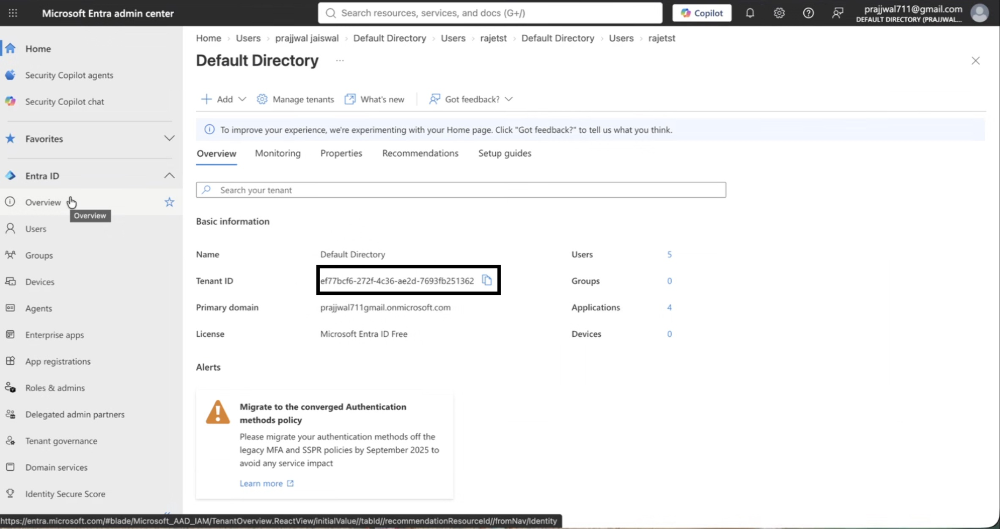
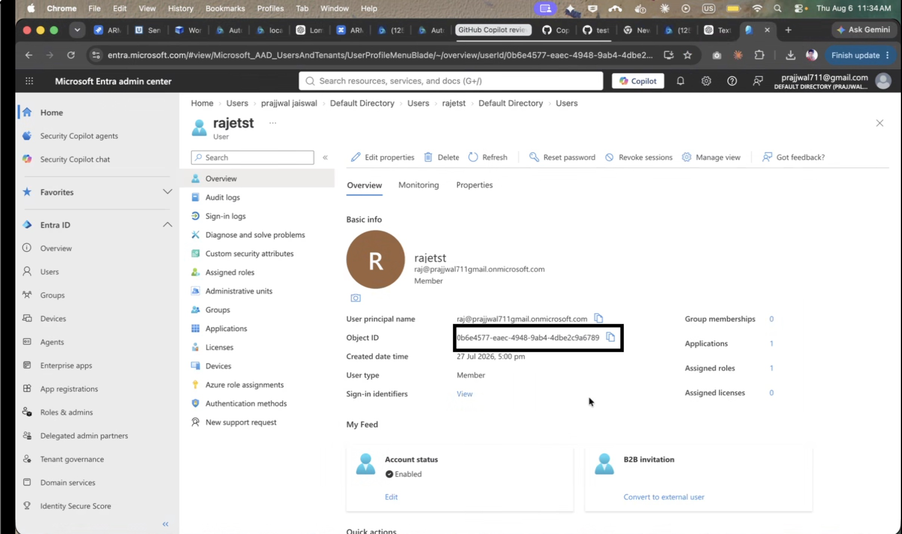

# Microsoft Entra ID

### Overview 

This step-by-step guide shows you how to configure **Single Sign-On (SSO)** in AutoRABIT using **Microsoft Entra ID**—formerly Azure Active Directory (Azure AD)—as your **SAML 2.0 identity provider (IdP)**.

When you connect AutoRABIT to Entra ID, you can:

1. Control in Entra ID which users can access AutoRABIT.
2. Let users sign in to AutoRABIT automatically with their Entra ID credentials.
3. Manage all accounts centrally from the Azure portal.

### Prerequisites 

Before you begin, make sure you have:

1. An active **Microsoft Entra ID** subscription.
2. **Administrator** permissions in both AutoRABIT and Entra ID.
3. AutoRABIT added to Entra ID as a **non-gallery application**.

***

## Configure SSO in Entra ID 

1. Sign in to the **Microsoft Entra** admin center.
2. In the left pane, select **Entra ID ▸ Enterprise applications**.
3. Choose **All applications** from the **Application type** filter.
4. Click **New application**. In **Add from the gallery**, search for _autorabit_ and press **Enter**.
5. Select **AutoRABIT**, rename it if desired, then click **Add**.
6. Open the **AutoRABIT** app page and select **Single sign-on**.
7. In **Select a single sign-on method**, choose **SAML**.
8. On **Set up single sign-on with SAML**, click the **Edit** (pencil) icon in **Basic SAML Configuration**.
9.  Enter the following values and click **Save**:

    | Field                      | Value format                          | Example                         |
    | -------------------------- | ------------------------------------- | ------------------------------- |
    | **Identifier (Entity ID)** | `https://<instanceURL>/saml/metadata` | `https://xyz.com/saml/metadata` |
    | **Reply URL**              | `https://<instanceURL>/saml/SSO`      | `https://xyz.com/saml/SSO`      |
    | **Sign-on URL**            | `https://<instanceURL>`               | `https://xyz.com`               |
10. Under **SAML Signing Certificate**, click **Download** next to **Federation Metadata XML** and save the file locally.

***

## Complete the setup in AutoRABIT 

1. Sign in to **AutoRABIT**.
2. From the navigation bar, hover over **Admin** and select **My Account**.
3. In **My Account**, scroll to **SSO Configuration**.
4. Upload the **metadata XML** file you downloaded from Entra ID.
5. Sign out of AutoRABIT.
6. Go to the AutoRABIT login page and click **Single Sign On**.
7. Enter your AutoRABIT domain, click **Go**, and sign in with your Entra ID credentials.

After completing these steps, users assigned to the AutoRABIT application in Entra ID can access AutoRABIT with seamless single sign-on.

## Microsoft Entra ID SSO with Tenant ID and Object ID Mapping

### Overview

AutoRABIT now provides enhanced **Microsoft Entra ID Single Sign-On (SSO)** support using **Tenant ID** and **Object ID** mapping.

Previously, SSO authentication primarily relied on matching the **Microsoft Entra ID username** with the **AutoRABIT username**. With this enhancement, administrators can map an AutoRABIT user directly to their Microsoft Entra identity using Tenant ID and Object ID.

This provides greater flexibility, particularly when the username in Microsoft Entra ID differs from the username configured in AutoRABIT.

### Prerequisites

Before configuring this feature:

1. Microsoft Entra ID SSO must already be configured for AutoRABIT.
2. You must have access to the user's **Tenant ID** and **Object ID** in Microsoft Entra ID.
3. You must have appropriate administrator permissions in AutoRABIT to edit user details.

***

### Locate the Tenant ID in Microsoft Entra ID

1. Sign in to the **Microsoft Entra admin center**.
2. Navigate to **Entra ID > Overview**.
3. Under **Basic information**, locate the **Tenant ID**.
4. Copy the Tenant ID.

<figure><figcaption></figcaption></figure>

> The Tenant ID identifies the Microsoft Entra tenant associated with the user.

***

### Locate the User Object ID

1. In the Microsoft Entra admin center, navigate to **Entra ID > Users**.
2. Select the required user.
3. On the user's **Overview** page, locate the **Object ID**.
4. Copy the Object ID.

<figure><figcaption></figcaption></figure>

> The Object ID uniquely identifies the user within the Microsoft Entra tenant.

***

### Configure the User in AutoRABIT

Edit the required user in AutoRABIT and configure the following fields:

* **Microsoft SSO Tenant ID** – Enter the Tenant ID obtained from Microsoft Entra ID.
* **Microsoft SSO Object ID** – Enter the Object ID of the corresponding Entra user.

<figure><figcaption></figcaption></figure>

Save the user configuration after entering the required details.

***

### How does SSO authentication work?

AutoRABIT validates the user's SSO identity in the following order:

| Scenario                                                                                                   | SSO Result                                                                                 |
| ---------------------------------------------------------------------------------------------------------- | ------------------------------------------------------------------------------------------ |
| Tenant ID and Object ID are valid                                                                          | **Login successful**, even when the Entra ID username and AutoRABIT username are different |
| Tenant ID/Object ID do not provide a valid match, but the Entra ID username matches the AutoRABIT username | **Login successful** using the existing username-based authentication                      |
| Tenant ID/Object ID do not provide a valid match and the usernames do not match                            | **Login unsuccessful**                                                                     |

This maintains compatibility with the existing username-based SSO flow while providing a more reliable identity-mapping option through Microsoft Entra IDs.

### Key Benefits

* Supports SSO when the **Microsoft Entra ID and AutoRABIT usernames are different**.
* Provides more precise user mapping using unique Microsoft Entra identifiers.
* Retains support for the existing **username-based SSO authentication**.
* Gives administrators greater flexibility when managing users across Microsoft Entra ID and AutoRABIT.
