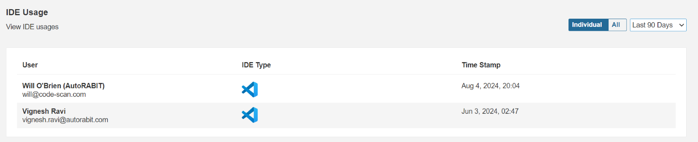

# Configure a Webhook in Microsoft Azure

In the world of Azure, a Webhook is a trigger. There are several systems in Azure that can be triggered, including:

* Runbooks in Azure Automation
* Web jobs in Web Apps or Service Fabric that allow a website to have a background task
* Functions, another Service Fabric feature but is a server-less method of running a task or small workflow

One of the scenarios that you will be most familiar with is runbooks in [Azure Automation](../../../integration-and-plugins/azure-devops.md). Automation allows us to create a runbook, which will perform some task, such as powering up one or more virtual machines. That runbook can be triggered or started in many ways, one of the methods is triggering via a webhook.

We can create a webhook in the Azure Portal or a runbook. This webhook generates a URI, a uniform resource identifier that looks like a URL. We can use this URI in any external system to start the runbook via HTTP POST action.

For example:\
_A developer writes an application that is running in Azure or anywhere with Internet access and when something happens, the URI is posted. Azure Automation will respond by executing the associated runbook._

## Create a Webhook API token from ARM&#x20;

1. Login into ARM&#x20;
2. Click on Admin Section -> API Token&#x20;
3. Click on Create API Token.&#x20;

<figure><figcaption></figcaption></figure>

4. Enter the token name&#x20;
5. Select Type as “webhook”&#x20;
6. Enter Description if required &#x20;
7. Click on Create Option&#x20;

<figure><figcaption></figcaption></figure>

8. Your New API Token is created&#x20;

### Create webhook with authentication on Azure&#x20;

1\. Log into Microsoft Azure Account at [https://portal.azure.com/](https://portal.azure.com/).&#x20;

2\. Go to your project Service Hooks page:&#x20;

`https://{orgName}/{projectname}/settings/serviceHooks`&#x20;

<figure><figcaption></figcaption></figure>

3\. Click on Create Subscription.&#x20;

4\. The wizard will start and give a list of all the services for which integration is to be created.&#x20;

<figure><figcaption></figcaption></figure>

5\. Click on Next and we will see a list of triggers when an event occurs. Select the event to trigger on and any filters (if applicable):&#x20;

<figure><figcaption></figcaption></figure>

<figure><figcaption></figcaption></figure>

6\. The next step is to provide the payload URL. The payload URL is the URL of the server that will receive the webhook POST requests. Paste the copied URL generated by AutoRABIT or enter the payload URL manually. &#x20;

Payload URL: `< instance_url>/api/webhook/v2/<orgname>/trigger-scm-push-request` &#x20;

For example: If the instance is https://login.autorabit.com, then the payload URL would be: [https://login.autorabit.com/api/webhook/v2/autorabit.com/trigger-scm-push-request](https://login.autorabit.com/api/webhook/v2/autorabit.com/trigger-scm-push-request)

7\. Add the basic authentication details as below &#x20;

**Basic authentication username:** ARM login username&#x20;

**Basic authentication password:** Webhook type API token generated from ARM&#x20;

<figure><figcaption></figcaption></figure>

8. Enter the Username used in Autorabit and password as webhook API Token generated in ARM.&#x20;


NOTE: If any type of trigger event, such as Pull Request and Pull Request updated, is required, use the same hook configuration with the above URL and respective authentication details."&#x20;


9. Confirm the settings are correct, test the subscription and then finish the wizard. &#x20;

<figure><figcaption></figcaption></figure>

10. Click on the Finish button to complete the service hook subscription. The webhook can be seen in the Service Hooks tab.&#x20;

<figure><figcaption></figcaption></figure>

11. Once the build is triggered via webhook and completed successfully, refresh the service hook tab to find out that the webhook succeeded. We can also view the history of webhooks to see how many times the event was triggered and if the webhook was completed successfully or not.&#x20;

#### For Enterprise customers: &#x20;

`/api/webhook/v2/<orgname>/enterprise/trigger-scm-push-request`&#x20;

`/api/webhook/v2/<orgname>/enterprise/sync-alm-commits` &#x20;

\
