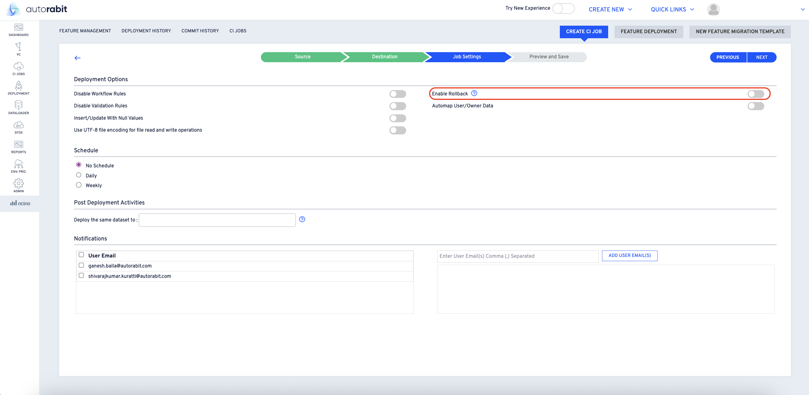

# Deployment via Version Control using Salesforce Org

This section is about deploying the nCino metadata and data via version control using the Salesforce dataset.

1. Hover your mouse over the [nCino ](https://www.autorabit.com/industry-solution/banking-financial-services-ncino/)module and click on the **Deployment History** option.

<figure><figcaption></figcaption></figure>

2. Click on the **Feature Deployment** button.

<figure><figcaption></figcaption></figure>

3. On the next screen, give the process a **name** and a brief **description** of it.
4. In the **Source** section, select Deployment From as [**Version Control**](https://www.autorabit.com/blog/8-benefits-of-version-control-in-salesforce-development/) **using Salesforce Org**.
5. Select your **Version Control** type, **Repository**, and **Branch**.
6.  Select the **deployment type**.

    * **Entire Branch:** This option will fetch the feature migration templates configured on your branch. You'll be asked to choose the **template** and **template version** when you select the entire branch option.

    <figure><figcaption></figcaption></figure>

    * **Single Revision:** This option will pull all of the versions from your repo, allowing you to choose which revision to use in the deployment.

    <figure><figcaption></figcaption></figure>

    <figure><figcaption></figcaption></figure>


After deploying a job, modifying the deployment type during subsequent edits may affect the integrity or effectiveness of any rollbacks performed thereafter.


7. Select your **Source Salesforce Org**.
8. Based on your template selection, the object configuration section will render the selected objects and apply filters and mappings.

<figure><figcaption></figcaption></figure>

9. Choose your **Destination Environment**.

<figure><figcaption></figcaption></figure>

10. There are various options that you can configure to your objects before you proceed with deployment or commit:

    * Applied Mappings
    * Applied Filters

    <figure><figcaption></figcaption></figure>

#### Applied Mappings 

In this section, you can use an external ID in place of a related record's Salesforce record ID to relate or associate records to each other as you process an Upsert operation. For example, if **Object B** has a lookup field to another **Object A** you can use the values contained in a field that's marked as an External ID on **Object A** to relate the two (**Object B** to **Object A** records).

In the **Source** field: Select your own source field whose values will get populated in the destination External Id field.

In the **Destination** field: Select the required field from the destination org whose values will remain unique for all the records.

<figure><figcaption></figcaption></figure>


**Important Note (About Applied Mappings)**:

1. Since the source for Deployment via **Template** or **Version Control** is a CSV file rather than a Salesforce Org, all fields, regardless of the External ID supported, will be fetched and displayed in the **Source** column. However, the relevant fields will be shown under the Destination column since the target org is a salesforce org.
2. AutoRABIT External ID fields are not supported for the **Upsert** operation.


#### Applied Filters 

Such filters will be displayed here if any filter is applied to the objects. You can edit the already applied filter (if required) using **Edit Filter.**

<figure><figcaption></figcaption></figure>

#### Deployment Option 

Based on your destination selection, you will have different deployment buttons to choose from:

1. **Create Dataset:** Create a dataset from your Salesforce Org. On selection, you will be redirected to the [Commits History](../../version-control/ez-commits/commits-summary.md) screen.
2. **Create Dataset & Deploy:** Create a dataset and deploy it to your Salesforce Org.

<figure><figcaption></figcaption></figure>

For deploying to the destination org, you will find the list of deployment criteria you can opt for before proceeding.

**Deployment Filters**

1. **Disable Workflow Rules:** This option will deactivate the workflow rules associated with objects part of the deployment
2. **Disable Validation Rules:** This option will deactivate the validation rules associated with objects part of the deployment
3. **Insert/update with Null Values:** This will either insert or update record field values with null (if the value is null in Source Org) in Destination Org
4. **Use UTF-8 file encoding for file read and write operations:** Use UTF-8 as the internal representation of strings. Text is transcoded from the local encoding to UTF-8 when data is written to or read from a file. UTF-8 must be enabled if your data exclusively contains English alphabets. UTF-8 must be disabled if your data contains non-English alphabets. UTF-8 should be enabled by default in accordance with Salesforce.

<figure><figcaption></figcaption></figure>

Click **OK** to complete the feature deployment process. You'll be redirected to the [Feature Deployment Summary](feature-deployment-summary.md) page, where you can view detailed deployment reports or re-deploy the nCino objects to your Salesforce Org once again.
