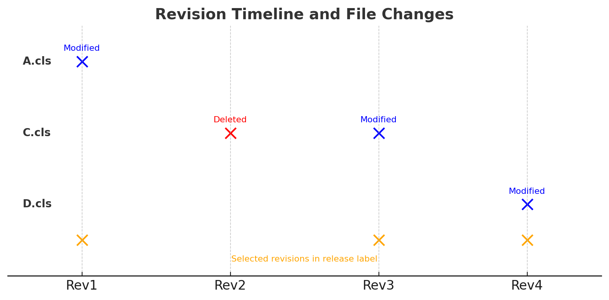

# Understanding Why Selected Files May Not Appear in the Artifact ZIP

**Plain Language Summary**\
Think of creating an artifact ZIP like packing a suitcase from your laundry.\
You pick items from three different laundry days, but when you actually pack, you only grab clothes from your **most recent laundry pile**.

\
If a shirt you wanted was already thrown away before that last laundry day, it won’t make it into your suitcase — even if it was in an earlier pile you selected.\
That’s how the artifact ZIP works: it only includes files that still exist in the latest revision you checked out.

***

### Overview

When creating a Release label and generating an artifact ZIP during deployment, you may notice that a file you selected is missing from the final ZIP.\
This is expected behavior in certain scenarios and is caused by the way Git checkout works during artifact preparation.

***

### Example Scenario

#### Git Revision History

```
nginxCopyEditRev1 → Rev2 → Rev3 → Rev4
```

**Changes per Revision:**

* **Rev1:** `A.cls` modified
* **Rev2:** `C.cls` deleted
* **Rev3:** `C.cls` modified
* **Rev4:** `D.cls` modified

**Selected Revisions in Release Label:** Rev1, Rev3, Rev4

**Expected:** `A.cls`, `C.cls`, and `D.cls` in the artifact ZIP\
**Actual:** `A.cls` and `D.cls` only (`C.cls` missing)

***

### Why This Happens

When preparing the artifact ZIP:

1. The system checks out the **latest selected revision** from your Release label.
   * In this example, the checkout happens at **Rev4**.
2. At **Rev4**, `C.cls` does not exist (it was deleted in Rev2).
3. Since the file is not present in the checkout directory, it cannot be copied into the package directory.
4. As a result, it’s not included in the artifact ZIP.

**Key point:**\
If a file does not exist in the codebase at the checkout revision, it will **not** be packaged — even if earlier or later selected revisions show changes to that file.

***

### Best Practices to Avoid Missing Files

* **Select the latest revision where the file exists** before it was deleted.
* If the file was deleted in a later commit but is still needed:
  * Restore it in your branch, or
  * Cherry-pick the revision containing the file before creating the artifact.
* **Group related changes into sequential commits** to minimize cross-revision dependencies.

***

### Visual: Timeline of File Changes

<figure><figcaption></figcaption></figure>

***

### Conclusion

This is not a defect — it’s an inherent behavior of Git checkout during artifact creation.\
To ensure all required files are included, plan your Release label selections so the final checkout state contains every file you want in your artifact ZIP.
