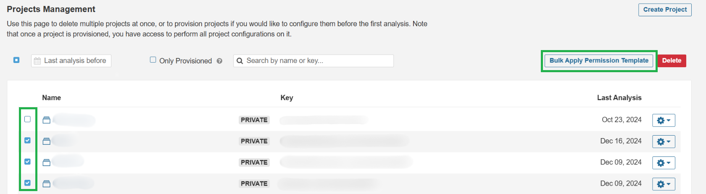

# URL Callout Integration with Tricentis

One of the key DevSecOps integrations available in ARM is Tricentis, a leading provider of continuous testing tools, to streamline the testing process in CI/CD pipelines. The integration between AutoRABIT and Tricentis is achieved through URL callouts, which allow these two platforms to communicate and trigger automated testing at various stages of the release process.&#x20;

This article details how AutoRABIT leverages the URL callout to integrate with Tricentis, ensuring seamless automated testing as part of the release lifecycle.&#x20;

### **URL Callout in AutoRABIT**&#x20;

In AutoRABIT, a URL callout is a configuration that allows AutoRABIT to send HTTP requests to external systems or services like Tricentis. This communication is initiated when specific conditions are met during the release or deployment process, typically when a new build is triggered or changes are ready to be tested.&#x20;

The callout allows AutoRABIT to:&#x20;

1. Trigger Automated Tests: When a new build or release package is ready, AutoRABIT sends a request to Tricentis to initiate the testing process.&#x20;
2. Pass Metadata and Configuration: Along with the trigger, the URL callout can pass essential information, such as the build version, specific test cases to run, and relevant metadata.&#x20;
3. Retrieve Test Results: After the tests are completed, Tricentis can send results back to AutoRABIT.&#x20;

Once Tricentis completes the testing, it can send back the test results using a callback URL or a direct API response, which AutoRABIT can capture. The following steps summarize how AutoRABIT handles the test results:&#x20;

* Notification and Reporting: AutoRABIT can be set up to notify teams (via email or other communication channels) with the results of the test execution. These results can also be logged for auditing and future reference.&#x20;

### Benefits of AutoRABIT-Tricentis Integration&#x20;

* Increased Automation: The seamless integration reduces the manual effort required for testing, enabling continuous delivery pipelines with high automation.&#x20;
* Improved Testing Efficiency: By automatically triggering relevant test cases in Tricentis based on build metadata, you ensure that testing is timely and targeted.&#x20;
* Faster Feedback Loops: Developers get real-time feedback on the quality of their code, helping to reduce the time spent on finding and fixing bugs late in the release cycle.&#x20;
* Enhanced Compliance and Reporting: All testing activities are tracked and logged in AutoRABIT, supporting compliance efforts and providing a clear audit trail.&#x20;

### How to Set Up a URL Callout in ARM for Tricentis

To automate testing from AutoRABIT, in a CI Job you can add a Callout URL that calls the Testim Salesforce REST API to trigger test execution of a Test, Test Plan, Test Suite, or Test Label. This is done seamlessly with a single webhook call; there is no need for intermediary VMs or CI tools. To do this:&#x20;

1. Obtain an API key (this is only available on Pro accounts). _Immediately copy this key, it is only visible when it is generated._&#x20;

<figure><figcaption>
API Keys Library
</figcaption></figure>

2. Go to the [Testim.io Public API](https://editor.swagger.io/?url=https://raw.githubusercontent.com/testimio/public-openapi/main/api.yaml) in Swagger and choose the type of remote execution API call for test execution; Test, Test Plan, Test Suite, or Test Label. Copy the JSON payload.&#x20;

<figure><figcaption>
Screenshot
</figcaption></figure>

3. In AutoRABIT, when creating a new CI Job, create a Callout URL to automate test execution in Testim Salesforce. You can choose the Callout URL to run Pre-Deployment or Post-Deployment (On Success or On Failure of the Deployment).

**Complete the following:**&#x20;

1. Method set as POST URL. Use the REST API call from Step 2 and append at the end of the URL the Test, Plan, or Suite ID, or Label, e.g., https://api.testim.io/tests/run/234&#x20;
2. Authorization. Select “Custom” and add in “Bearer YOUR-API-KEY” where YOUR-API-KEY is from Step 1.&#x20;
3. Content Type. Select “JSON (application/json)”.
4.  Content. Paste the JSON payload from Swagger from Step 2.

    <figure><figcaption>
Screenshot
</figcaption></figure>
5.  Content. In the JSON payload for the key:value pair:

    1. “grid” : “string” replace “string” with the name of one of your grids, found in the Grids section of your profile in the top right of Testim Salesforce.
    2. “branch” : “master” replace “master” with the name of the branch that points to the Salesforce environment that the tests will be executed against.

    <figure><figcaption>
Screenshot
</figcaption></figure>
6. &#x20;Save the CI Job. Whenever the CI Job runs, the Callout URL will trigger the execution of tests in Testim Salesforce. Log in to Testim Salesforce to view the results.&#x20;

### Conclusion&#x20;

AutoRABIT’s integration with Tricentis via URL callouts ensures that testing becomes an integrated, automated part of the release process. This approach allows organizations to leverage the full power of the Tricentis testing suite while benefiting from the release management and automation capabilities of AutoRABIT. &#x20;

&#x20;
