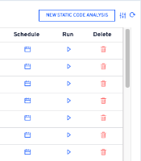
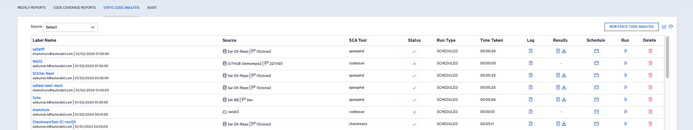
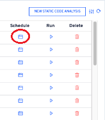
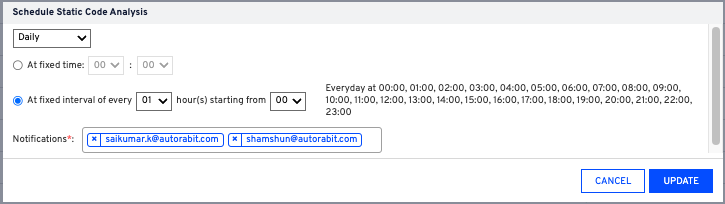

# Static Code Analysis

### Overview 

Static code analysis, or static analysis, is a software verification activity that analyzes source code for quality, reliability, and security without executing the code. Using static analysis, you can identify defects and security vulnerabilities that could compromise the safety and security of your application. Static analysis can be a cost-effective approach to measuring and tracking software quality metrics without the overhead of writing test cases or instrumenting your code.

Static analysis is generally good at finding coding issues, such as:

* Programming errors
* Coding standard violations
* Undefined values
* Syntax violations
* Security vulnerabilities

### Run Static Code Analysis 

To run a static code tool on your [Salesforce Org](arm-administration/registration/salesforce-org/) or Version Control Branch, follow the below steps:

1.  Hover your mouse over the **REPORTS** module and choose the option: [**STATIC CODE ANALYSIS**](https://www.autorabit.com/products/codescan/)\

    <figure><figcaption></figcaption></figure>
2. Click on the **NEW STATIC CODE ANALYSIS** button at the top right corner of the screen.\

<figure><figcaption></figcaption></figure>

3. On the next screen, enter a **Label Name**.
4.  Choose **Source** as **Salesforce Org** or **Version Control**.

    *   For **Salesforce Org** selection, choose the Salesforce Org for which the SCA will be performed.\

        <figure><figcaption></figcaption></figure>
    * For [**Version Control**](arm-features/version-control/) selection, choose your source **Repository** and **Branch**.

    <figure><figcaption></figcaption></figure>

    * Select **Source** as **Salesforce org**, then new options become available:

<figure><figcaption></figcaption></figure>

* When performing a prevalidation commit with SCA analysis in DX format on the respective SF Org and package directory, consistency with previously executed analyses for this SF Org and related directory is crucial. Choosing the appropriate comparison branch is essential for accurate evaluations.
* Existing analyses lack branch tracking, limiting the effectiveness of the fix to new analyses if transitioning from a base scan in mdapi to DX, project deletion, and rerun become necessary for recreation in the DX source structure.
* Building on point #1, achieving the described outcome is unattainable with different structures but aligns seamlessly within a single structure per project.
* Depending on the need, a Salesforce or a repository must be bonded with either mdapi or DX source structure but not with both.

5. Select the SCA tool from the drop-down list. For example, [_CodeScan_](https://www.codescan.io/), _ApexPMD, Checkmarx, Salesforce Scanner, or SonarQube_.\

<figure><figcaption></figcaption></figure>


Note: Before running the **Static Code Analysis** tool, you must enable them under the **My Account > Plugins** section.


6. The list of respective **Metadata Types** is displayed for the selected SCA tool. By default, all are selected. You can unselect certain metadata types as per your requirements.\
   Supported Metadata Types:
   * For **ApexPMD, Checkmarx, SonarQube**: _Apex Classes, Apex Triggers, Apex Pages, AuraDefinitionBundle, LightningComponentBundle._
   * For **Codescan, Salesforce Scanner**: _ApexClasses, ApexPages, ApexTriggers, AuraDefinitionBundle, CustomObjects, Flow, LightningComponentBundle, PermissionSets, Profiles, Settings, SharingRules, Workflows, StaticResource._
7. For **CodeScan** or **SonarQube**, choose the **Baseline Branch** if you want to run comparisons between reports.\
   
8. Select the recipients for the alert under the **Notifications** field. Multiple recipients can be added here.
9. Next, choose the frequency for SCA to run, i.e., daily, weekly, or at any specific interval. For example, if you want the SCA tool to run daily at **10 AM**, select the **Daily** option and set the fixed time to 10.

<figure><figcaption></figcaption></figure>

<figure><figcaption></figcaption></figure>

10. Click on **SAVE**.
11. Upon confirmation, you'll be redirected to the home page, where you can find your recently configured SCA.

<figure><figcaption></figcaption></figure>


**Important Note:**

When the analysis is run on a zip file, the content is not visible in UI. But Salesforce Scanner can scan the zipped file and provide the vulnerabilities. However, the file contents for **Static Resource** metadata type are empty.


#### Additional options on this page 

1. **Editing the Schedule:** Locate the edit schedule icon:

<figure><figcaption></figcaption></figure>

2. Choose the desired report frequency (daily, weekly, monthly, etc.).
3. Specify the exact times for reports to run.
4. Please add/remove an email If you want to send/not send the notification.
5. Click on **UPDATE** to save and confirm the changes made to the schedule.

<figure><figcaption></figcaption></figure>

6. **Running On-demand SCA**: To run the SCA tool before the scheduled time frame, click on the     **Run (****)** button.\

<figure><figcaption></figcaption></figure>

<figure><figcaption></figcaption></figure>

7. **Log**: Click on the **Log** () icon to find the detailed log report.

<figure><figcaption></figcaption></figure>

<figure><figcaption></figcaption></figure>

8. **SCA Result**: ARM generates a detailed SCA report whenever you run static code analysis. This report will have info about the reviewed files and the related violations. Click on each file to view its related violations at the bottom right side of the page. If you click on any violation, it will take you to the respective line (in the black screen on the right side) where the violation occurred.\
   \

<figure><figcaption></figcaption></figure>

<figure><figcaption></figcaption></figure>

9. **Download SCA Report**: Click on the **Download** () icon to download the report in CSV format on your local device.
10. **Delete SCA process**: Click on the **Delete (****)** icon to delete the SCA process configured for your org/anch. This cannot be undone.
11. **View the SCA run details**: To view the list of SCA runs to date along with individual SCA results, click on the **Label Name**. The main screen shows the last details of the SCA run.\

    <figure><figcaption></figcaption></figure>

### **Points to Note:** 

We are utilizing **\<sforgname>** or **\<reponame>** as the project’s unique identifier, and we’re creating short-lived branches for each run. Thus, the technique builds a single project for a single Salesforce Org or Version Control Repo/branch and then executes the analysis on the short-lived branches.

The naming convention for the short-lived branches: **\<jobname\_branchname>**

The short-lived branches are active for a limited time (30 days by default, depending on _SonarQube/CodeScan_ configuration), after which they will be automatically deleted. The report will remain on ARM. However, the branch will be removed from the _SonarQube/CodeScan_ side.

Scans will run only on the **source**, whether the source is **VC Repo** or **SF Org**. The scan results will then be available in the **Reports** module. Users can trace the job that is run in ARM to the scan using the unique identifier.


**Important Note:**

If there is no **master analysis** available, you will get the following message on the screen:&#x20;

_You do not have a Master analysis. We recommend you run the Master (baseline) analysis from the Static Code Analysis (hyperlink) section in the Reports module before you proceed. If you do not run the Master analysis, the analysis from this job will become your Master (baseline) analysis._

Click **Continue anyway** to proceed with the new analysis as Master.

