# Source Org Registration

## Purpose

This guide explains the source org registration workflow in AutoRABIT Vault. The flow connects a Salesforce org to AutoRABIT Vault by capturing environment details, guiding the required Salesforce External Client App setup, authorizing access, validating the connection, and completing the registration.

After the source org is registered successfully, AutoRABIT Vault displays the connected org on the Dashboard and enables the next onboarding actions, including backup configuration and source org re-authentication when required.

## Workflow Overview

| **Area**                                               | **Behavior**                                                                                        |
| ------------------------------------------------------ | --------------------------------------------------------------------------------------------------- |
| **Environment Details**                                | Captures the source org name, Salesforce username, org type, login URL, and Salesforce API Version. |
| **Salesforce Admin Setup**                             | Provides the Salesforce-side setup checklist for creating and configuring the External Client App.  |
| **Enter Credentials**                                  | Stores the Client ID and Client Secret generated in Salesforce for secure authorization.            |
| **Authorize AutoRABIT** **Vault to Access Salesforce** | Redirects to Salesforce, requests access, and returns to AutoRABIT Vault after access is approved.  |
| **Validation & Confirmation**                          | Tests the API connection and completes the registration when validation succeeds.                   |

## Start Source Org Registration

The source org registration starts from the AutoRABIT Vault Dashboard. When registration begins, AutoRABIT Vault opens the Source Org Registration workflow and displays the Environment Details step. A guided callout introduces the setup and explains that the first Salesforce org must be connected before AutoRABIT Vault activities such as backups, restores, replication, and related operations can proceed.

<figure><figcaption></figcaption></figure>

The Environment Details step captures the basic Salesforce environment information. The Environment Name identifies the org across AutoRABIT Vault activities. The Salesforce username identifies the account used for registration. Org Type defines whether the connection targets a Production org or a Sandbox org.

After the org type is selected, the Salesforce Login URL is reviewed. For Sandbox connections, the sandbox login URL is used by default. If the Salesforce org uses a custom domain, the login URL is updated to match the custom domain. The Salesforce API Version is then selected from the available list. The latest supported API version is preferred unless a specific compatibility requirement applies.


**Note:** The login URL must point to the same Salesforce environment where the External Client App is configured. A mismatch can prevent successful authorization.


<figure><figcaption></figcaption></figure>

<figure>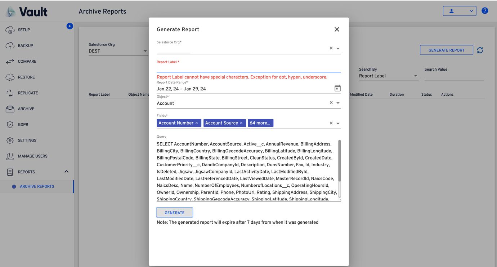<figcaption></figcaption></figure>

<figure>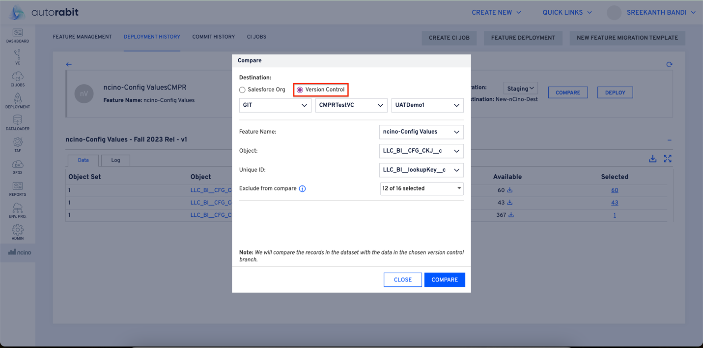<figcaption></figcaption></figure>

<figure>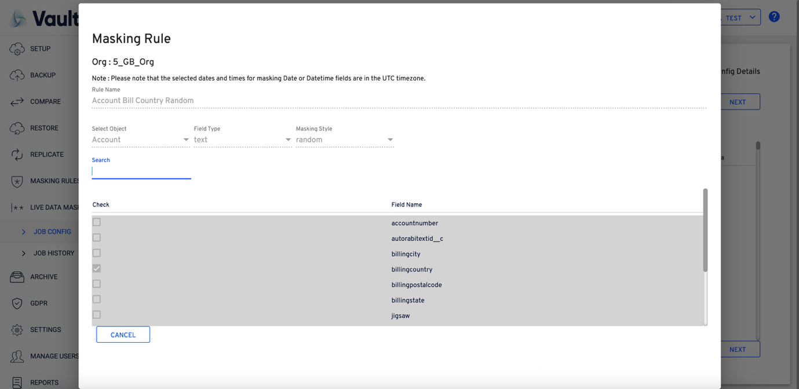<figcaption></figcaption></figure>

<figure>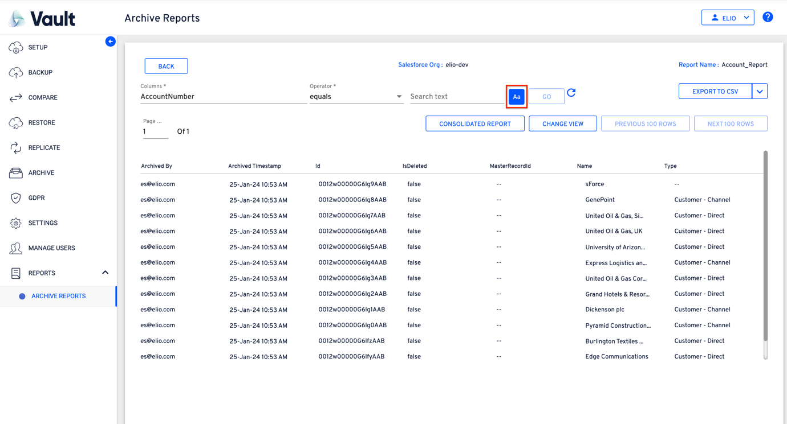<figcaption></figcaption></figure>

After the environment details are submitted, AutoRABIT Vault moves to Salesforce Admin Setup. This step provides a checklist for completing the required configuration in Salesforce before authorization. The setup creates an External Client App, enables OAuth, selects the Authorization Code Flow, disables the PKCE security option when required by the displayed instructions, adds the Callback URL, assigns OAuth scopes, and saves the credentials needed by AutoRABIT Vault.

AutoRABIT Vault displays the Callback URL directly in the workflow. The value is copied using Copy and pasted into the Callback URL field of the Salesforce External Client App. The redirect URI must match exactly. Any mismatch can cause the connection to fail during authorization.

The Required OAuth Scopes section identifies the permissions that must be selected in Salesforce. These scopes allow AutoRABIT Vault to access identity information, use Salesforce APIs, use browser-based OAuth authorization, access the connected org, and perform requests when needed after the initial login.


**Note:** The Salesforce setup must be completed before authorization starts. The Callback URL, OAuth scopes, Client ID, and Client Secret must match the External Client App configuration in Salesforce.


<figure>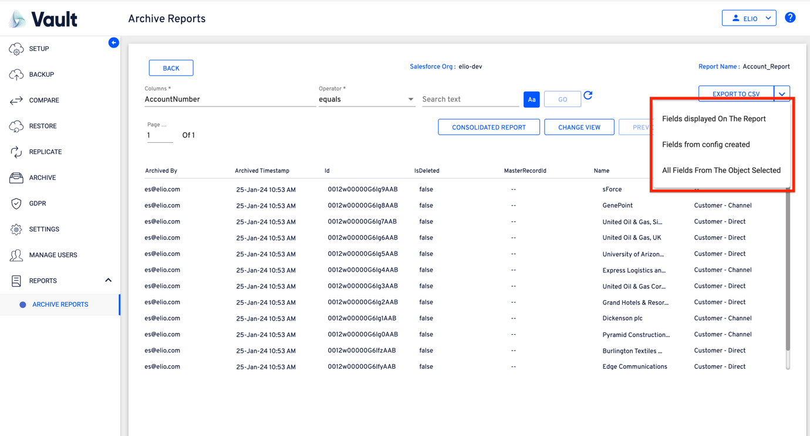<figcaption></figcaption></figure>

<figure>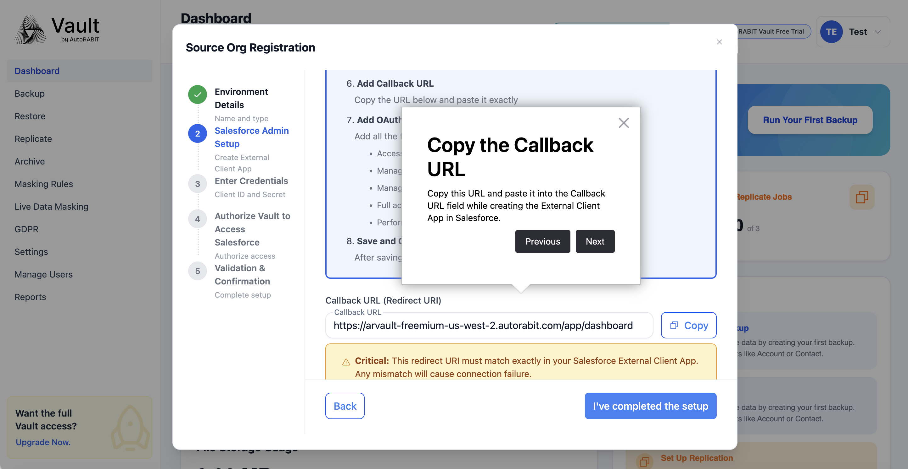<figcaption></figcaption></figure>

<figure>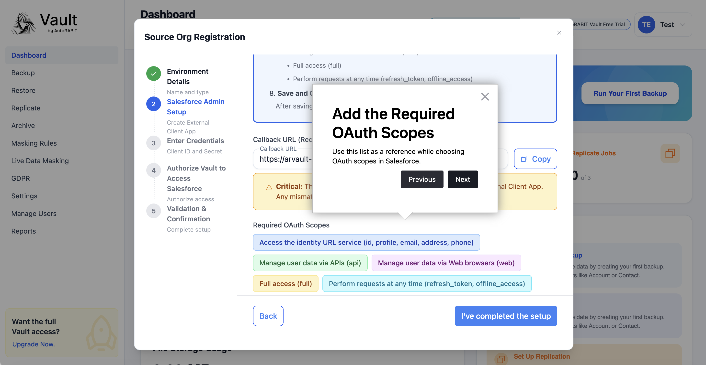<figcaption></figcaption></figure>

<figure>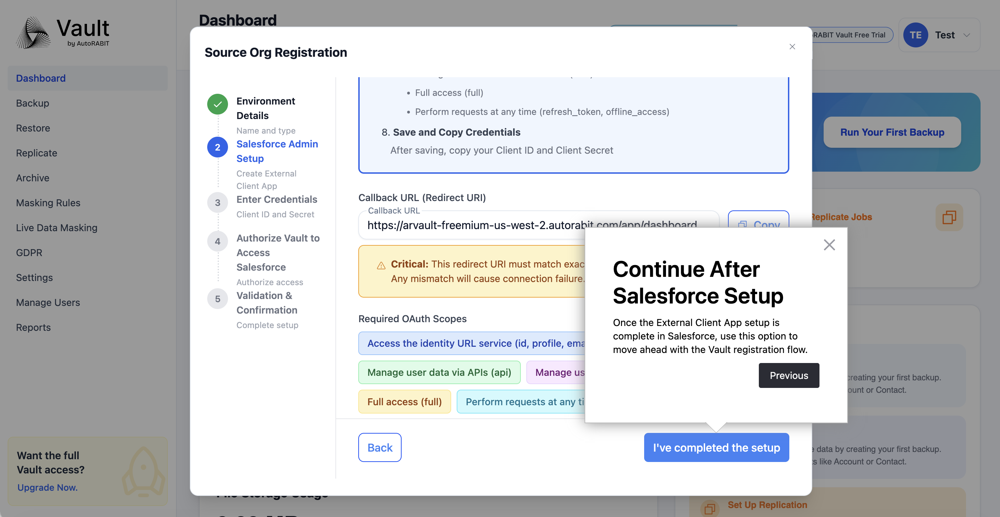<figcaption></figcaption></figure>

<figure>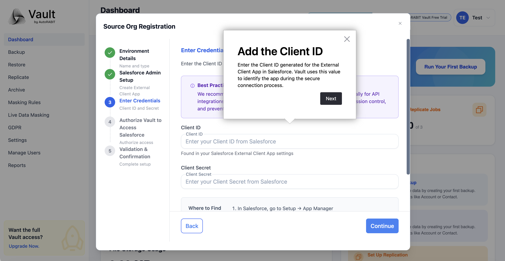<figcaption></figcaption></figure>

<figure><figcaption></figcaption></figure>

<figure><figcaption></figcaption></figure>

<figure><figcaption></figcaption></figure>

Once the Salesforce setup is complete, AutoRABIT Vault displays the Enter Credentials step. The Client ID and Client Secret generated from the Salesforce External Client App are entered in AutoRABIT Vault. These values are used only for the secure connection process and must be copied from the same External Client App configured for this source org.

AutoRABIT Vault also displays guidance for locating the required values in Salesforce. The Client ID and Client Secret are available from the External Client App details after the consumer credentials are revealed in Salesforce.


**Note**: A dedicated Salesforce integration account is recommended for API integrations. This provides better audit trails, permission control, and stability when personal accounts change


<figure><figcaption></figcaption></figure>

<figure><figcaption></figcaption></figure>

After the credentials are added, AutoRABIT Vault displays the Authorize Vault to Access Salesforce step. The connection details are reviewed before authorization starts. AutoRABIT Vault shows the org title, org type, and login URL so the connection target can be confirmed before continuing.

Selecting Connect to Salesforce redirects to the Salesforce login page. Salesforce handles authentication directly. After successful login, Salesforce displays the access request for the External Client App. Selecting Allow grants the required permissions and redirects the session back to AutoRABIT Vault automatically.

>)

>)

>)

>)

After Salesforce authorization is approved, AutoRABIT Vault completes the Salesforce connection and returns to the registration workflow. The Validation & Confirmation step displays the connected environment details and provides Test API Connection to confirm that AutoRABIT Vault can communicate with the Salesforce org.

When the API connection test succeeds, AutoRABIT Vault displays a success notification. The Complete action finalizes the registration. AutoRABIT Vault then confirms that the Salesforce org is registered successfully and returns to the Dashboard.

>)

>)

>)

<figure>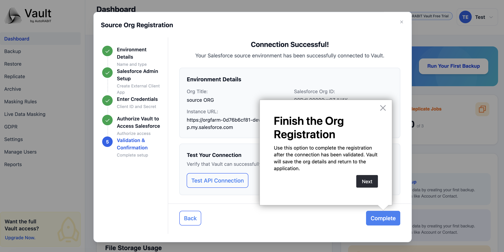<figcaption></figcaption></figure>

After registration is complete, the Dashboard displays the registered Source Org with a successful connection status. AutoRABIT Vault updates the onboarding state and enables the next recommended action, such as running the first backup. The source org details can be opened from the Dashboard to review the registered environment information.

The source org details view displays the org name, registered username, org ID, API version, instance URL, environment type, platform, org edition, authentication type, and registration time. These details provide a quick confirmation of the registered Salesforce connection.

<figure>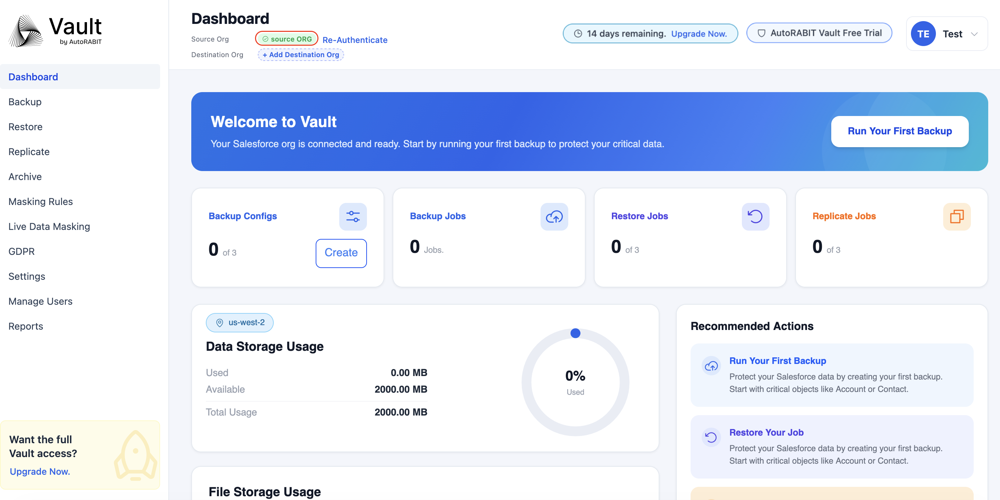<figcaption></figcaption></figure>

<figure>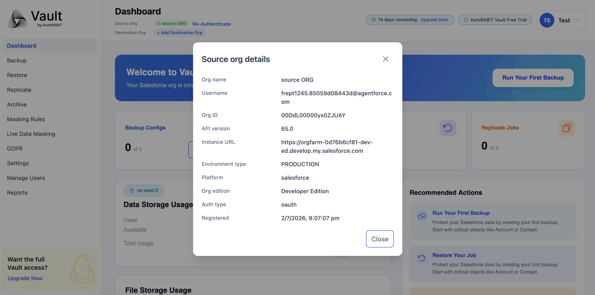<figcaption></figcaption></figure>

<figure>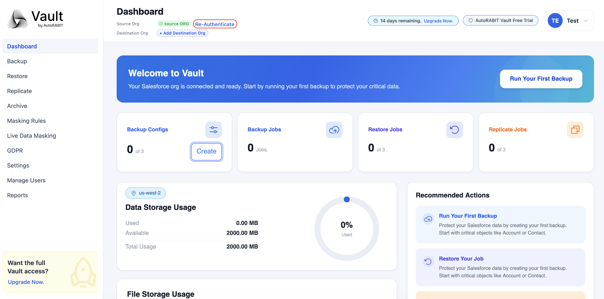<figcaption></figcaption></figure>

## Re-Authenticate the Source Org

AutoRABIT Vault displays Re-Authenticate beside the registered Source Org. Re-authentication is used when the Salesforce authorization needs to be refreshed, such as after credential changes, permission updates, or authorization issues. Selecting Re-Authenticate redirects to Salesforce login and follows the same authorization pattern used during the initial connection.

>)

## Final Result

The source org registration is complete when AutoRABIT Vault validates the Salesforce API connection, displays the registration success notification, and shows the connected Source Org on the Dashboard. The org is then ready for AutoRABIT Vault activities supported by the free trial, including backup setup and subsequent onboarding actions.

## System Behavior Summary

| **Area**                               | **Behavior**                                                                                         |
| -------------------------------------- | ---------------------------------------------------------------------------------------------------- |
| **Guided setup**                       | AutoRABIT Vault displays step-by-step callouts that explain the purpose of each registration stage.  |
| **Callback URL validation dependency** | The Callback URL must match the Salesforce External Client App redirect URI exactly.                 |
| **OAuth scope dependency**             | The required OAuth scopes must be selected in Salesforce before authorization succeeds.              |
| **Connection validation**              | Test API Connection verifies that AutoRABIT Vault can communicate with the connected Salesforce org. |
| **Successful completion**              | AutoRABIT Vault displays success notifications and adds the connected Source Org to the Dashboard.   |
| **Re-authentication**                  | AutoRABIT Vault provides Re-Authenticate to refresh the Salesforce authorization when needed.        |
