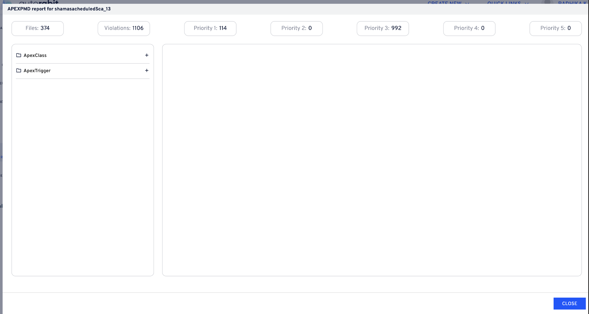
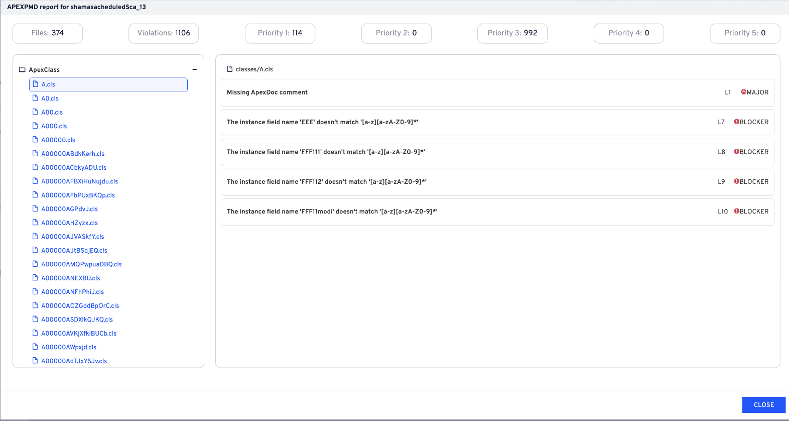
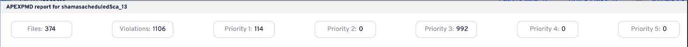

# CodeScan Integration with ARM

ARM, an _Automated Release Management_ solution built for the Salesforce platform, delivers fast CI/CD solutions for DevOps teams.

This helps us to offer essential solutions to the [Salesforce DevOps](https://www.autorabit.com/blog/how-do-i-choose-the-best-salesforce-devops-tools/) ecosystem. [ARM](https://www.autorabit.com/products/automated-release-management/) partnered with our CodeScan automated code review and standardization enables developers on the Salesforce platform to deliver new customer experiences with better quality, greater velocity, and increased security.

To integrate all the functionalities included in your CodeScan account with ARM, you need to integrate CodeScan as a plugin with your ARM account which involves a few steps in your CodeScan as well as ARM account.

To integrate [CodeScan](https://www.codescan.io/) with the ARM, follow the procedure as described below.

#### Create a CodeScan Token 

1. Click [HERE](https://knowledgebase.autorabit.com/codescan/docs/generate-a-security-token) to see the documentation on how create a new security token.
2. Copy the **token**. This token will be used while storing your credential with [ARM](https://www.autorabit.com/).

#### Store your CodeScan's credential in ARM 

1. Login into your ARM account.
2. Go to the **Admin** module and click on **Credentials**.

<figure><figcaption></figcaption></figure>

3. Next, click on **Create Credential** from the right navigation bar.

<figure><figcaption></figcaption></figure>

4. On the next pop up screen, enter the **Credential name**.
5. Choose the **Credential Type** as **User name with Password**.
6. Choose your **Credential Scope**,
   * **Global:** Credential can be accessed within the team
   * **Private:** Credential for private usage
7. **Username**: Enter the username for your CodeScan account.
8. **Password:** Use the copied token (CodeScan token) you made in the previous step as a password.
9. Please double check that you use your CodeScan username instead of the email address that you use to log in to CodeScan.
10. Click **Save**.

<figure><figcaption></figcaption></figure>

#### Integrate ARM with CodeScan 

1. Go to **Admin > My Account** section.
2. Go to the **Plugins** section.
3. Select the **CodeScan** checkbox under **Static Code Analysis**.

<figure><figcaption></figcaption></figure>

4.  Fill in the below details:

    * Enter the CodeScan hosted URL.
    * For CodeScan cloud version use [https://app.codescan.io](https://app.codescan.io/).
    * Choose the **Host Type** i.e., Cloud or On-premise. For CodeScan hosted on Cloud, you need to add the [**Organization Key**](https://knowledgebase.autorabit.com/codescan/docs/finding-your-organization-keys).

    <figure><figcaption></figcaption></figure>
5. Select your **Credential** from the drop-down.
6. Click **Test Connection** to check if the connection has been authenticated or not. A success message is displayed after the authentication is completed.
7. Click **Save**.

<figure><figcaption></figcaption></figure>

8. Click on **Save** again and your CodeScan integration is all set.

<figure><figcaption></figcaption></figure>

#### Configuring CodeScan's Global Criteria in ARM 

1. Go to **Admin > My Account** section.
2. Next, navigate to the **Validation Criteria-Static Code Analysis** section.
3. Select the **Enable** checkbox.
4. Enable the **CodeScan** checkbox and assign the Quality Gate status for all your projects. By default, it is set to **ERROR**, however, you can choose the criteria of your own. If the Quality Gate matches with the status assigned to the projects on your CodeScan tool, the validation process gets failed and the build aborts.

<figure><figcaption></figcaption></figure>

5. Click **Save**.
6. Next, go to section **Commit Validation - Approval Settings**. In this section, you can allow CodeScan tools to identify potential software quality issues before the code moves to production and abort the commit process if the Quality Gate set earlier matches with the status in CodeScan application.
7. Select the checkbox: **Enable criteria-based Review Process**
8.  Enable the **Should pass validation criteria for Static Code Analysis** checkbox and then select the below checkboxes:

    * CodeScan
    * Auto reject commit process if the criteria are not met

    <figure><figcaption></figcaption></figure>
9. Click **Save**.
10. Similar to CodeScan criteria globally configured in ARM for the Commit operation, you can even set the same for Merge process.
11. Go to next section: **Merge Settings.**
12. Select the **Enable criteria-based Review Process** checkbox.
13. Under **Should pass validation criteria for Static Code Analysis**, select the **CodeScan** checkbox.

<figure><figcaption></figcaption></figure>

14. Now, click on **Save**.

### Running CodeScan SCA in ARM 

After integrating ARM with CodeScan plugin, select **CodeScan** as static code analysis tool to detect bugs, code smells and security vulnerabilities before the code moves to the production on ARM.

#### During Deployment Process: 

1. On the Deployment Settings screen, choose **CodeScan/Lint** as a **SCA tool**.

<figure><figcaption></figcaption></figure>

2. AutoRABIT has a provision for you to freeze or stop the deployment if the build doesn't meet the global criteria set under **My Account > Validation Criteria-Static Code Analysis settings**.
3. Select the **recipients** for the SCA alerts. To do so, enter the **recipient's email address** who all be notified about the alert in SCA Mail Notification field.

<figure><figcaption></figcaption></figure>

4. Once the deployment is done, you can find the detailed **SCA Report** for the deployment process under **Deployment History**.

<figure><figcaption></figcaption></figure>

#### During EZ- Merge Process: 

While merging Salesforce records between two Version Control branches, you can allow CodeScan to check for any bugs, code smells and security vulnerabilities.

1. In the **New EZ-Merge** screen, go to the **Prevalidate Merge** section.
2. Select **CodeScan/Lint** as a **SCA tool**.
3. To run CodeScan on all of the **Apex Classes, Triggers, Apex Pages & AuraDefinitionBundles**, select the checkbox **All Supported Metadata Types**.

<figure><figcaption></figcaption></figure>

4. Proceed with the merge process.
5. Find the detailed **SCA Report** under **Commits** screen.

#### During Commit Process: 

While performing a validation deployment before actually committing the changes, you can allow CodeScan to check for any bugs, code smells and security vulnerabilities.

1. In the Submit for Validation screen, go to the **Validation Reports** section.
2. Select **CodeScan/Lint** as a **SCA tool**.

<figure><figcaption></figcaption></figure>

3. Here, you will have provision to set the condition for running CodeScan SCA tool, i.e, running for all the **Apex Classes, Triggers, Apex Pages & AuraDefinitionBundles** components or stating the time period from where it will run.

<figure><figcaption></figcaption></figure>

4. Proceed with the Prevalidate Commit process.
5. Find the detailed **SCA Report** under **Commits** screen.

#### During CI Job: 

While carrying out the CI Job process, you can configure CodeScan to check for any bugs, code smells and security vulnerabilities.

1.  In the **Create CI Job** screen, search for the **Run Code Analysis Report** checkbox under the **Build** section.

    * Enable the checkbox: **Run Code Analysis Report**.
    * Select **CodeScan/Lint** as a **SCA tool**.

    <figure><figcaption></figcaption></figure>
2. Here, you will have provision to set the condition for running CodeScan SCA tool, i.e, running for all the **Apex Classes, Triggers, Apex Pages & AuraDefinitionBundles** components or from the full source or stating the time period from where it will run.
3. Also, you can set the priority, which means if the priority set is not achieved, the current build is unstable.

<figure><figcaption></figcaption></figure>

4. Find the detailed **SCA report** in CI Job Results screen under the **Build Details** section.

<figure><figcaption></figcaption></figure>

#### CodeScan SCA Results: 

During the implementation phase of a Security Development Lifecycle (SDL), [Static Code Analysis](https://www.autorabit.com/products/codescan/) is usually performed as part of a Code Review.

* CodeScan being a Static Analysis tool continuously detects and reports on data flow problems, software defects, language implementation errors, inconsistencies, dangerous usage, coding standard violations, and security vulnerabilities.
* ARM generates a detailed SCA result report and the Lint runs by default every time you run a [static code analysis](https://knowledgebase.autorabit.com/docs/static-code-analysis). Lint analyzes source code to flag programming errors, bugs, stylistic errors, and suspicious constructs.
* Lint Report will only display information about AuraBundle components.

These reports will have information about the files that were reviewed and its related violations.

To display CodeScan results that are applicable for all kinds of tools (CodeScan, Checkmarx, Apex PMD, Salesforce Scanner, SonarQube) you will be presented with the following screens:

1. **Components and Layout**:
   * **Left Sidebar**:
     * **Metadata List**: Display a list of all metadata types.
     * **Fields List**: The corresponding fields will be displayed when a user clicks on a specific metadata type.

<figure><figcaption></figcaption></figure>

* **Right Pane**:
  * **Issues List**: Display a list of issues related to the selected metadata and fields.

<figure><figcaption></figcaption></figure>

**Code Lines**: When a user clicks on an issue, display the relevant lines of code where the issue occurs.

**Top Section**:

* **Grid View**: Display an overview grid containing information such as files, violations, and other relevant statistics.
* **Details in Grid View**:
  * **Files**: List of scanned files.
  * **Violations**: Total number of violations, categorized by severity (e.g., critical, major, minor).

<figure><figcaption></figcaption></figure>

2. **User Interactions**:
   * **Metadata Navigation**: Users can browse and select metadata types from the left sidebar.
   * **Field Display**: Upon selecting a metadata type, fields related to that metadata type will be displayed.
   * **Issue Details**: Clicking on a field will show issues related to that field on the right pane.
   * **Code View**: Clicking on an issue will display the specific lines of code related to that issue on the right pane.
   * **Top Grid Interaction**: The grid at the top allows users to get an overview and drill down into specific files and their violations.

**CodeScan Analysis Dashboard**

* Click on the **link** at the bottom of the page as in the image below which will redirect you to CodeScan Analysis Dashboard page to compare the SCA report in your CodeScan account.

<figure><figcaption></figcaption></figure>
