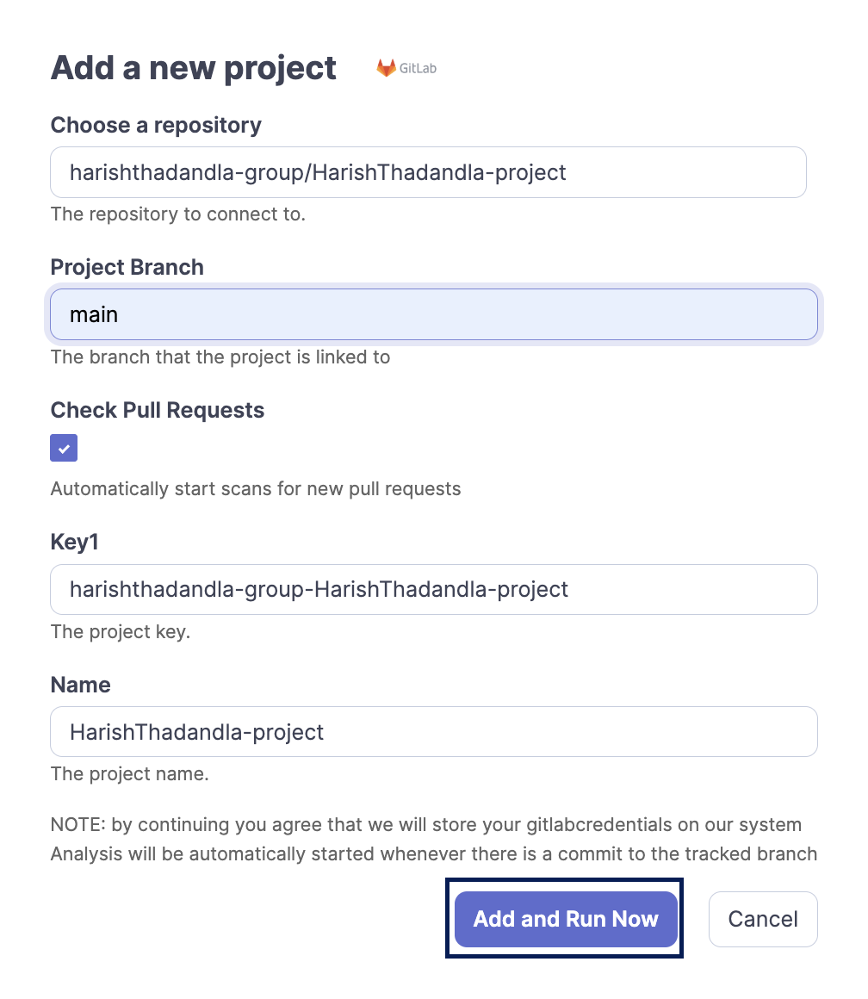
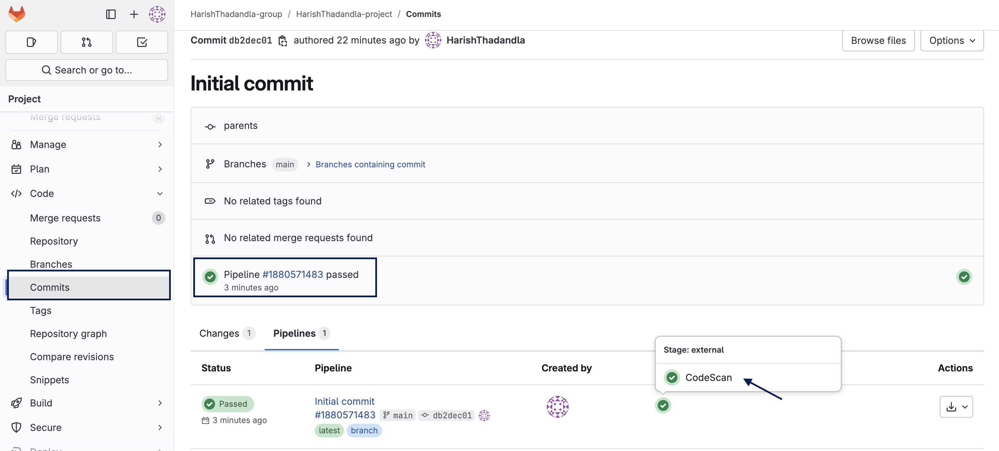

# Add a project to CodeScan from GitLab

This document guides you through how to add a GitLab project to your CodeScan Cloud account and run the analysis.

1. Log in to your CodeScan account.
2. Once you log in to your [CodeScan](https://www.codescan.io/) account, click on the (**+**) icon in the top-right corner and select **Analyze new project**.

<figure><figcaption></figcaption></figure>

3. This takes you to a different window. Choose the **Organization** for which you'd like to create a project. Click on **Set Up**.

<figure><figcaption></figcaption></figure>

4. On the next screen, click on **Add Analysis Project** button.

<figure><figcaption></figcaption></figure>

5. You will now see a new popup window; click on [**GitLab**](https://knowledgebase.autorabit.com/codescan/docs/integrating-codescan-in-gitlab) from the given options.

<figure><figcaption></figcaption></figure>

6. Now another popup window appears with the fields: **Choose a repository**, **Project Branch**, **Check Pull Requests**, **Key**, and **Name.**

<figure><figcaption></figcaption></figure>

* Choose the repository you want to add, followed by the project branch name.
* Make sure you select the checkbox under **Check Pull Requests**. This will add **webhooks**.
* Next, enter the **Project Key** followed by the **Project Name**.
* Once you fill out all the details in the popup window, click on **Add and Run Now**.


**Note:** To find the project key, refer to our document [HERE](https://knowledgebase.autorabit.com/codescan/docs/finding-your-project-key).


7. This triggers the project analysis and the project being added under your CodeScan organization.
8. You can view the project analysis report by clicking on **CodeScan** from your VC repository.

<figure><figcaption></figcaption></figure>

9. When you click the link, it will take you to the **CodeScan Project** page, where you can view your project analysis report.

<figure><figcaption></figcaption></figure>

Now that the webhooks have been created, every time a push or pull request is made to the tracked branch, an analysis will be triggered in CodeScan.
