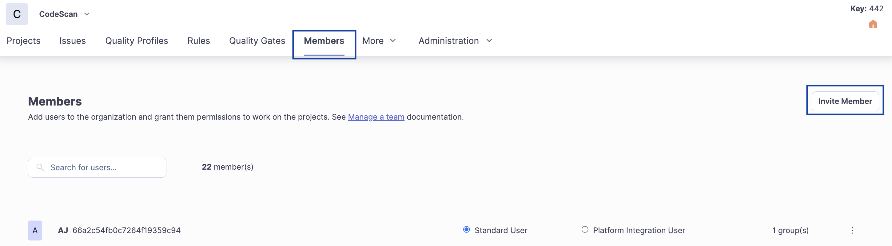

# Adding Users to a CodeScan Cloud Organization


**Important note:** The steps described in this article are only applicable to teams using **Auth0** as an authentication method. If your CodeScan organization has any **SAML** connections enabled—even if not enforced—then new users should be added through the Identity Provider. Please find more details [here](https://knowledgebase.autorabit.com/fundamentals/faq/codescan-faqs/general/single-sign-on-sso-faqs#how-do-i-add-users-to-codescan-after-sso-is-enabled).


User invitations to join the CodeScan organization are sent out by the org administrator. An email with a link inviting the user to join your organization will be sent to them.

1. Navigate to your instance's URL, for example, [_https://app.codescan.io/_](https://app.codescan.io/) for **US** region, [_https://app-eu.codescan.io/_](https://app.codescan.io/) for **EU** region, or [_https://app-aus.codescan.io/_](https://app.codescan.io/) for **AUS** region.
2. Go to your **`Organization`** in CodeScan.
3. Click on the **`Members`** menu of your Organization's home page, and then click on **`Invite Member`**.

<figure><figcaption></figcaption></figure>

4. In the **`Invite Users`** screen, enter the **`email`** (or emails) of the users you would like to add.\

<figure><figcaption></figcaption></figure>

5. Invited user will get an automated email from CodeScan. The user must click on the **`link`** to accept the invitation (see "accepting invitations" section for details).
6.  Once the user is added to your organization, you can **edit** their permissions through the **`Groups`**, **`Permissions`**, and **`Permission Templates`** under the **`Administration`** menu.\

    <figure><figcaption>
Administration Menu
</figcaption></figure>
