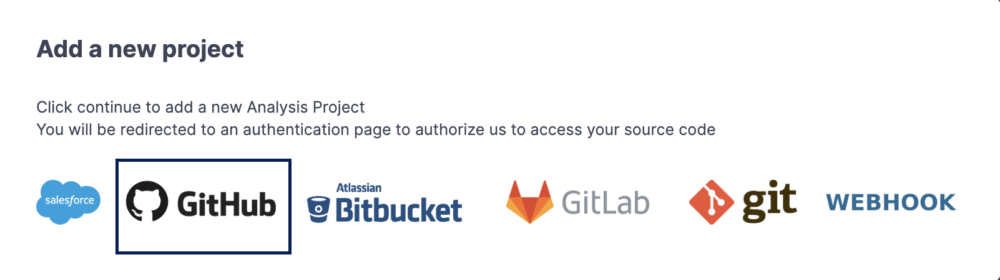

# Add a Project to CodeScan from GitHub Enterprise Cloud (with GitHub App)

### Prerequisites&#x20;

Please ensure the person performing the setup has administrator privileges for both GitHub Enterprise and CodeScan. These are required:

* Admin access to GitHub Enterprise
* Admin access to CodeScan

### Create a GitHub app&#x20;

Log in to your GitHub Enterprise Server with an Admin account and select one of the following approaches to create a GitHub app.

#### a. Recommended approach

To create a GitHub App, just copy the URL below:

`https://YOUR_GHES_HOSTNAME/settings/apps/new?name=codescan-enterprise-app&description=GitHub App for CodeScan integration&url=https://YOUR_PUBLIC_BASE&callback_urls[]=https://YOUR_PUBLIC_BASE/_codescan/oauth2/authorize&request_oauth_on_install=true&public=true&contents=read&metadata=read&repository_hooks=write&setup_on_update=true&webhook_active=false`&#x20;

Customize the URL by replacing the following attributes:&#x20;

YOUR\_GHES\_HOSTNAME = Your GitHub Enterprise URL (Example: [_github.company.com_](http://github.company.com/))&#x20;

YOUR\_PUBLIC\_BASE = URL of the CodeScan instance (Example: [_app.codescan.io_](https://app.codescan.io/))&#x20;

Click **Save**.

#### b. Manual creation

1. Log in to your GitHub Enterprise Server as an Admin (make sure to switch to Enterprise Level), and navigate to **Settings**.

Under **Settings**, select GitHub App → Create **New GitHub App.**

Provide details:

* **GitHub App name:** codescan-enterprise-app &#x20;


App name should be **codescan-enterprise-app,** please do not modify.


* **Homepage URL:** your CodeScan URL

For example:

[_https://app.codescan.io_](https://app.codescan.io/)&#x20;

[_https://app-eu.codescan.io_](https://app-eu.codescan.io/)&#x20;

[_https://app-aus.codescan.io_](https://app-aus.codescan.io/)&#x20;

* **Callback URL:** in the format \[CodeScanURL]/\_codescan/oauth2/authorize&#x20;

For example:

[_https://app.codescan.io/\_codescan/oauth2/authorize_](https://app.codescan.io/_codescan/oauth2/authorize)&#x20;

[_https://app-eu.codescan.io/\_codescan/oauth2/authorize_](https://app-eu.codescan.io/_codescan/oauth2/authorize)&#x20;

[_https://app-aus.codescan.io/\_codescan/oauth2/authorize_](https://app-aus.codescan.io/_codescan/oauth2/authorize)&#x20;

* **Post Installation:**&#x20;

Check **Redirect on update**:&#x20;

* Webhook:&#x20;

Uncheck **Active:**

* **Repository Permissions:**&#x20;

Contents: Read-only&#x20;

Metadata: Read-only&#x20;

Webhooks: Read and write&#x20;

2. Keep the app public by enabling Any Account.&#x20;

3. Click **Create GitHub App.**

### Trigger Analysis from CodeScan&#x20;

1. Log in to your CodeScan account as an Admin.
2. In the top right corner, click on the **'+'** icon and select **Analyze new project**.

<figure><figcaption></figcaption></figure>

3. Choose the **Organization** for which you'd like to create a project. Click **Set Up**.

<figure><figcaption></figcaption></figure>

4. On the next window, click on **Add Analysis Project**.

<figure><figcaption></figcaption></figure>

5. You will now see a new pop-up window; select **GitHub:**

<figure><figcaption></figcaption></figure>

6. Once you select **GitHub**, it will redirect you to the GitHub login page to validate your credentials:


Make sure you select “Install app.codescan.io” for your Enterprise organization, not a personal org.


7. On the next screen, fill in the details below:

* Choose the **Repository** to add, followed by the **Project Branch** name.


If you do not specify the Branch Name during GitHub integration, then it will take the main branch by default.


* Make sure you select the checkbox under **Check Pull Requests**.&#x20;


Admin permissions in GitHub are **required,** otherwise pull requests will not be trigger, even though a user may be able to select the box to "check pull requests" during GitHub integration.


* The **Project Key** and the **Project Name** are automatically generated. You can edit these values as needed.
* Click on **Add and Run Now:**

<figure><figcaption></figcaption></figure>

8. This triggers the project analysis and adds the project to your CodeScan organization.
9. You can view the project analysis report by clicking on **Details** from your repository:

<figure><figcaption></figcaption></figure>

10. When you click the link, it will take you to the **CodeScan Project** page, where you can view your project analysis report:

<figure><figcaption></figcaption></figure>

&#x20;

&#x20;
