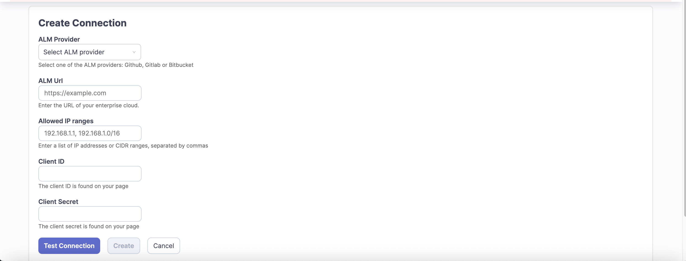
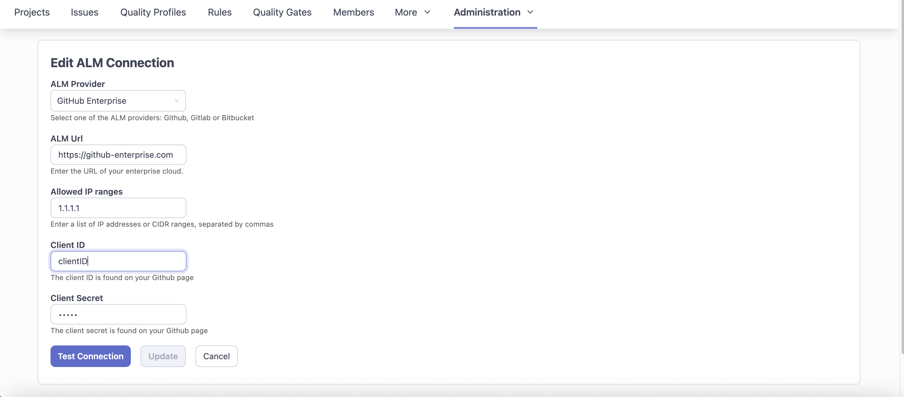
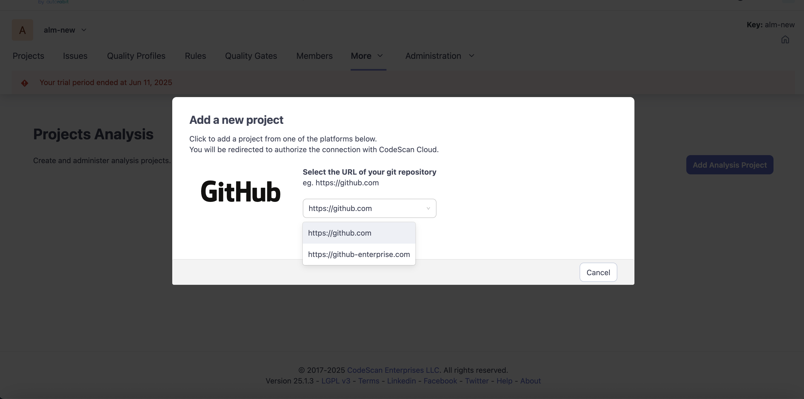

# Configuring and Managing ALM Integrations

**Org Administration › ALM Connections**

1. At the organization level, we’ve introduced a new **ALM Connections** page where you can manage integrations with enterprise instances of **GitHub**, **GitLab**, and **Bitbucket**.\
   By default, this list is empty until you add your first connection.

<figure><figcaption></figcaption></figure>

2. The **ALM Connections page** will contain configured ALM Connections. (default empty)

<figure><figcaption></figcaption></figure>

> **Tip:** Refer to our provider-specific Knowledge Base articles for step-by-step instructions on creating the OAuth connected app and generating the Client ID/Secret.

\
\
3\. **Configuring a New ALM Connection**

**Provider**

1. Choose your ALM platform (GitHub, GitLab, or Bitbucket).

**Domain / ALM URL**

2. Enter the URL for your ALM server.
3. Each ALM URL must be unique for each ALM connection within an organization.

**Allowed IP Ranges**

4. Please provide the CIDR ranges or IP addresses from which your Enterprise server operates.

**OAuth Credentials**

5. Paste the **Client ID** and **Client Secret** generated when you created your connected app in the provider’s system.

<figure><figcaption></figcaption></figure>

**Test Connection**

5. Click **Test Connection** to verify the provided credentials.\
   If the validation is successful, click **Create ALM Connection** to complete the setup.

#### 4. Manage ALM Connections

* Use the dropdown of configured connections to select and modify(Edit/ Delete) an existing integration.

<figure><figcaption></figcaption></figure>

* On click to the edit, below screen would be shown with ALM details, Update the required fields as mentioned in above point 3 (Configuring a New ALM Connection)

<figure><figcaption></figcaption></figure>

**Test Connection**

Click **Test Connection** again to validate the updated credentials.\
If successful, click **Update ALM Connection** to save the changes.

5. **Using ALM Connections During Project Setup**:

Once an ALM connection is successfully created or updated, it will appear in the dropdown under:\
**Project Analysis › Add Analysis Project › Add a New Project**

Select the appropriate ALM URL from the dropdown to proceed with project analysis.

<figure><figcaption></figcaption></figure>

6. **Knowledge Base Articles for Project Analysis via ALM Providers**

* [GitHub](https://knowledgebase.autorabit.com/codescan/docs/add-a-project-to-codescan-from-github)
* [Atlassian Bitbucket](https://knowledgebase.autorabit.com/codescan/docs/add-a-project-to-codescan-from-bitbucket)
* [Gitlab](https://knowledgebase.autorabit.com/codescan/docs/add-a-project-to-codescan-from-gitlab)
