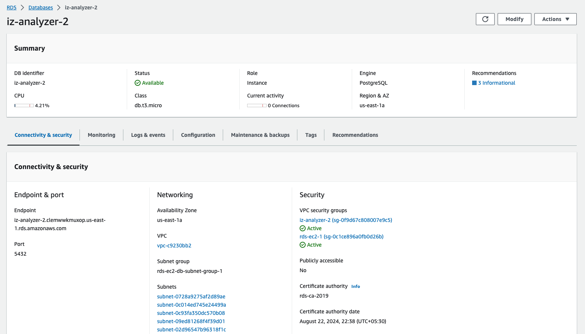

# Subscription

## Subscribe To IZ Suite

The AWS Marketplace is an online store that makes it easy for customers to start using IZ Suite and its services that run on the Amazon Web Services (AWS) cloud.

IZ Analyzer suite consists of Mule and API components for implementing enterprise grade Source Code Analysis along with a cloud offering of IZ Analyzer

### Marketplace Listing

1. Navigate to **`AWS Marketplace`** - https://aws.amazon.com/marketplace
2.  Search for **`IZ Analyzer`**  

    <figure><figcaption></figcaption></figure>

### How To Subscribe

1.  Click on `Continue to Subscribe`  

    <figure><figcaption></figcaption></figure>
2.  Click on `Continue to Configure`  

    <figure><figcaption></figcaption></figure>
3.  Select the software version, Fulfillment option, region and click on `Continue to Launch`  

    <figure><figcaption></figcaption></figure>
4.  Select the instance type, VPC Setting, Subnet Setting, Security Group and click on `Launch`  

    <figure><figcaption></figcaption></figure>
5. A new EC2 instance will be created in the selected region

### Create a Database


* This step is required if the instance is being configuring for the first time.
* This step can be ignored if the marketplace product instance is being updated to a new version.


1. Login to AWS management console. https://aws.amazon.com/console/
2. Navigate to **`Services`** -> **`RDS`** and click on **`Create Database`**
3.  Select **`PostgreSQL`** engine type, username, password, storage, backup options and click on `Create Database`  

    <figure><figcaption></figcaption></figure>
4.  Click on the created RDS database instance and copy the endpoint  

    <figure><figcaption></figcaption></figure>
5.  Click on **`Actions`** -> **`Setup EC2 Connection`**. Select the EC2 Instance created earlier and click on `Continue` to setup the connection between EC2 and RDS.\
    &#x20;

    <figure><figcaption></figcaption></figure>

### Configure Database details and start the server

1. Login to the created EC2 instance using the downloaded pem file. E.g.: ssh -i \<downloaded.pem> ubuntu@\<publicip>
2. Navigate to **`/home/ubuntu/sonarqube.x.x.x/conf`**
3. Open sonar.properties file and update the database connection details
   1. **`sonar.jdbc.url`** - Update the RDS host, port and database name
   2. **`sonar.jdbc.username`** - RDS username
   3. **`sonar.jdbc.password`** - RDS password
4. Navigate to /home/ubuntu/sonarqube.x.x.x/bin/linux-x86-64 and start the server
   1. ./sonar.sh start
5. This will run the server in background
6. Navigate to **`http://<publicip>:9000`** in the browser
