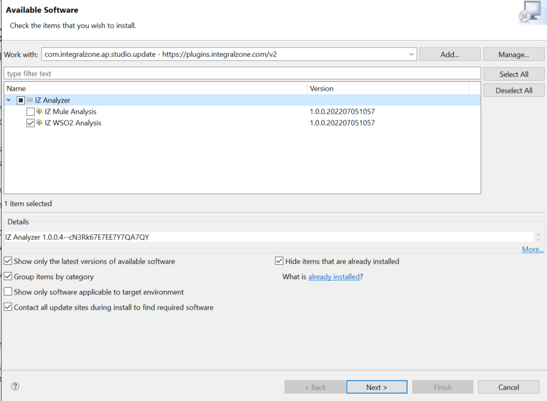
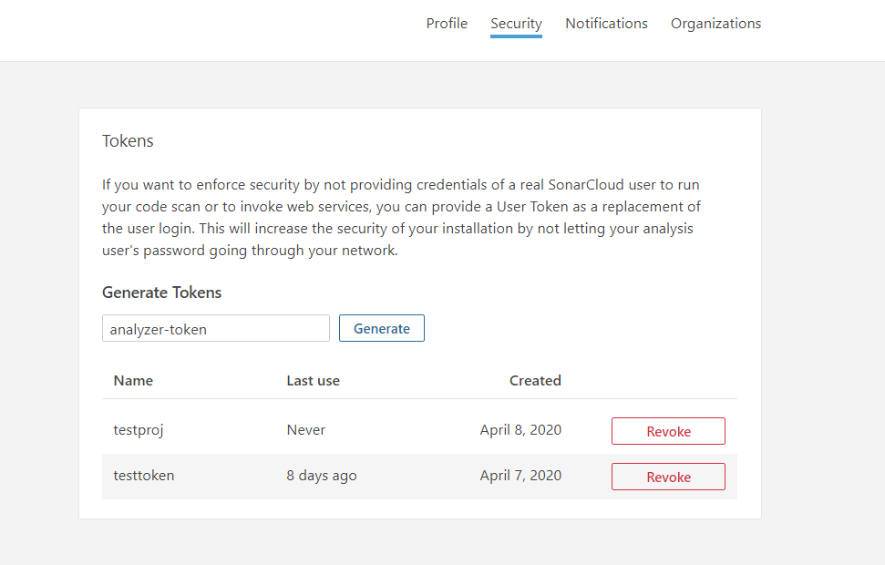
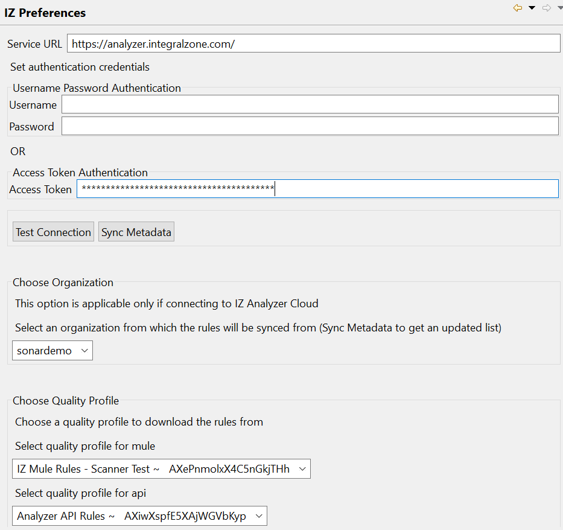

# Install Plugin


We recommend installing **`IZ Scan`** Anypoint Studio plugin instead of **`IZ Analyzer`** plugin.

**`IZ Scan`** not only supports all functionalities provided by **`IZ Analyzer`**, but it also ensures compatibility with future updates. Henceforth, all updates and enhancements will be exclusively published for **`IZ Scan`**.

The latest Anypoint Studio plugin update site is [https://plugins.integralzone.com/v4](https://plugins.integralzone.com/v4). Users can still continue to use the old plugin update site [https://plugins.integralzone.com/v2](https://plugins.integralzone.com/v2), but all the new updated will only be published to [https://plugins.integralzone.com/v4](https://plugins.integralzone.com/v4).

* Refer to [Install Analyzer Suite](../../iz-suite/iz-scan/anypoint-studio/installation/install-iz-analyzer-studio.md) to install the latest plugin
* Refer to [Analyzer Configuration](../../iz-suite/iz-scan/anypoint-studio/configuration/iz-analyzer-configuration.md) to configure IZ Analyzer plugin



Before installing and using IZ Anypoint Studio Plugin, make sure you have:

* Purchased a valid license.
* Business Group/Organization associated with the issued license.
* For on-premises instances, please use your organization-specific service URL instead of [https://analyzer.integralzone.com](https://analyzer.integralzone.com/)


### Install Plugin

1.  Go to **`Help`** -> **`Install New Software`** and add the plugin update site [https://plugins.integralzone.com/v2](https://plugins.integralzone.com/v2) in the address bar. 

    <figure><figcaption></figcaption></figure>
2. Select the appropriate feature, click on **`Next`** and follow the installation instructions.
   1. In case of Anypoint Studio, choose **`IZ Mule Analysis`**
   2. In case of WSO2 Integration Studio, choose **`IZ WSO2 Analysis`**
3. Restart Anypoint Studio after installation
4.  Log in to [https://analyzer.integralzone.com/](https://analyzer.integralzone.com/). Click on your Profile icon and navigate to **`My Account`**. Select the **`Security`** tab and generate a new token by providing a token name. 

    <figure><figcaption></figcaption></figure>
5. Go to **`Window`** -> **`Preferences`** -> **`IZ Preferences`**, provide the `Service Url` and enter the access token generated in the previous step for the `Access Token` field. `Service Url` for cloud users will be [https://analyzer.integralzone.com/](https://analyzer.integralzone.com/) and for on-premises installations, please use your organization-specific URL.
   1. Click on **`Test Connection`** to ensure connection is successful.
   2. Click on **`Sync Metadata`** to sync the `Organization` and available `Quality Profiles` -
      1. `Organization` -> Organization feature is applicable only if connecting to IZ Analyzer cloud.
      2.  `Quality Profiles` -> Choose the required Quality Profile to sync the rules from server. If none of the Quality Profiles are selected, default one will be used. 

          <figure><figcaption></figcaption></figure>
   3. Choose **`Apply`** and Select **`Apply and Close`**

### See Also

* [Update IZ Analyzer Studio Plugin](../../iz-suite/iz-scan/anypoint-studio/installation/update-iz-analyzer-studio.md)
* [Remove IZ Analyzer Studio Plugin](../../iz-suite/iz-scan/anypoint-studio/installation/remove-iz-analyzer-studio.md)
