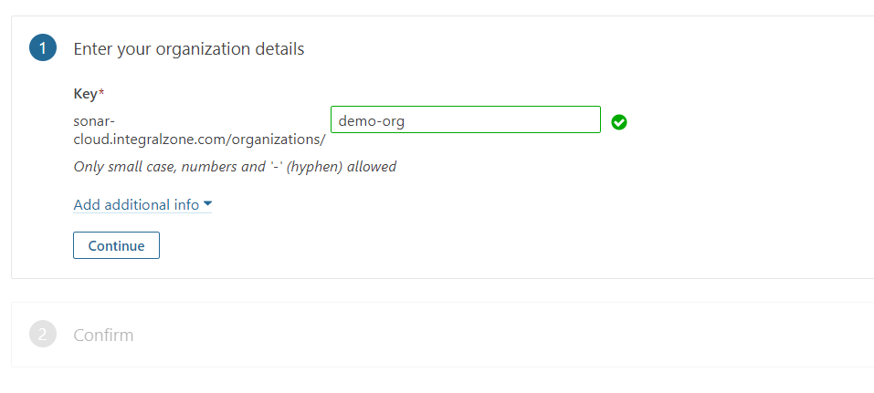

# Create Organization

### Create New Organization:

1. Browse to **`[IZ Analyzer](https://analyzer.integralzone.com/)`** -> **`Login with your credentials`**. +
2.  click on the plus icon beside profile icon -> Select **`Create New Organization`** -> Enter **`Organization Name`**-> click on **`Continue`**.  

    <figure><figcaption></figcaption></figure>
3. Confirm by clicking **`Create Organization`**


**By submitting, your organization will be created with a FREE subscription.** With FREE subscription all the projects you analyze will be public. Once the organization is created, choose **`Administration`** -> **`Organization Settings`** to upgrade for a PAID plan to analyze private projects.


### See Also

* [Activate Rules](../manage-rules/activate-rules.md)
