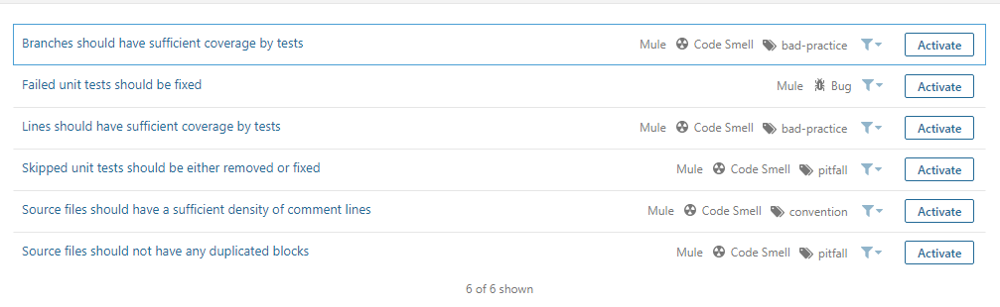

# Activate Rules

## Manage Rules in Server


Before creating a custom rule, make sure you have:

* Created a custom Quality Profile from the default Profile. Refer to [Create Custom Quality Profile](activate-rules.md) for more information.
* For on-premises or hybrid instances, please use your organization-specific service URL instead of [https://analyzer.integralzone.com](https://analyzer.integralzone.com/).
* For on-premises or hybrid instances, choosing an organization will not be required after login.


### Create Custom Quality Profile:

1. Browse to **`[IZ Analyzer](https://analyzer.integralzone.com/)`** -> **`Login with your credentials`** -> click on your profile icon -> Select your organization under **`My Organizations`** -> click on **`Quality Profiles`** menu -> Search for **`Mule Profiles`**. +
   * NOTE: There should be one **`Built In`** rule named **`IZ Mule Rules`**, which is the default profile. Rules cannot be activated or de-activated on the **`Built In`** profile. We need to clone/extend the **`Built In`** profile and then activate or de-activate rules.
2.  Click on the **`Settings`** -> **`Copy`**, if not already done  

    <figure><figcaption></figcaption></figure>
3.  Enter a **`New Name`** for the profile -> click on **`Copy`**, if not already done  

    <figure><figcaption></figcaption></figure>

### Activate Rules:

1.  Click on the created new profile **`Custom - IZ Mule Rules`**  

    <figure><figcaption></figcaption></figure>
2.  Click on **`Activate More`** to activate rules which are deactivated  

    <figure><figcaption></figcaption></figure>
3.  Once all the deactivated rules are listed, click on the **`Activate`** button against each rule to activate  

    <figure><figcaption></figcaption></figure>
4.  Once all the required rules are activated, go back to **`Quality Profiles`** menu -> Search for **`Mule Profiles`** -> **`Settings`** icon -> **`Set as Default`**, if not already done

    * NOTE: Only the profile marked as **`Default`** will be used for evaluating the rules&#x20;

    <figure><figcaption></figcaption></figure>

## See Also

* [Deactivate Rules](deactivate-rules.md)
