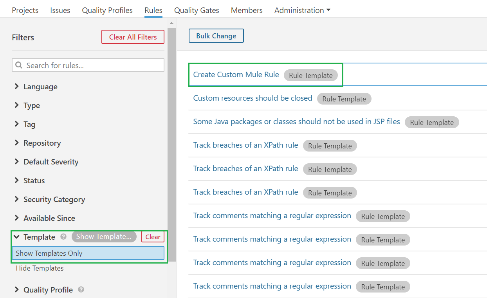
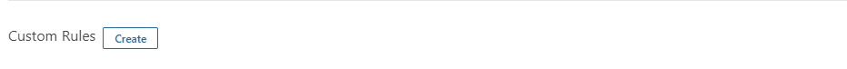
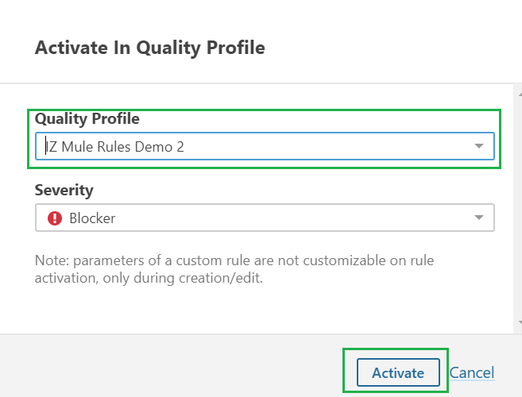
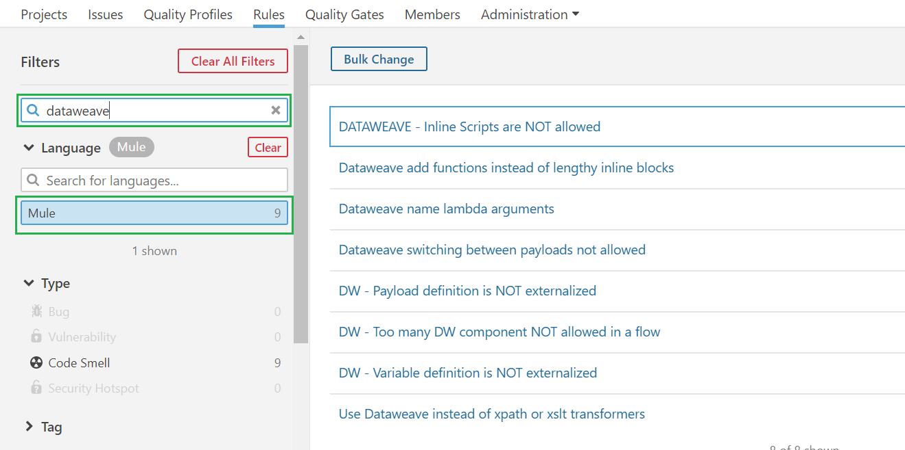

# Custom Rules

## Manage Custom Rules


In case of an On-Premises or Hybrid installation model:

* Navigate to your organization-specific service URL instead of [https://analyzer.integralzone.com](https://analyzer.integralzone.com/)
* Choosing an organization will not be required after login



Before creating a custom rule, make sure you have:

* Created a custom Quality Profile from the default Profile. Refer to [Create Custom Quality Profile](activate-rules.md) for more information
* In case of an On-Premises or Hybrid installation model, navigate to your organization-specific service URL instead of [https://analyzer.integralzone.com](https://analyzer.integralzone.com/)


### Create Custom Rule:

1.  Click on **`Rules`** -> **`Show Templates Only`** -> **`Create Custom Mule Rule`**  

    <figure><figcaption></figcaption></figure>
2. **`Registry Keywords`** details the list of all available variables that can be used in the groovy script, while defining a custom rule
3.  Click on **`Create`** to start defining a custom rule\
    &#x20;

    <figure><figcaption></figcaption></figure>
4. Fill in all the required attributes. Refer to Custom Rule Attributes for more information
5. Click on **`Create`** to create the custom rule

Rules should be activated in at least one of the custom **`Quality Profiles`** for it to be applied on the projects being scanned (usually the default Quality Profile). Follow the below steps to activate the rule:

1. Select the custom rule created earlier
2. Click on **`Activate`**&#x20;
3.  Select the **`Quality Profile`** in which the rule should be activated and click on **`Activate`**  

    <figure><figcaption></figcaption></figure>

### Custom Rule Attributes:

1. **`Name`** - Name of the new custom rule
2. **`Key`** - Unique key for the custom rule. The key will be auto populated, which can be changed if there are any conflicts
3. **`Type`** - Select the type of rule, which can be one of
   1. Code Smell
   2. Bug
   3. Vulnerability
   4. Security Hotspot
4. **`Severity`** - Select the rule severity, which can be one of
   1. Blocker
   2. Critical
   3. Major
   4. Minor
   5. Info
5. **`Implementation`** - Actual groovy script for the rule definition
6. **`Description`** - Description of the rule. Markdown syntax can be used to describe the rule. Few examples include

| Write                                              | To Display                                       |
| -------------------------------------------------- | ------------------------------------------------ |
| +**this text is bold**+                            | **this text is bold**                            |
| +https://analyzer.integralzone.com/+               | https://analyzer.integralzone.com/               |
| +[IZ Analyzer](https://analyzer.integralzone.com)+ | [IZ Analyzer](https://analyzer.integralzone.com) |

### Edit Custom Rule:

1.  Click on **`Rules`** -> Select language **`Mule`** -> **`Search for rule name`**  

    <figure><figcaption></figcaption></figure>
2. Select a rule to edit
3. Update the required fields and click on **`Save`**. Refer to Custom Rule Attributes for more information

### See Also

* For Activating custom rules - [Activate Rules](activate-rules.md)
* For Deactivating custom rules - [Deactivate Rules](deactivate-rules.md)
