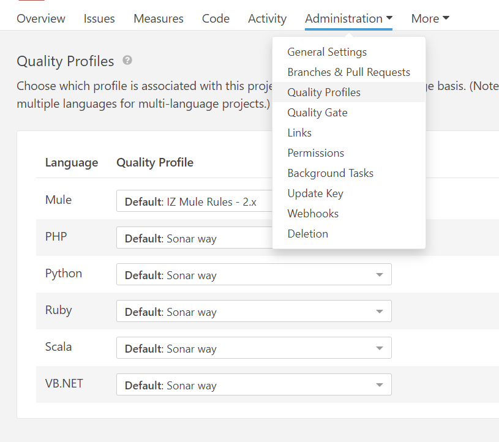
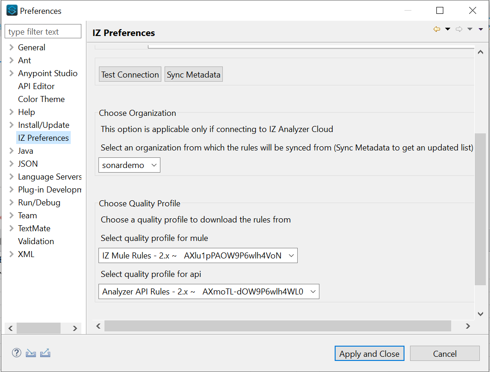

# Switch Quality Profiles

In this section, we will learn about using different **`Quality Profiles`** for each project or a group of projects. By default, the **`Quality Profile`** marked as default will be used for analysis of the projects.


Refer to the [Activate Rules](activate-rules.md) section to create multiple **`Quality Profiles`** with appropriate rules based on the requirement.


### In Server:

1. Select the project which requires a different **`Quality Profile`** than the default one.
2.  Navigate to **`Administration`** -> **`Quality Profiles`** and choose the appropriate quality profile required by the project based on the language.\
    &#x20;

    <figure><figcaption></figcaption></figure>
3. The subsequent analysis of the project will use the selected quality profile.

### In Anypoint Studio Plugin:

1. Navigate to **`Window`** -> **`Preferences`** -> **`IZ Preferences`**.
2.  Click on **`Sync Metadata`** and choose the appropriate quality profile.\
    &#x20;

    <figure><figcaption></figcaption></figure>
3. Click on **`Apply and Close`**

### See Also

* For Creating custom rules custom rules - [Custom Rules](custom-rules.md)
* For Deactivating custom rules - [Deactivate Rules](deactivate-rules.md)
