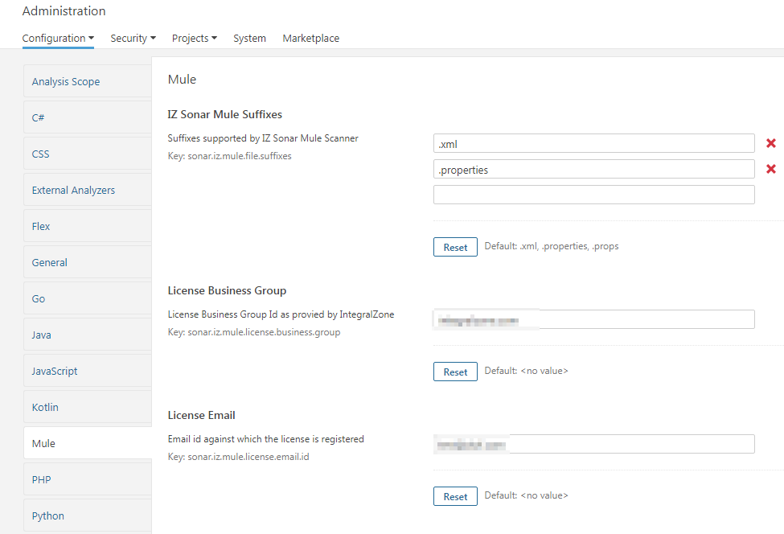

# Install Server Plugin

* IZ Analyzer plugin supports [SonarQube™](https://www.sonarqube.org) version **`7.5`** and above


Before installing and using IZ Analyzer Server Plugin, make sure you have:

* Purchased a valid license.
* Business Group/Organization associated with the issued license.
* Server plugin jar provided by IZ. Either api-analyzer-plugin-x.x.jar or mule-analyzer-plugin-x.x.jar or wso2-analyzer-plugin-x.x.jar or all.


### Install Plugin:

1. Copy the plugin jar (either api-analyzer-plugin-x.x.jar or mule-analyzer-plugin-x.x.jar or both) to **`SONAR_HOME/extensions/plugins`**
2. Restart [SonarQube™](https://www.sonarqube.org) server


* **`SONAR_HOME`** refers to [SonarQube™](https://www.sonarqube.org) server installation path


### Configure Plugin:

1. Browse to **`[SonarQube™](https://www.sonarqube.org) server web`** -> **`Login with admin credentials`** -> **`Administration`**
2. Select **`Mule`** or **`API`** or **`WSO2`** from the list of languages based on the plugins installed. Configure the following fields:
   1. **`License Key`**: License key provided by [Integral Zone](https://integralzone.com)
   2. **`License Email`**: Email Id against which the license is registered
   3.  Click on save  

       <figure><figcaption></figcaption></figure>


License Key and Email will be provided by IZ as part of license activation


### See Also

* [Update IZ Analyzer Server Plugin](../../iz-suite/iz-scan/anypoint-studio/installation/update-iz-analyzer-studio.md)
* [Remove IZ Analyzer Server Plugin](../../iz-suite/iz-scan/anypoint-studio/installation/remove-iz-analyzer-studio.md)

***

[SonarQube™](https://www.sonarqube.org) is a trademark belonging to SonarSource SA. For further information, please visit www.sonarqube.org
