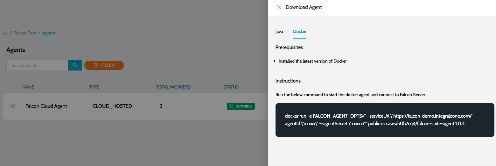

# Agent Installation


Before installing, make sure you have:

* Purchased a valid license.
* Installed Docker
* URL of the IZ Server instance


## IZ Suite Agent Installation

### Starting IZ Agent

1. Once the **`IZ Server`** is up and running, navigate to **`Settings`** -> **`Agents`**
2. Click on **`Download Agent`** action
3.  Instructions to run the agent will be provided along with the **`Client ID`** and **`Client Secret`** required to start the agent\
    &#x20;

    <figure><figcaption></figcaption></figure>

### See Also

* [Prerequisites](installation-requirements.md)
* [Server Installation](server-installation.md)
