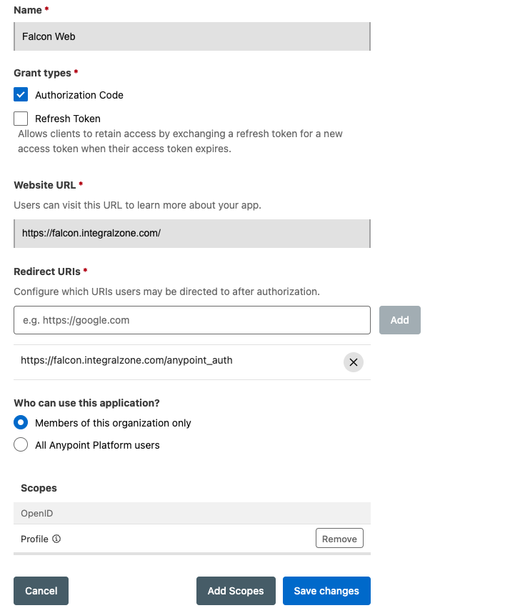

# Getting Started

This section outlines the initial setup and onboarding process for the IZ Suite instance.

### Apply License

1. The first time the instance is launched, a license needs to be applied.
2. Access the application from your browser and click on **`Get Started`**.
3. Upon your first login, you will be prompted to apply the license. The License Key and Email will be provided by Integral Zone as part of the onboarding process.
4. Enter the License Key and Email, then click Apply.

### Initial Login

1. Access the application from your browser and click on **`Get Started`**
2. Click on `Sign-in with IZ Token`
3. Use the initial **`Access/Security Token`** provided by Integral Zone as part of on boarding process

### Setup Single Sign-on

Follow these steps to enable Anypoint CloudHub SSO:

1. Create a connected app in CloudHub to enable SSO:
   1. Navigate to https://anypoint.mulesoft.com
   2. Navigate to **`Access Management`** -> **`Connected Apps`** (Admin permissions might be required for this operation)
   3. Click on **`Create App`**
   4. Use **`IZ Web`** as the Connected App name
   5. **`Type`** - Acts on behalf of a user
   6. **`Grant Types`** - Authorization Code
   7. **`Website URL`** - Your IZ instance url. Eg: https://company-iz.integralzone.com
   8. **`Redirect URIs`** - \<Your IZ instance url>/anypoint\_auth. Eg: https://company-iz.integralzone.com/anypoint\_auth
   9. **`Who can use this application`** -> Members of this organization only
   10. **`Scopes`** -> Click on Add Scopes and select **`Open Id`** -> **`Profile`**
   11. Save the setting. We will be using the generated Client Id and Client Secret in the next steps\
       &#x20;

       <figure><figcaption></figcaption></figure>
2. Sign-in to IZ Suite application
3. After signing to the application, navigate to **`Global Settings`** -> **`Settings`**
4. Search for **`Anypoint Auth`** and click on **`Edit`** action item
   1. Update the value of **`isEnabled`** to **`true`**
   2. Update the Anypoint Connected App’s Client Id and Client Secret in respective fields
   3. Click on Submit
5. Log out of the application and Sign-in with CloudHub option should be enabled.

### Disable `Signin with IZ Token` Option

`Signin with IZ Token` feature is intended only for initial system setup and should be disabled once one of the `Single Sign-on` options is isEnabled.

Generate admin login token

1. Navigate to **`Global Settings`** -> **`Settings`**
2. Navigate to **`Organization`** -> **`Tokens`** and click on **`Generate Token`**
   1. **`Token Name`** - Admin Login
   2. **`Expiry`** - Can be left blank
   3. **`Roles`** - IZ Core Admin
   4. Click on Submit and save the token which can be used when any of the configured Single Sign-on options has issues

Disable Sign-in with IZ Token

1. Search for **`IZ Token Auth`**
   1. Update the value of **`isEnabled`** to **`false`**

### Generate Admin Token

The admin token generated using the steps below will be useful for signing in to the application if all other sign-in options become unavailable.

1. Sign-in to IZ Suite application
2. Navigate to **`Organizations`** -> **`Tokens`**
3. Click on **`Generate Token`**
   1. **`Token Name`** - Name of the token
   2. **`Expiry`** - Can be left blank
   3. **`Roles`**- IZ Core Admin
4. Click on **`Ok`** and save the generated token, which can be used when none of the other sign-in options are available.
5. Use the following URL to enter the admin token: https://\<HOST>/iz/oauth?response\_type=code\&redirect\_uri=/auth/iz/callback\&admin=true

### Configure CICD Pipeline

The following step is applicable only for **`IZ Scan`**

1. **`CICD Integration using Maven`** - Maven CICD Scanner

### Configure Agent

The following step is applicable only for **`IZ Eye`** and **`IZ Pulse`**.

1. Running Default Agent - Running Agent
2. Configure New Agent - New Agent

### Setup Anypoint Studio Plugin

1. **`Anypoint Studio Plugin Installation`** - Install Plugin
2. **`Anypoint Studio Plugin Setup`** - Configuration
3. **`Anypoint Studio Plugin Fly Results`** - On The Fly Results

### Setup Anypoint Code Builder

1. **`Anypoint Code Builder Plugin Installation`** Install Plugin
2. **`Anypoint Code Builder Plugin Setup`** - Configuration
3. **`Anypoint Code Builder Fly Results`** - On The Fly Results

### See Also

* [Prerequisites](installation-requirements.md)
* [Cluster Mode](cluster-installation.md)
