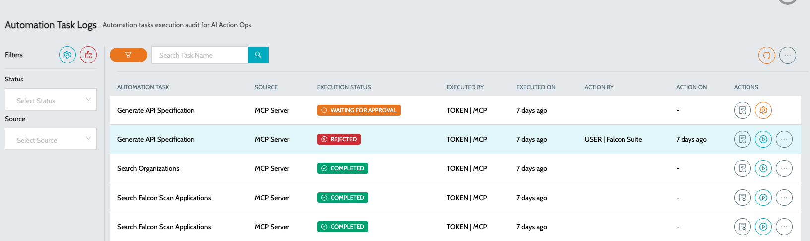
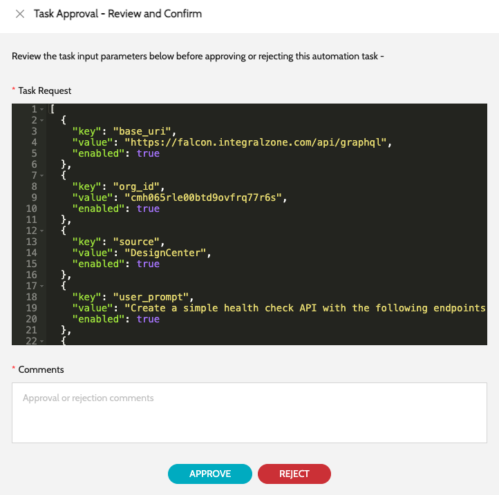

# Automation Task Logs

Any Automation Task execution logs will be available here, including the execution logs, request, response etc.

### Automation Task Logs

* Navigate to **`IZ Insights`** -> **`Automation Task Logs`**.
*

    | Column Name            | Description                                                                                            |
    | ---------------------- | ------------------------------------------------------------------------------------------------------ |
    | **`Automation Task`**  | Name of the automation task being executed                                                             |
    | **`Source`**           | Source from where the automation is executed. Eg: **`MCP Server`**,**`Manual`**,**`Chat Bot`**         |
    | **`Execution Status`** | Status of the execution. Eg: **`Completed`**,**`Rejected`**,**`Waiting for Approval`**, **`Failed`**   |
    | **`Executed By`**      | User who executed the automation task                                                                  |
    | **`Executed On`**      | Date and Time when the automation task was executed                                                    |
    | **`Actions`**          | Include - Execution log of the automation task, Re run automation task, View the request and response. |

### Approving Automation Task

*   If an automation task requires manual approval, a special action called **`Task Approval`** will be enabled and the status of the automation task execution will be in **`Waiting for Approval`** status.  

    <figure><figcaption></figcaption></figure>
* Click on the **`Task Approval`** action item against the row to take appropriate action -
  * **`Approve`** - To approve the execution of automation task
  *   **`Reject`** - To reject the execution of automation task\
      &#x20;

      <figure><figcaption></figcaption></figure>
* Add appropriate comments and perform the action.

### See Also

* [Code With AI](code-with-ai.md)
* [Automation Tasks](automation-tasks.md)
