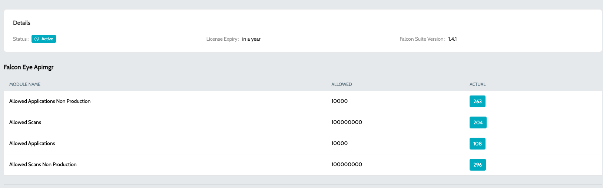
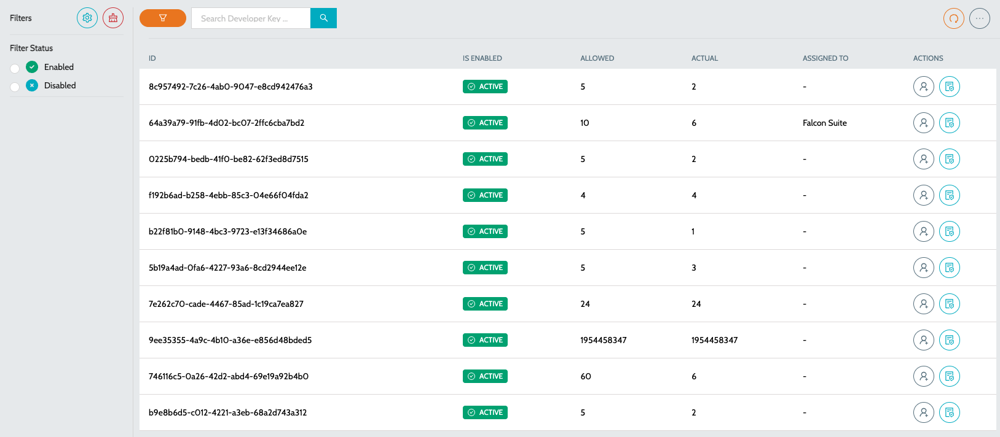

# License Usage

### Subscription

Provides a consolidated view of the license subscription, its validity, and consumption across different IZ modules. It is intended to give administrators quick insight into license health, usage trends, and entitlement limits.

1. Navigate to **`Global Settings`** → **`License`** -> **`Subscription`**

Each module table typically contains:

**`Module Name`** – The specific capability or resource governed by the license&#x20;

**`Allowed`** – The maximum quota permitted under the subscription&#x20;

**`Actual`** – The current consumption against that quota

<figure><figcaption></figcaption></figure>

### Developer Keys

Provides a centralized view of all IDE developer keys associated with a subscription. It is intended for administrators to manage, monitor, and govern developer key usage independently.

1. Maintain an inventory of issued IDE developer keys
2. Monitor usage against key-specific allocations
3. Identify keys that are fully utilized, underutilized, or unassigned

There are 2 actions associated for each developer keys:

1. **`Assign User`** - Assign a user for the Developer key for reference
2. **`View Scanned Projects`** - View the list of projects scanned against the developer key

<figure><figcaption></figcaption></figure>

### See Also

* Enabling MCP Server
* Configuring STDIO MCP Server
* Configuring HTTP MCP Server
* MCP Tools
