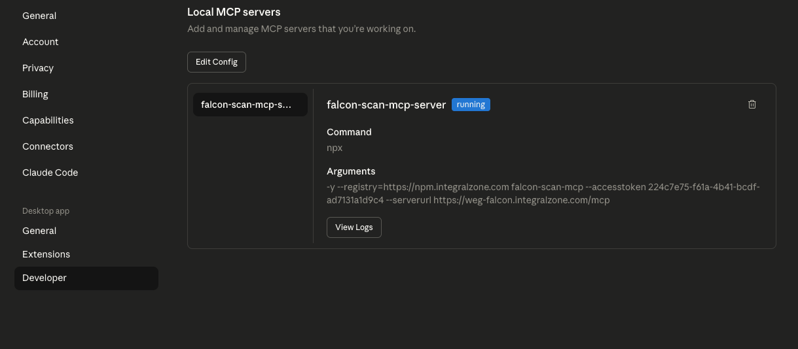

# STDIO MCP Server Configuration

The following section describes the steps required to configure the IZ STDIO MCP server in various IDEs.

### Visual Studio Code

* Open the preferences and search for MCP
* Click on **`Add Server`** -> **`Command (stdio)`**
* Enter the command (Eg: npx) and name as **`iz-scan-mcp-server`**
* A mcp.json file with the entered details will be opened
* Add the following arguments **`accesstoken`**, **`serverurl`**.
* To generate a token, refer token generation
* The final configuration should look something like

```json
"iz-scan-mcp-server": {
    "command": "npx",
    "args": [
        "-y",
        "--registry=https://npm.integralzone.com",
        "iz-scan-mcp",
        "--accesstoken",
        "&lt;Token Generated from IZ Suite>",
        "--serverurl",
        "&lt;http(s)://YOUR_HOST_NAME>"
    ],
    "type": "stdio"
}
```

### Cursor IDE

* Open the preferences and search for MCP
* Click on **`View: Open MCP Settings`**
* In the settings screen click on **`New MCP Server`** and add the below configuration:

```json
    "iz-scan-cli-mcp-server": {
        "command": "node",
        "args": [
            "-y",
            "--registry=https://npm.integralzone.com",
            "iz-scan-mcp",
            "--accesstoken",
            "&lt;Token Generated from IZ Suite>",
            "--serverurl",
            "&lt;http(s)://YOUR_HOST_NAME>"
        ]
    }
```

* To generate a token, refer token generation
* Save the mcp.json file.
*   Navigate back to Cursor Settings tab and toggle the enable switch. <br>

    <figure><figcaption></figcaption></figure>

### Claude Desktop

* Navigate to **`Settings`** -> **`Developer`** and click on edit config.
* Edit the **`claude_desktop_config.json`** file and add the following contents under **`mcpServers`** tag:

```json
    "iz-scan-cli-mcp-server": {
        "command": "node",
        "args": [
            "-y",
            "--registry=https://npm.integralzone.com",
            "iz-scan-mcp",
            "--accesstoken",
            "&lt;Token Generated from IZ Suite>",
            "--serverurl",
            "&lt;http(s)://YOUR_HOST_NAME>"
        ]
    }
```

* To generate a token, refer token generation.
* Save the **`claude_desktop_config.json`** file.
* Restart Claude Desktop
* Navigate to **`Settings`** -> **`Developer`** and if every thing is configured correctly, the status should be **`running`**.&#x20;

<figure><figcaption></figcaption></figure>

### See Also

* [Enabling MCP Server](mcp-server-installation.md)
* [Generating MCP Token](generating-mcp-token.md)
* [Configuring HTTP MCP Server](http-mcp-server-configuration.md)
* [MCP Tools](mcp-tools.md)
