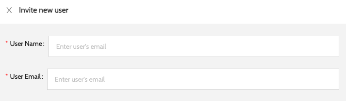
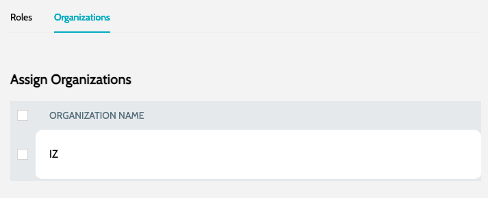

# Invite User

Invite user to the organization:

1. Navigate to **`Organization`** -> **`Users`** and click on **`Invite User`**
2. Enter the basic details:&#x20;

<figure><figcaption></figcaption></figure>

&#x20; a. **`User Name`** - Name of the user

&#x20; b. **`User Email`** - Email of the user. User should sign-in using the account linked to same email id

3. Choose the roles to be assigned to the user&#x20;

<figure><figcaption></figcaption></figure>

4. Choose the organizations users should be part of&#x20;

<figure><figcaption></figcaption></figure>

5. Click on **`Submit`** to invite the user

#### Invitation Email 

\
From 26.4.1, when **`IZ User Auth`** is enabled and **`Email Settings`** are configured, the invited user receives an email with a **`Set your password`** link:

* The link is valid for **7 days** and can be used **once**.
* After setting a password, the user signs in with **`IZ User`** on the login page.
* If the link has expired, the user can request a new one with **`Forgot password?`** on the sign-in form, or an administrator can use **`Set Temporary Password`** under **`Users`**.

If email is not configured, the invitation is still created but no email is sent. Use **`Set Temporary Password`** to give the user a first password. See [Sign-in and MFA](../sign-in-and-mfa.md).

 

### See Also

* [Organizations](organizations.md)
* [Users](users.md)
* [Roles](roles.md)
