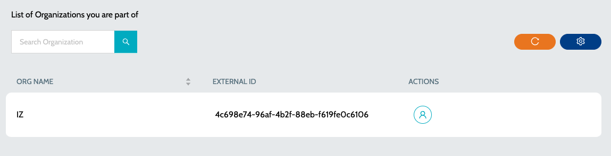

# Organizations

List of organizations the user is part of

1. Navigate to **`Organization`** -> **`My Organizations`**&#x20;

<figure><figcaption></figcaption></figure>

2. Click on **`View Users`** action to view the users of organization&#x20;

<figure><figcaption></figcaption></figure>

### See Also

* [Users](users.md)
* [Invite User](invite-user.md)
* [Roles](roles.md)
