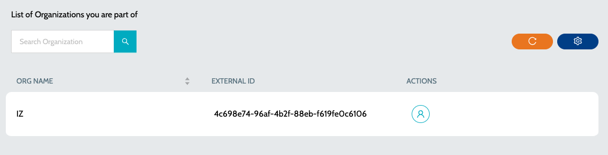

# Organizations

List of organizations the user is part of

1. Navigate to **`Organization`** -> **`My Organizations`**&#x20;

<figure><figcaption></figcaption></figure>

2. Click on **`View Users`** action to view the users of organization&#x20;

<figure><figcaption></figcaption></figure>

### Onboard Organization 

Users with the **`Onboard Organization`** permission can add an organization:

1. Navigate to **`Organization`** -> **`My Organizations`** and click on **`Onboard Organization`**
2. Enter the **`Organization Name`** and select the **`Source`**: **`Other`**, **`Salesforce`** or **`AWS`**
3. For source **`AWS`** (from 26.4.1), enter the AWS account details:

| Field                   | Required | Description                                                                                                                                                                                                                       |
| ----------------------- | -------- | --------------------------------------------------------------------------------------------------------------------------------------------------------------------------------------------------------------------------------- |
| **`AWS Account ID`**    | Yes      | The 12-digit id of the AWS account. The sync checks that the access key belongs to this account.                                                                                                                                  |
| **`Access Key ID`**     | Yes      | Access key id of an IAM user or role with read access to the AWS services to be governed.                                                                                                                                         |
| **`Secret Access Key`** | Yes      | Secret of the access key. It is stored encrypted and is never shown again.                                                                                                                                                        |
| **`Regions`**           | No       | Comma-separated list of regions to govern, for example `eu-west-2,us-east-1`. Each region becomes an environment of the organization. When left empty, the regions that contain supported resources are discovered automatically. |

4. Click on **`OK`**

For an AWS organization, IZ Suite creates one environment per region and a **`global`** environment for region-agnostic resources such as CloudFront distributions. Each AWS account is onboarded as its own organization with its own environments; a tenant can onboard any number of accounts. The administrator who onboards an AWS organization is granted the AWS permissions on it automatically.

#### Edit Organization 

1. Click on the **`Edit Organization`** action of the organization
2. Update the **`Organization Name`**. The **`Source`** cannot be changed.
3. For an AWS organization, the **`AWS Account ID`**, **`Access Key ID`** and a masked **`Secret Access Key`** are shown. To rotate or correct the credential, enter the new values. Leaving the masked secret unchanged keeps the stored secret.
4. Click on **`OK`**

 

### See Also

* [Users](users.md)
* [Invite User](invite-user.md)
* [Roles](roles.md)
