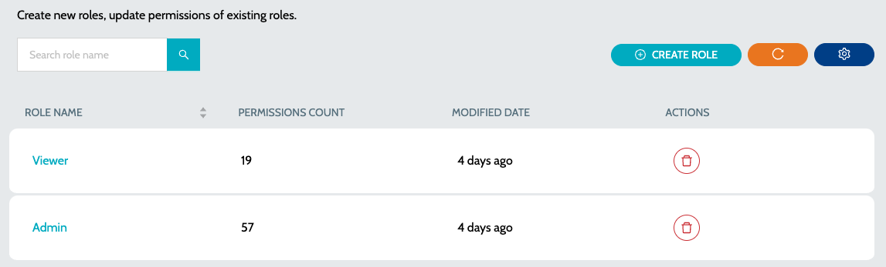
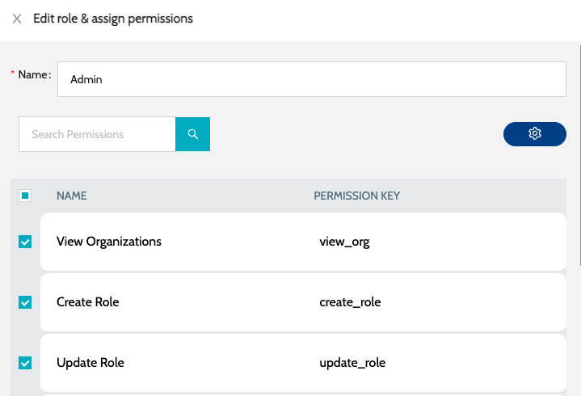
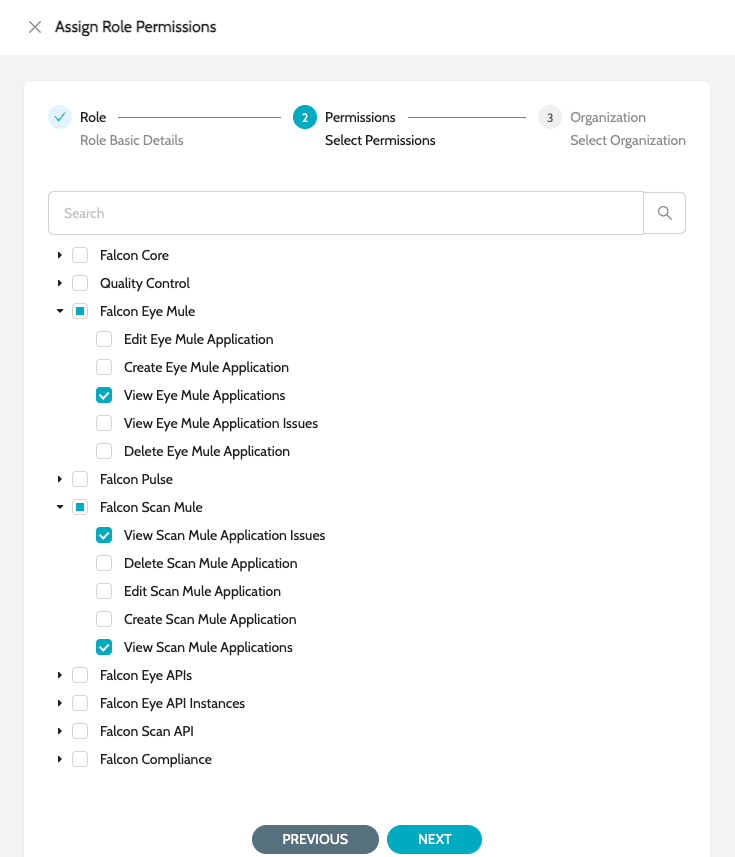
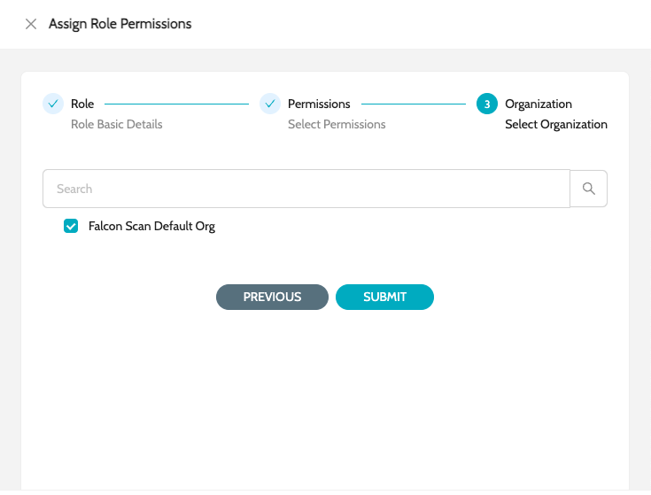

# Roles

### Built-in Roles

| Role Name                                           | Description                                                                | Modules .6+                      |
| --------------------------------------------------- | -------------------------------------------------------------------------- | -------------------------------- |
| **`IZ Core Admin`** .6+                             | Admin access to all IZ Core Modules                                        | **`Organization`**               |
| **`Global Settings`**                               | **`Agents`**                                                               | **`Users`**                      |
| **`Schedules`**                                     | **`Audit`** .5+                                                            | **`Quality Control Admin`** .5+  |
| Admin access to Quality Control Settings            | **`Quality Gates`**                                                        | **`Quality Profiles`**           |
| **`Rules`**                                         | **`Metric Profiles`**                                                      | **`Metrics`** .4+                |
| **`IZ Pulse Admin`** .4+                            | Admin access to IZ Pulse Settings                                          | **`Status Pages`**               |
| **`Categories`**                                    | **`Endpoints`**                                                            | **`Maintenance Schedules`**      |
| **`IZ Scan CLI`**                                   | Role with appropriate permissions to be used with IDE Plugin or CICD Scans | **`IZ Scan CLI / IDE`** .3+      |
| **`_ORG_ IZ Eye Admin`** .3+                        | Admin access to IZ Eye for a specific organization                         | **`Mule Application`**           |
| **`Exchange APIs`**                                 | **`API Manager Apps`** .2+                                                 | **`_ORG_ IZ Scan Admin`** .2+    |
| Admin access to IZ Scan for a specific organization | **`Mule Projects`**                                                        | **`API Projects`** .6+           |
| **`IZ Core Viewer`** .6+                            | View access to all IZ Core Modules                                         | **`Organization`**               |
| **`Global Settings`**                               | **`Agents`**                                                               | **`Users`**                      |
| **`Schedules`**                                     | **`Audit`** .5+                                                            | **`Quality Control Viewer`** .5+ |
| View access to Quality Control Settings             | **`Quality Gates`**                                                        | **`Quality Profiles`**           |
| **`Rules`**                                         | **`Metric Profiles`**                                                      | **`Metrics`** .4+                |
| **`IZ Pulse Viewer`** .4+                           | View access to IZ Pulse Settings                                           | **`Status Pages`**               |
| **`Categories`**                                    | **`Endpoints`**                                                            | **`Maintenance Schedules`** .3+  |
| **`_ORG_ IZ Eye Viewer`** .3+                       | View access to IZ Eye for a specific organization                          | **`Mule Application`**           |
| **`Exchange APIs`**                                 | **`API Manager Apps`** .2+                                                 | **`_ORG_ IZ Scan Viewers`** .2+  |
| View access to IZ Scan for a specific organization  | **`Mule Projects`**                                                        | **`API Projects`**               |

#### Permissions Added in 26.4.1 

* **AWS:** two permission categories, **`Falcon Eye AWS`** and **`Falcon Scan AWS`**, hold the permissions of each AWS service for IZ Eye (inventory) and IZ Scan (configuration scanning). A service's permissions are available only when the service is enabled on the tenant's licence. The administrator who onboards an AWS organization receives the AWS permissions on it automatically.
* **Java:** Java scan permissions are granted automatically on server start: every role that holds Python scan permissions on an organization receives the matching Java permissions there. Users see **`Java Apps`** after signing in again.
* **Languages added later:** when a new language or platform is added through seed data after the tenant was onboarded, every role of the tenant receives the new language's permissions wherever it holds the permissions of the related existing language (for example Java follows Python), on every organization of the tenant. Existing roles therefore see the new language's applications without manual changes.
* **Security tokens:** **`Generate Security Token`** allows a user to generate their own security tokens, and **`Generate Security Token For Another User`** allows generating tokens for other users and the **`Set Temporary Password`** and **`Reset MFA`** actions under **`Users`**.

### Roles

To view all roles in the system -

1. Navigate to **`Organization`** -> **`Roles`**&#x20;

<figure><figcaption></figcaption></figure>

2. Click on the role name to edit the permissions assigned to the role&#x20;

<figure><figcaption></figcaption></figure>

3. Choose the required set of permissions and click on Submit

### Create Role

To create a new role -

1. Navigate to **`Organization`** -> **`Roles`** and click on **`Create Role`**&#x20;

Choose the required set of permissions&#x20;

<figure><figcaption></figcaption></figure>

3. Choose the appropriate Organization and Environments (if applicable)&#x20;

<figure><figcaption></figcaption></figure>

4. Click on Submit

### See Also

* [Organizations](organizations.md)
* [Users](users.md)
* [Invite User](invite-user.md)
