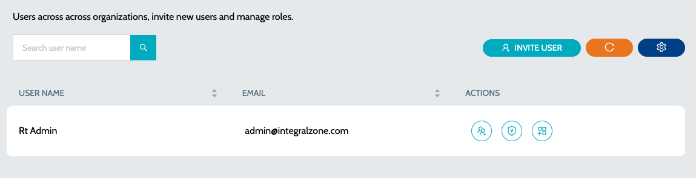
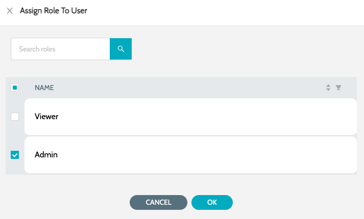
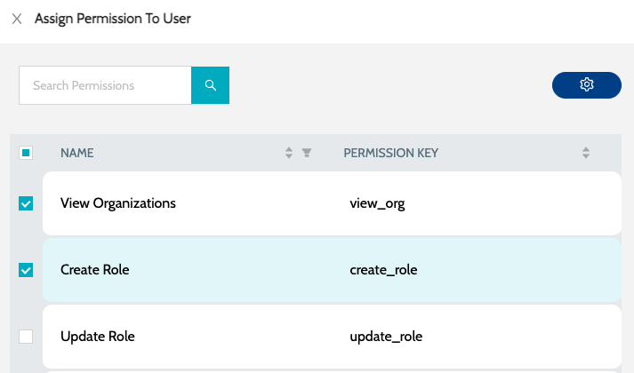
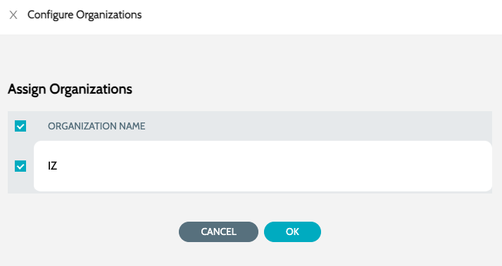

# Users

List of all users in the system

1. Navigate to **`Organization`** -> **`Users`**

<figure><figcaption></figcaption></figure>

2. Actions include -

a. **`Assign Roles`** - Configure roles to the user

<figure><figcaption></figcaption></figure>

b. **`Assign Permission`** - Configure permissions to the user

<figure><figcaption></figcaption></figure>

c. **`Assign Organization`** - Configure organizations to the user

<figure><figcaption></figcaption></figure>

### See Also

* [Organizations](organizations.md)
* [Invite User](invite-user.md)
* [Roles](roles.md)
