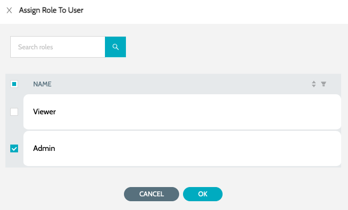
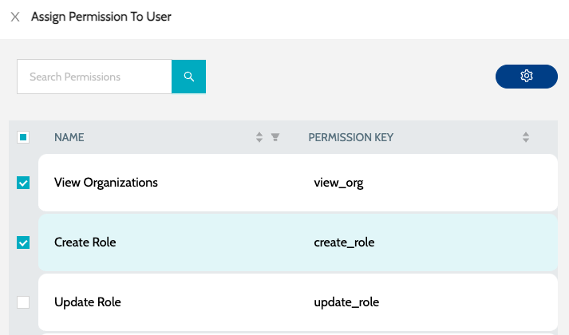

# Users

List of all users in the system

1. Navigate to **`Organization`** -> **`Users`**&#x20;

<figure><figcaption></figcaption></figure>

2. Actions include -

a. **`Assign Roles`** - Configure roles to the user&#x20;

<figure><figcaption></figcaption></figure>

b. **`Assign Permission`** - Configure permissions to the user&#x20;

<figure><figcaption></figcaption></figure>

c. The actions menu of each user also offers, depending on your permissions:

| Action                                 | Description                                                                                                                                                      |
| -------------------------------------- | ---------------------------------------------------------------------------------------------------------------------------------------------------------------- |
| **`Manage Subscriptions`**             | Manage the user's notification subscriptions.                                                                                                                    |
| **`Set Temporary Password`**           | From 26.4.1. Set an IZ User Auth password for the user. The user must change it at their next sign-in.                                                           |
| **`Reset MFA`**                        | From 26.4.1. Remove the user's authenticator and recovery codes, for example after a lost device. The user sets up an authenticator again at their next sign-in. |
| **`Disable User`** / **`Enable User`** | Disable or re-enable the user. A disabled user cannot sign in.                                                                                                   |

**`Set Temporary Password`** and **`Reset MFA`** require the **`Generate Security Token For Another User`** permission. See [Sign-in and MFA](../sign-in-and-mfa.md).


From 26.4.1 every tenant has an **`IZ Support User`** licence administrator. It has no password and is used only by Integral Zone support to recover access when all administrators are locked out.


### See Also

* [Organizations](organizations.md)
* [Invite User](invite-user.md)
* [Roles](roles.md)
