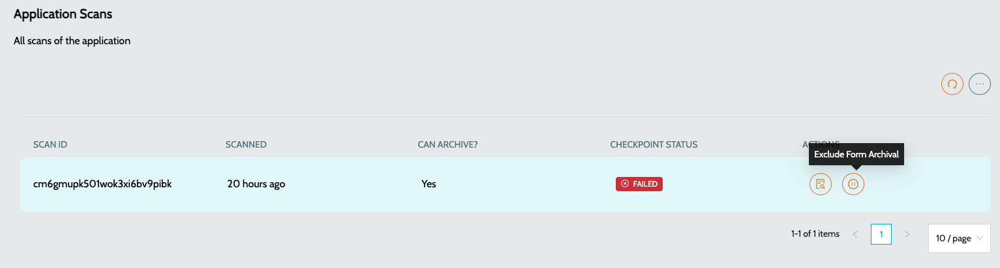

# Records Archival

## Archival Process

The archival process ensures that historical data is efficiently managed by archiving older records while retaining essential recent data. Multiple archival jobs are available, and their configurations can be adjusted under Global Settings with key named **`Archival Policies`**. Users can modify these settings based on their requirements.

## Archival Policies

### Application Scans

1. **`Retention Period`**: 7 days (default value)
2. Retention Type can either be configured based on number of days or scans&#x20;

| Retention Type        | Description                                                                     |
| --------------------- | ------------------------------------------------------------------------------- |
| numberOfDaysToRetain  | Number of days the scan history will be retained unless exempted from archival. |
| numberOfScansToRetain | Number of previous scans to retained unless exempted from archival.             |

1. **`Archival Rule`**: Scan history will be maintained for 7 days. Any scans older than 7 days will be archived, except for the latest scan.
2. **`Exemptions`**: Users can mark specific scans as exempt from the archival process to retain them beyond the default period.
3. To exclude a scan from archival, Navigate to the required application’s actions -> **`View Previous Scans`** and exclude / include the required scan from archival

<figure><figcaption></figcaption></figure>

### Job Executions

1. **`Retention Period`**: 7 days (default value)
2. **`Archival Rule`**:
   1. One-time jobs that are completed will be retained for 7 days.
   2. Any job executions older than 7 days will be archived.
   3. Recurring jobs are not subject to archival and will remain available.

### Audit Log

1. **`Retention Period`**: 30 days (default value)
2. **`Archival Rule`**: System and user audit logs will be maintained for 30 days. Any records older than 30 days will be archived.

### Notification

1. **`Retention Period`**: 30 days (default value)
2. **`Archival Rule`**: Notification Status logs will be maintained for 30 days. Any records older than 30 days will be archived.

### Configuring Archival Policies

Users can modify the archival settings by navigating to **`Global Settings`** > **`Archival Policies`**. These settings allow customization of retention periods and exemption rules based on organizational needs.

### Additional Considerations

1. Archived data is no longer accessible through regular system views but can be retrieved if needed.
2. Proper exemptions should be configured to retain critical scan data beyond the archival window.
3. Recurring jobs remain available regardless of their execution history.

### See Also

* [Creating an Agent](../agent/create-agent.md)
* [Updating an Agent](../agent/update-agent.md)
