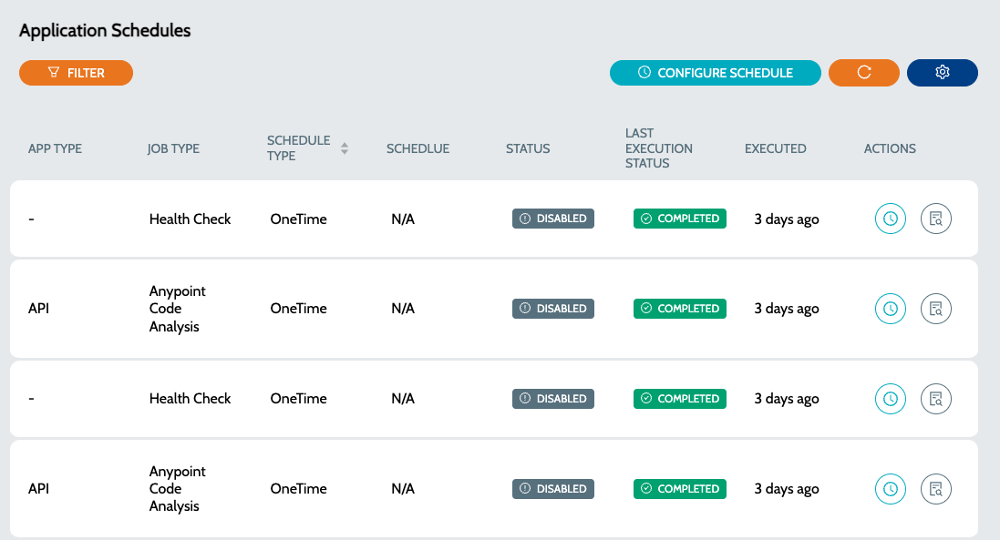

# Job Schedules

Job Schedules lists all the schedules created in the system


* Job Schedules can be either of the following types
* **`One Time`** - Job will only be executed once
* **`Regular Interval`** - Jobs will run based on the configured schedule


### Schedules

1. Navigate to **`Schedules`** -> **`Schedules`**

<figure><figcaption></figcaption></figure>

2. **`Status`** column indicates the Job status. A **`One Time`** job will be automatically disabled once the execution is complete
3. Click on **`Disable Job`** to disable any active job instances
4. Click on **`View Executions`** to view the list of executions for the configured schedule&#x20;

<figure><figcaption></figcaption></figure>

### See Also

* [Job Executions](job-executions.md)
