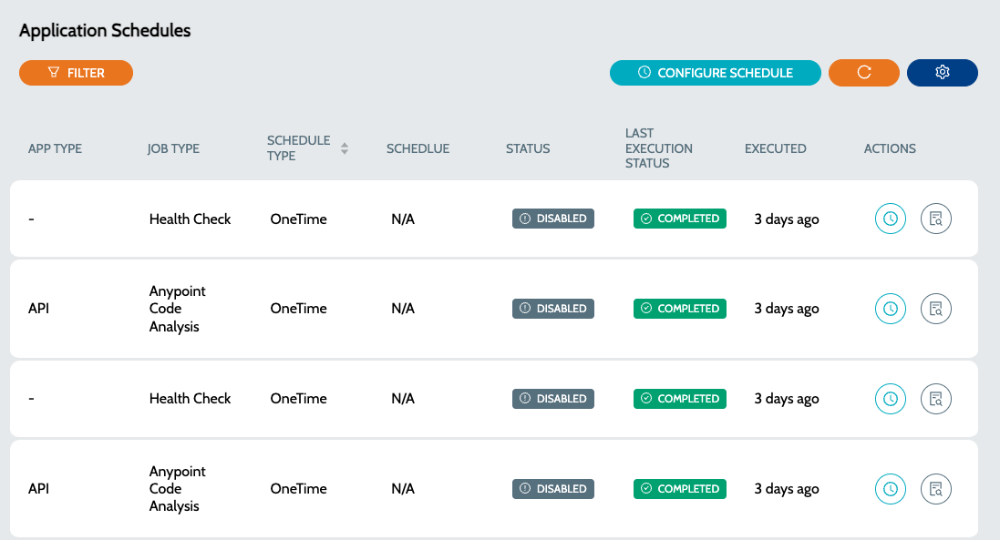

# Job Schedules

Job Schedules lists all the schedules created in the system


* Job Schedules can be either of the following types
* **`One Time`** - Job will only be executed once
* **`Regular Interval`** - Jobs will run based on the configured schedule


### Schedules

1. Navigate to **`Schedules`** -> **`Schedules`**

<figure><figcaption></figcaption></figure>

2. **`Status`** column indicates the Job status. A **`One Time`** job will be automatically disabled once the execution is complete
3. Click on **`Disable Job`** to disable any active job instances
4. Click on **`View Executions`** to view the list of executions for the configured schedule&#x20;

<figure><figcaption></figcaption></figure>

### How Schedules Are Executed

1. The IZ Server evaluates every enabled schedule and records when it fired last and when it is due next.
2. When a schedule is due, the server queues it. Any running agent that supports the schedule's job type picks it up and creates the job executions for the selected organizations and environments.
3. Pending job executions are allocated to free agent workers every 10 seconds. In a multi-tenant installation, allocation is fair across tenants.
4. If no agent supporting the job type is running, the schedule stays queued until one starts. Check **`Global Settings`** -> **`Agents`** when schedules do not run.

### See Also

* [Job Executions](job-executions.md)
