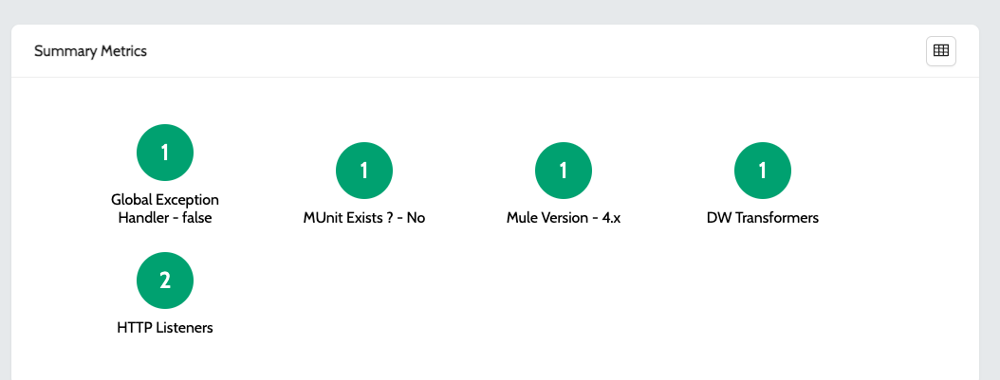
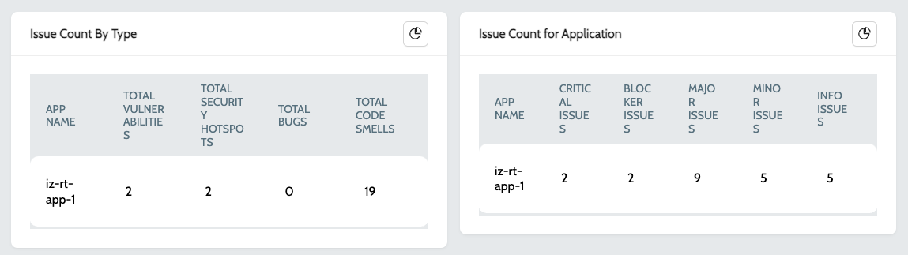

# Application Dashboard

Application Dashboard displays the summary / grouped report of all the issues and metrics in the application -

1. Navigate to **`IZ Eye`** and select any application type. E.g.: Mule Projects or APIs
2. Click on the **`View Dashboard`** action of any of the applications
3. Dashboard is group by -
   1. **`Application Statistics`** - Displays all the issues grouped by rule severity and category&#x20;

<figure><figcaption></figcaption></figure>

**`b. Summary Metrics`** - Displays all the aggregated metrics  

<figure><figcaption></figcaption></figure>

**`c. Issue Count By Type`** - Displays the graphical view of count of issues by type and category&#x20;

<figure><figcaption></figcaption></figure>

4.  To get the tabular view of all the available charts, click on the **`table view`** icon available on the top right of every chart\
    &#x20;

    <figure><figcaption></figcaption></figure>

### See Also

* [Mule Projects](applications/mule-applications.md)
* [API Applications](applications/exchange-apis.md)
* [Application Issues](../application-issues.md)
