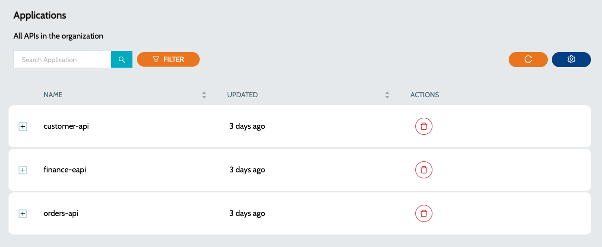
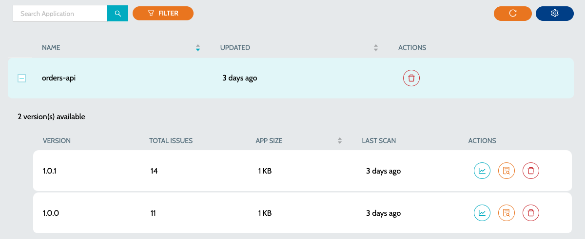

# Exchange APIs


* To start scanning the APIs, a schedule has to be created to scan the APIs in Anypoint **`Exchange`**
* To create a schedule follow the steps mentioned at [Configure Schedule](../../azure-ais/schedule-configuration.md)
* All APIs published in the configured Business Group’s **`Exchange`** will be scanned.


### Configuring Schedule

1. While configuring the schedule select `Anypoint Exchange APIs Analysis` job type
2. In the next step, select the required `Organizations`
3. Choose the appropriate schedule

### To view all the APIs

1.  Navigate to **`IZ Eye`** -> **`APIs`**  

    <figure><figcaption></figcaption></figure>
2.  Click on the **`Plus`** icon to view all the versions of the API 

    <figure><figcaption></figcaption></figure>
3. Summary details include -
   1. **`Total Issues`** - Indicates total number of issues once the application is scanned
   2. **`App Size`** - Total size of the deployed artifact
   3. **`Last Scan`** - Time since the last scan was performed
4. Actions include -
   1. **`View Dashboard`** - Summary report of all the issues. [View Dashboard](../../../../../iz-suite/iz-eye/dashboard.md)
   2. **`View Issues`** - Detailed report of the issues with file names and line numbers. [View Issues](../../application-issues.md)

### See Also

* [Mule Projects](mule-applications.md)
* [Application Issues](../../application-issues.md)
* [Application Dashboard](../../../../../iz-suite/iz-eye/dashboard.md)
