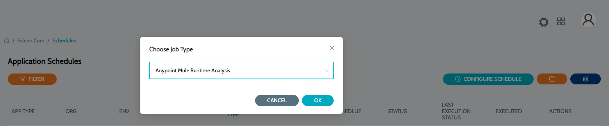
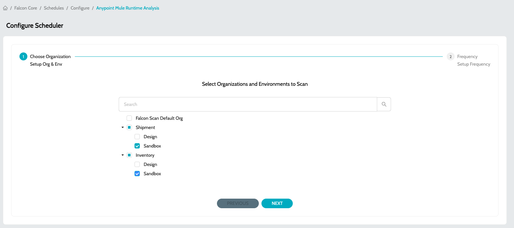
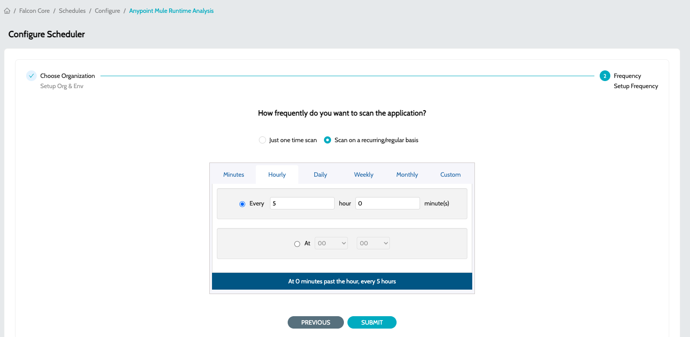

# Code Scan Schedule Configuration

## Configure Schedule


* Repeatedly creating a schedule for the same organization and environment will simply overwrite the pre-existing schedule.
* Required Connected App scopes for each Job Type reference can be found here


1. Navigate to **`Schedules`** -> **`Schedules`** and click on **`Configure Schedule`**
2. Select appropriate job type
   1. **`Anypoint Mule Runtime Analysis`** - Job Type to scan application deployed in Runtime Manager
   2. **`Anypoint API Instance Analysis`** - Job Type to scan application deployed in API Manager
   3. **`Anypoint Exchange APIs Analysis`** - Job Type to scan RAML/OAS assets published to exchange
   4.  **`API Health Check`** - Job Type to monitor API Endpoints  

       <figure><figcaption></figcaption></figure>
3.  Select the Organizations and Environments to perform the scan\
    &#x20;

    <figure><figcaption></figcaption></figure>
4.  Select the schedule/frequency at which the analysis should be performed 

    <figure><figcaption></figcaption></figure>
5. Click on **`Submit`** to configure the schedule

### See Also

* [Aggregated Dashboard](../../../../iz-suite/iz-eye/dashboard.md)
* [Application Dashboard](application-dashboard.md)
* [Agent Job Types](../../iz-core/agent/agent-job-types.md)
* [Mule Projects](applications/mule-applications.md)
* [API Applications](applications/exchange-apis.md)
