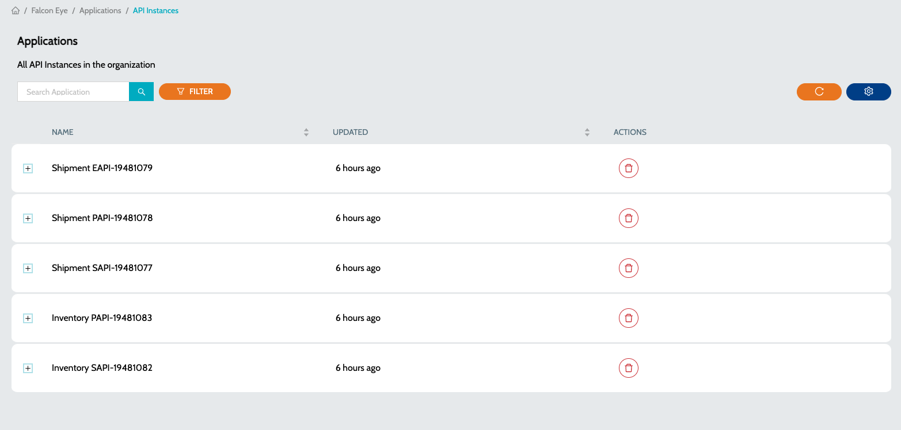
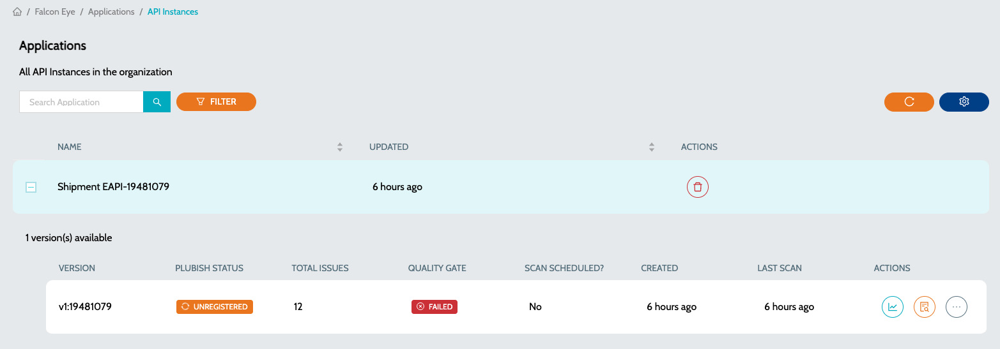

# API Instances


* To start scanning the API Instances, a schedule has to be created to scan the applications deployed to `API Manager` in Anypoint Platform.
* To create a schedule follow the steps mentioned at [Configure Schedule](../azure-ai-services/schedule-configuration.md).


### Configuring Schedule

1. While configuring the schedule, select `Anypoint API Instance Analysis` job type
2. In the next step, select the required `Organizations` and `Environments`
3. Choose the appropriate schedule

### To view all the API Instances

1.  Navigate to **`IZ Eye`** -> **`API Instances`**  

    <figure><figcaption></figcaption></figure>
2.  Click on the **`Plus`** icon to view all the versions of the API Instances  

    <figure><figcaption></figcaption></figure>
3. Summary details include -
   1. **`Instance Id`** - Version or Instance Id of the API Instance
   2. **`Publish Status`** - Status of the published API Instance
   3. **`Total Issues`** - Total Issues based on the configured Rule Profile
   4. **`Quality Gate`** - Status of the Quality Gate
   5. **`Last Scan`** - Time since the last scan was performed
4. Actions include -
   1. **`View Dashboard`** - Summary report of all the issues. [View Dashboard](../dashboard.md)
   2. **`View Issues`** - Detailed report of the issues with file names and line numbers. [View Issues](application-issues.md)

### See Also

* [API Applications](api-applications.md)
* [Application Issues](../../../../codescan/issues/)
* [Application Dashboard](../dashboard.md)
