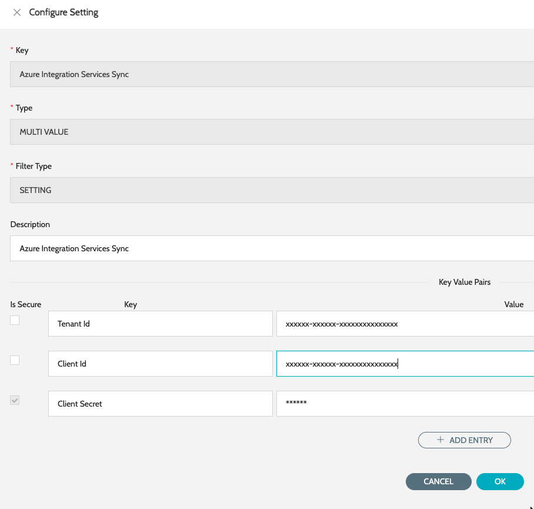

# Application Registration

App Registration in Microsoft Azure is required to securely connect to REST APIs because it establishes a trusted identity for the IZ Suite application within the Microsoft Entra ID (formerly Azure Active Directory) ecosystem. When IZ Suite integrates with Azure services, it must authenticate itself before accessing resources such as management APIs, integration services, or other protected endpoints.

App Registration creates a dedicated application identity, generates credentials (Client ID, Client Secret), and enables administrators to assign precise API permissions using OAuth 2.0 flows. This ensures secure, role-based, and auditable access to Azure REST APIs without relying on user credentials, making the integration enterprise-grade, compliant, and scalable.

### New App Registration in Azure

Follow the below steps to register a new app in Microsoft Entra ID -

1. Search for **`Microsoft Entra ID`** -> **`App Registrations`** click on **`New registration`**
2. Enter the basic details -
   1. **`Name`** - Name of the app
   2. **`Supported account types`** - Single tenant only
3. Click on Register
4. Once the app is created, click on **`Add a certificate or secret`** under Client Credentials
   1. Select the Client Secret tab and click on **`New Client Secret`**
   2. **`Description`** -> Description for the client secret
   3. **`Expiry`** -> Choose the expiry based on the organization standards
   4. Copy the value of the new client secret, which will be used while configuring OAUTH in IZ Suite

Follow the below steps to assign permissions to the registered app -

1. Navigate to **`Subscriptions`** -> Select the required subscription -> **`Access Control (IAM)`**
2. Navigate to **`Role Assignments`** click on **`Add Role Assignments`**
   1. Select **`Reader`** role
   2. Assign access to -> User, group or service principal
   3. Select Members -> and search for the created Entra ID app and select it
   4. Review and assign

### Retrieve the App’s Client Id and Tenant id

1. Search for **`Microsoft Entra ID`** -> **`App Registrations`** click on the registered app
   1. **`Directory (tenant) ID`** - Tenant Id to be used in IZ Suite
   2. **`Application (client) ID`** - Client Id to be used in IZ Suite
   3. Client secret should already be copied at the time of generation

### Configuring the App in IZ Suite

1. Navigate to main menu **`Global Settings`** -> **`Settings`** and search for **`Azure Integration Services Sync`**
2. Click on edit action item
3. Enter the following details -
   1. **`Tenant Id`** - The tenant id from the Azure’s App Registration page
   2. **`Client Id`** - The client id from the Azure’s App Registration page
   3. **`Client Secret`** - The secret copied while generating the Client secret
4. Click on save.&#x20;

<figure><figcaption></figcaption></figure>

### See Also

* [Configure Code Scan Schedules](../code-scan-schedule-configuration.md)
* [Logic Apps](applications/logic-applications.md)
* [API Management](applications/apim-applications.md)
* [Function Apps](applications/function-applications.md)
