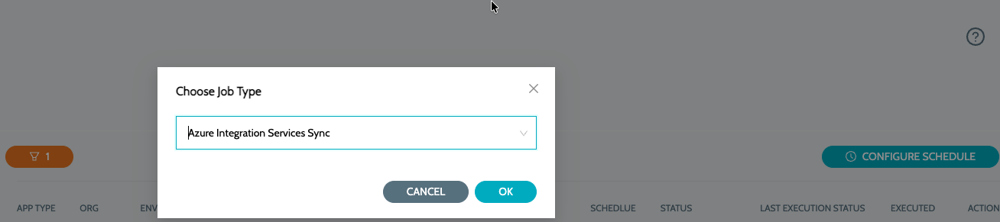
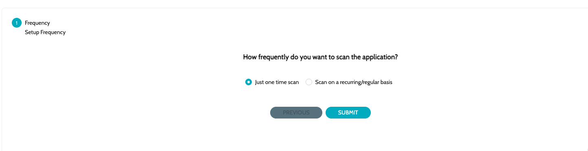
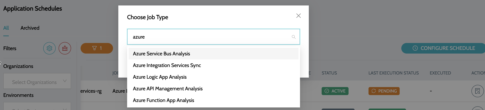
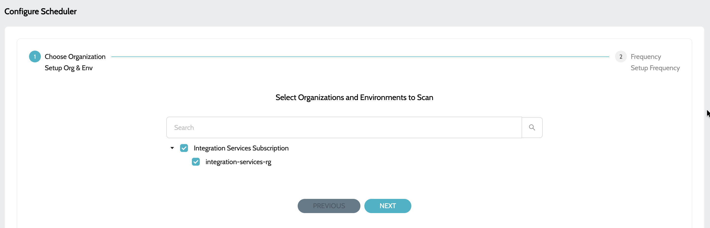
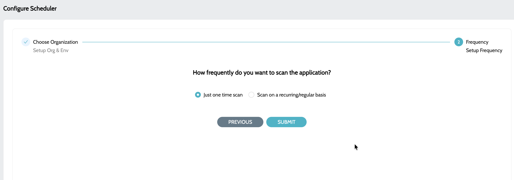

# Schedule Configuration


* It is required to create the Microsoft Entra Id’s App registration before configuring the schedules - App Registration
* Repeatedly creating a schedule for the same organization and environment will simply overwrite the pre-existing schedule.


### Configuring the initial Schedule

This schedule is required to sync the applicable subscriptions and resource groups for the first time. Creating a recurring schedule will periodically check for new Subscriptions and resource groups.

1. Navigate to **`Schedules`** -> **`Schedules`** and click on **`Configure Schedule`**
2. Select **`Azure Integration Services Sync`** job type and proceed&#x20;

<figure><figcaption></figcaption></figure>

3. Select the appropriate schedule based on the requirement (Either **`OneTime`** or **`Recurring`**)&#x20;

<figure><figcaption></figcaption></figure>

4. Once the schedule completed successfully, we should be able to see all the Subscriptions and Resource Groups under **`Organization`** main menu.&#x20;

<figure><figcaption></figcaption></figure>

5. Click on **`View Environments`** to view all the resource groups under thee subscription.

### Configuring schedule for continuous code scans

1. Navigate to **`Schedules`** -> **`Schedules`** and click on **`Configure Schedule`**
2.  Select the appropriate schedule based on the requirement. Applicable schedules include -

    1. **`Azure Logic App Analysis`** - To scan the applicable **`Logic Apps`** under the selected resource group
    2. **`Azure API Management Analysis`** - To scan the applicable **`API Management - Policies`** under the selected resource group
    3. **`Azure Function App Analysis`** - To scan the applicable **`Function Apps`** under the selected resource group&#x20;

    <figure><figcaption></figcaption></figure>
3. Select the Subscriptions and Resource Groups to perform the scan&#x20;

<figure><figcaption></figcaption></figure>

4. Select the schedule/frequency at which the analysis should be performed

<figure><figcaption></figcaption></figure>

5. Click on **`Submit`** to configure the schedule

### See Also

* [App Registration](application-registration.md)
* [Logic Apps](applications/logic-applications.md)
* [API Management](applications/apim-applications.md)
* [Function Apps](applications/function-applications.md)

