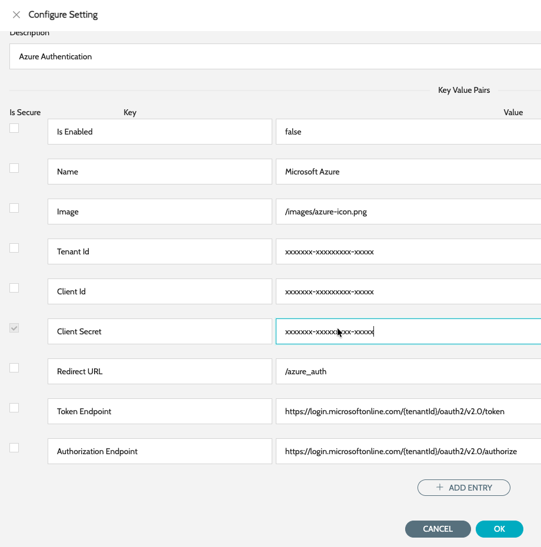

# SSO Configuration

## Azure SSO Configuration

IZ Suite can be configured to integrate with Azure Single Sign-On (SSO) using Microsoft Entra ID (formerly Azure Active Directory) to provide secure and centralized authentication. By registering IZ Suite as an enterprise application in Azure and configuring SAML or OpenID Connect, organizations can enable users to log in with their corporate Azure credentials.

### Registering App in Azure Entra ID

Follow the below steps to register an App in Entra ID -

1. Navigate to **`Microsoft Entra ID`** -> **`App Registrations`** -> **`New Registration`**
2. Enter the basic details -
   1. **`Name`** - Name of the new App
   2. **`Supported account types`** - Single Tenant Only
   3. **`Redirect URI`** - Should be Web, **`https://<iz_suite_url>/azure_auth`**
3. Click on Save
4. Once the app is created, click on **`Add a certificate or secret`** under Client credentials
5. Click on **`Client secrets`** -> **`New Client Secret`**
6. Enter name, expiry and click on Add
7. Copy the generated Client Value which will be displayed only once
8. Click on **`API Permissions`** and make sure **`User.Read`** is assigned.

### Configuring the App in IZ Suite

1. Navigate to main menu **`Global Settings`** -> **`Settings`** and search for **`Azure Auth`**
2. Click on edit action item
3. Enter the following details -
   1. **`Is Enabled`** - Set the value to true
   2. **`Tenant Id`** - The tenant id from the Azure’s App
   3. **`Client Id`** - The client id from the Azure’s App
   4. **`Client Secret`** - The secret copied while generating the Client secret
4. Click on save.&#x20;

<figure><figcaption></figcaption></figure>

### See Also

* [Configure Code Scan Schedules](../code-scan-schedule-configuration.md)
* [Logic Apps](applications/logic-applications.md)
* [API Management](applications/apim-applications.md)
* [Function Apps](applications/function-applications.md)
