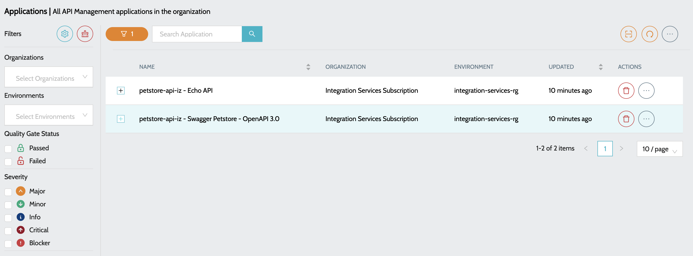
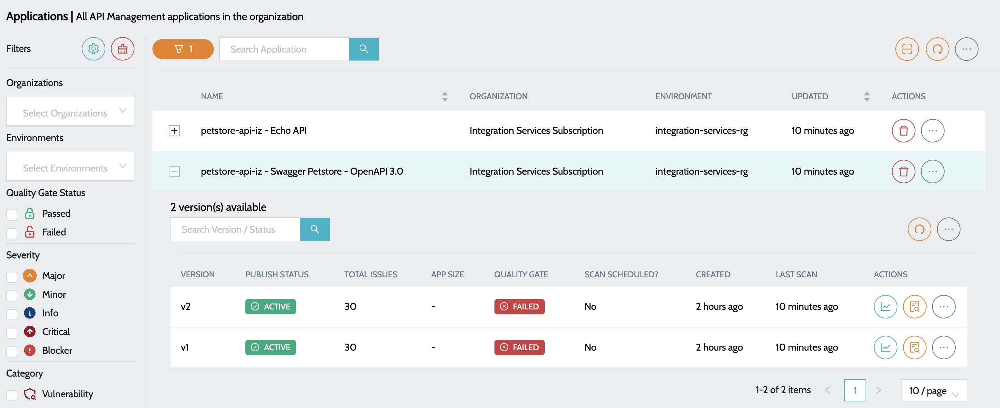

# APIM Applications

## Azure API Management


* To start scanning the applications, a schedule has to be created to scan the deployed API Management Instances - [Configure Code Scan Schedules](../../anypoint-platform/code-scan-schedule-configuration.md)


### What Is Scanned

For every API discovered in an API Management instance, the **`Azure API Management Analysis`** job collects the policy definitions at all four scopes and evaluates them together against the active **Azure API Management** quality profile:

| Scope         | File reported in issues                        | Description                                        |
| ------------- | ---------------------------------------------- | -------------------------------------------------- |
| **Global**    | `policy.xml`                                   | The service-level policy applied to all APIs       |
| **Product**   | `products/<product>/policy.xml`                | The policy of each product the API is published in |
| **API**       | `apis/<api>/policy.xml`                        | The policy of the API                              |
| **Operation** | `apis/<api>/operations/<operation>/policy.xml` | The policy of each operation of the API            |

Scopes without a policy are skipped. Issues are reported with the file path shown above and the line number inside that policy, so a rule such as _"API should have a rate-limit policy applied"_ can be satisfied at any scope.

### To view all the APIs

1.  Navigate to **`IZ Eye`** -> **`Azure API Management`**. Overview includes

    <figure><figcaption></figcaption></figure>

a. **`Name`** - Name of the API prefixed with Resource Group name

b. **`Organization`** - Subscription to which the API belongs to

c. **`Environment`** - Resource Group to which the API belongs to 

2.  Click on the **`Plus`** icon to view all the versions of the API  

    <figure><figcaption></figcaption></figure>
3. Summary details include -
   1. **`Total Issues`** - Indicates total number of issues once the application is scanned
   2. **`Status`** - Indicated the status of class / trigger in Salesforce
   3. **`Last Scan`** - Time since the last scan was performed
4. Actions include -
   1. **`View Dashboard`** - Summary report of all the issues.
   2. **`View Issues`** - Detailed report of the issues with file names and line numbers.

### See Also

* [App Registration](../app-registration.md)
* [Configure Code Scan Schedules](../../../iz-pulse/configure-schedule.md)
* [Logic Apps](logic-applications.md)
* [Function Apps](function-applications.md)
