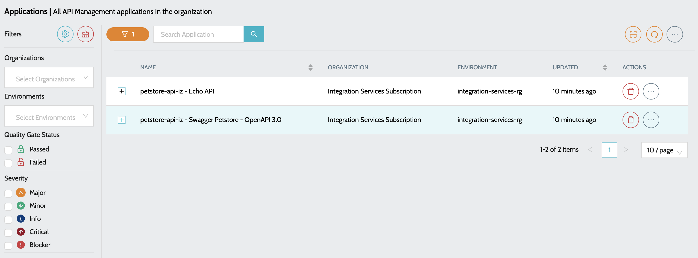
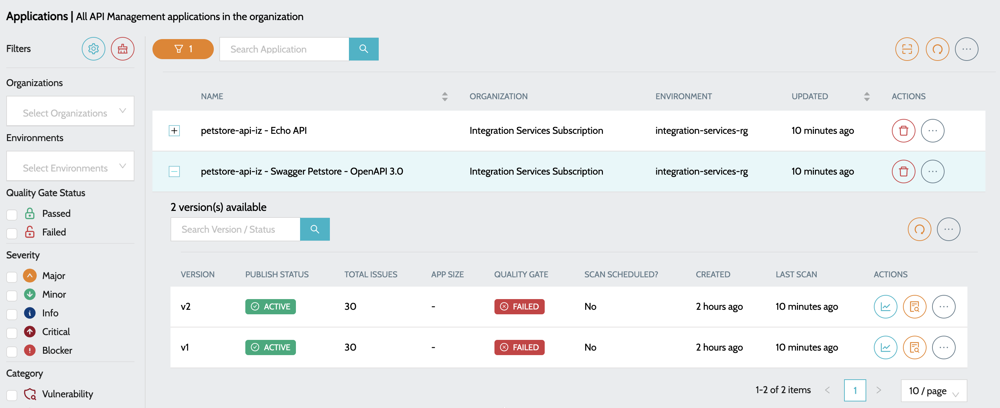

# Function Applications

## Azure API Management


* To start scanning the applications, a schedule has to be created to scan the deployed API Management Instances - [Configure Code Scan Schedules](../../anypoint-platform/code-scan-schedule-configuration.md)


### To view all the APIs

1. Navigate to **`IZ Eye`** -> **`Azure API Management`**. Overview includes -

<figure><figcaption></figcaption></figure>

* **`Name`** - Name of the API prefixed with Resource Group name
* **`Organization`** - Subscription to which the API belongs to
* **`Environment`** - Resource Group to which the API belongs to

2. Click on the **`Plus`** icon to view all the versions of the API

<figure><figcaption></figcaption></figure>

3. Summary details include -

* **`Total Issues`** - Indicates total number of issues once the application is scanned
* **`Status`** - Indicated the status of class / trigger in Salesforce
* **`Last Scan`** - Time since the last scan was performed

4. Actions include -

* **`View Dashboard`** - Summary report of all the issues.
* **`View Issues`** - Detailed report of the issues with file names and line numbers.

### See Also

* [App Registration](../app-registration.md)
* [Configure Code Scan Schedules](../../anypoint-platform/code-scan-schedule-configuration.md)
* [Logic Apps](logic-applications.md)
* [Function Apps](function-applications.md)
