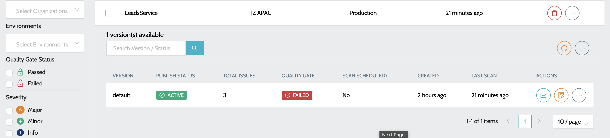
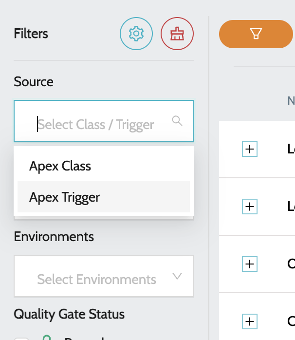

# Apex Classes and Triggers

## Apex Applications


* Create Organization and Environment with appropriate external client app credentials - [Configure External Client App](../external-client-application-configuration.md)
* To start scanning the applications, a schedule has to be created to scan the Classes and Triggers deployed in Salesforce Instance - [Configure Code Scan Schedule](../../code-scan-schedule-configuration.md)


### To view all the applications

1. Navigate to **`IZ Eye`** -> **`Salesforce Apex`**. Overview includes -

<figure><figcaption></figcaption></figure>

a. **`Name`** - Name of the Apex Class or Trigger

b. **`Organization`** - Organization to which the app belongs to

c. **`Environment`** - Environment to which the app belongs to

2. Click on the **`Plus`** icon to view the details

<figure><figcaption></figcaption></figure>

3. Summary details include -

&#x20;    a. **`Total Issues`** - Indicates total number of issues once the application is scanned

&#x20;    b. **`Status`** - Indicated the status of class / trigger in Salesforce

&#x20;    c. **`Last Scan`** - Time since the last scan was performed

4. Actions include -

&#x20;     a.**`View Dashboard`** - Summary report of all the issues.

&#x20;     b.**`View Issues`** - Detailed report of the issues with file names and line numbers.

### To view only Apex Classes or Triggers

1. To filter either Classes or Triggers locate the **`Source`** filter from the filtering options and choose the appropriate value -

<figure><figcaption></figcaption></figure>

1. **`Apex Class`** - To filter only Apex Classes
2. **`Apex Trigger`** - To filter only Apex Triggers

Use these filters to narrow the list quickly, then open the application details to review scan status, issue count, and the available reporting actions for the selected Apex Class or Trigger.

### See Also

* [Configure External Client App](../external-client-application-configuration.md)
* [Configure Code Scan Schedule](../../code-scan-schedule-configuration.md)
