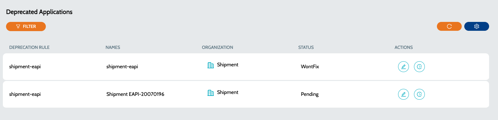

# Deprecated Applications

All the applications marked for deprecation can be accessed using this screen

### Deprecated Applications

List of all the deprecated applications in the system.

* Navigate to **`IZ Lens`** -> **`Deprecated Applications`**.
* **`Deprecation Rule`** - Name of the deprecation rule which caused the deprecation.
* **`Name`** - Name of the deprecated application
* **`Organization`** - Organization to which the application belongs to
* **`Status`** - Status of the application deprecation
* **`Action`** - Actions include -
  * **`Edit Deprecation`** - Can be used to update the status and add notes related to the deprecation
  * **`View Application Issues`** - View all issues related to the application

<figure><figcaption></figcaption></figure>

### See Also

* [Inventory](../../../iz-suite/iz-lens/inventory.md)
* [Application Dashboard](../iz-eye/anypoint-platform/application-dashboard.md)
* [Mule Projects](../iz-eye/anypoint-platform/applications/mule-applications.md)
* [API Applications](../iz-eye/anypoint-platform/applications/exchange-apis.md)
