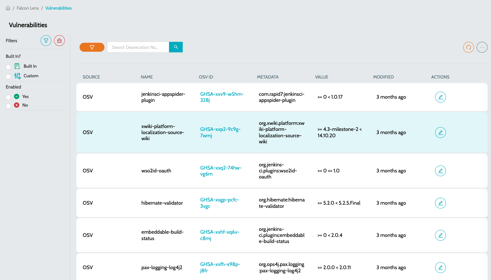

# Vulnerabilities

Vulnerabilities is the comprehensive list of OSV (Open Source Vulnerabilities) database.

The OSV (Open Source Vulnerabilities) database is an open-source vulnerability database designed to provide precise and actionable security information about vulnerabilities in open-source software. It is maintained by Google and other contributors.

### OSV Database

* **`Vulnerability Management`** – It helps developers and security teams identify and address security issues in their dependencies.
* **`Automation in Security Tools`** – Many security tools integrate OSV to automatically check for vulnerabilities in package dependencies.
* **`Software Composition Analysis (SCA)`** – It helps in analyzing software components for known vulnerabilities.
* **`Package Security Tracking`** – It allows tracking vulnerabilities for specific package ecosystems like npm, PyPI, Go modules, and Maven.
* **`Integration with CI/CD Pipelines`** – OSV can be integrated into DevOps workflows to prevent deploying software with known security issues.
* **`Accurate Fix Information`** – Provides affected versions, patched versions, and commit references for precise remediation.

### Seed Vulnerabilities

* Navigate to **`Global Settings`** -> **`Seed Data`**.
* Click on **`Seed Vulnerabilities`** to seed the data from OSV database.

### Vulnerabilities

Indicates the list of Vulnerabilities seeded from OSV database.

* Navigate to **`IZ Lens`** -> **`Vulnerabilities`**.
* **`Source`** - Indicates the source from which Vulnerabilities was seeded from
* **`Name`** - Name of the Vulnerable library
* **`OSV ID`** - Link to OSV asset
* **`Metadata`** - Complete group id and asset id of the library.
* **`Value`** - Indicated the vulnerable versions

<figure><figcaption></figcaption></figure>

### See Also

* Inventory
* Aggregated Dashboard
* Application Dashboard
* Mule Projects
* API Applications
