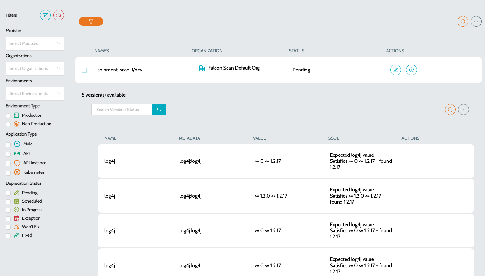

# Vulnerable Applications

All the applications using vulnerable libraries / dependencies will be listed as part of **`Vulnerable Applications`**

### Vulnerable Applications

List of all the Vulnerable applications in the system.

* Navigate to **`IZ Lens`** -> **`Vulnerable Apps`**.
* **`Name`** - Name of the application using Vulnerable libraries
* **`Organization`** - Organization to which the application belongs to
  * **`Name`** - Name of the Vulnerable library
  * **`OSV ID`** - Link to OSV asset
  * **`Metadata`** - Complete group id and asset id of the library.
  * **`Value`** - Indicated the vulnerable version used

<figure><figcaption></figcaption></figure>

### See Also

* [Inventory](../../../iz-suite/iz-lens/inventory.md)
* [Application Dashboard](../iz-eye/anypoint-platform/application-dashboard.md)
* [Mule Projects](../iz-eye/anypoint-platform/applications/mule-applications.md)
* [API Applications](../iz-eye/anypoint-platform/applications/exchange-apis.md)
